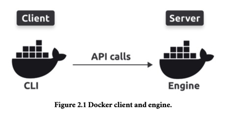
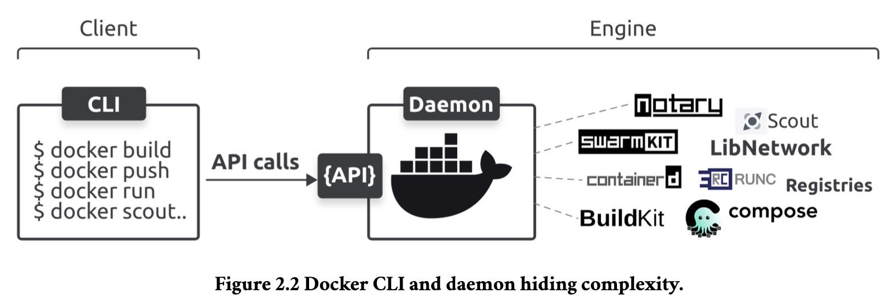

# 第一部分 宏观的东西

## 第一章 30,000 英尺的容器

> 这一章节中，我们可以学到：
>
> 1. 为什么我们有容器
> 2. 容器可以为我们做什么
> 3. 我们可以在哪里使用他们

### 容器

容器模型的一个特性是，每个容器都共享它所运行的主机的操作系统。这意味着单个主机可以运行比虚拟机更多的容器。

容器也比虚拟机更快、更便携。

### Linux 容器

现代容器背后的一些主要技术包括；内核名称空间、控制组（cgroups）、功能等等。

我知道许多类似容器的技术早于Docker和现代容器。然而，它们都没有像Docker那样改变世界。

几乎所有的容器都是Linux容器。这是因为Linux容器更小、更快，而且Linux有更多的工具。

本书的这个版本中的所有示例都是Linux容器。

*WSL 2 (Windows Subsystem for Linux)* 

### 关于 Mac 容器

没有Mac容器这种东西。

它通过在Mac上的轻量级Linux虚拟机中运行Docker来工作。其他工具，如 Podman 和 Rancher Desktop，也非常适合在 Mac 上使用容器。

Docker 和容器生态系统正在适应Wasm应用程序，你应该期待未来vm、容器和Wasm应用程序在大多数云和应用程序中并行运行。

### WebAssembly 是什么

WebAssembly （Wasm）是一种现代的二进制指令集，它构建的应用程序比容器更小、更快、更安全、更可移植。你用你最喜欢的语言编写应用程序，并将其编译为Wasm二进制文件，它将在任何有Wasm运行时的地方运行。

### Kubernetes 是什么

术语：容器化应用程序是作为容器运行的应用程序。稍后我们将详细介绍这一点。

重要的是要知道所有 Docker 容器都在 Kubernetes 上工作。

如果你需要学习 Kubernetes，请查看以下资源：

- **Quick Start Kubernetes:** 大约100页，将使您在一天内快速了解Kubernetes ！
- **The Kubernetes Book**：这是掌握 Kubernetes 的终极书籍。

### 总结

然而，随着VMware和虚拟机管理程序的成功，出现了一种更新、更高效、可移植的虚拟化技术，称为容器。

WebAssembly 正在推动云计算的第三波浪潮，但 Docker 和容器生态系统正在演变，以与WebAssembly一起工作，本书有一整章专门讨论Docker和WebAssembly。

## 第二章 Docker和容器相关的标准和项目

Docker平台旨在**使构建、运输和运行容器尽可能简单。**

Docker 平台主要有两个部分：

- The CLI (client)
- The engine (server)

CLI 是我们熟悉的 docker 命令行工具，用于部署和管理 container。它将简单的命令转换为 API 请求，并将其发送给引擎。

引擎包含运行和管理容器的所有服务器端组件。

下图展示高级架构，client 和 引擎 可以是在同一个主机或通过网络连接：

图2.2 向您展示了引擎背后的一些复杂性

### 容器相关标准与项目

- The OCI（**The Open Container Initiative (OCI)**）
- The CNCF（**The CloudNative Computing Foundation (CNCF)**）
- The Moby Project

## 第三章 Getting Docker

