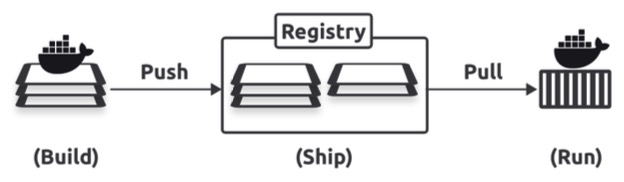

# 第一部分 宏观的东西

> https://labs.play-with-docker.com/

## 第一章 30,000 英尺的容器

> 这一章节中，我们可以学到：
>
> 1. 为什么我们有容器
> 2. 容器可以为我们做什么
> 3. 我们可以在哪里使用他们


### 容器

容器模型的一个特性是，每个容器都共享它所运行的主机的操作系统。这意味着单个主机可以运行比虚拟机更多的容器。

容器也比虚拟机更快、更便携。


### Linux 容器

现代容器背后的一些主要技术包括；内核名称空间、控制组（cgroups）、功能等等。

我知道许多类似容器的技术早于Docker和现代容器。然而，它们都没有像Docker那样改变世界。

几乎所有的容器都是Linux容器。这是因为Linux容器更小、更快，而且Linux有更多的工具。

本书的这个版本中的所有示例都是Linux容器。

*WSL 2 (Windows Subsystem for Linux)* 


### 关于 Mac 容器

没有Mac容器这种东西。

它通过在Mac上的轻量级Linux虚拟机中运行Docker来工作。其他工具，如 Podman 和 Rancher Desktop，也非常适合在 Mac 上使用容器。

Docker 和容器生态系统正在适应Wasm应用程序，你应该期待未来vm、容器和Wasm应用程序在大多数云和应用程序中并行运行。


### WebAssembly 是什么

WebAssembly （Wasm）是一种现代的二进制指令集，它构建的应用程序比容器更小、更快、更安全、更可移植。你用你最喜欢的语言编写应用程序，并将其编译为Wasm二进制文件，它将在任何有Wasm运行时的地方运行。


### Kubernetes 是什么

术语：容器化应用程序是作为容器运行的应用程序。稍后我们将详细介绍这一点。

重要的是要知道所有 Docker 容器都在 Kubernetes 上工作。

如果你需要学习 Kubernetes，请查看以下资源：

- **Quick Start Kubernetes:** 大约100页，将使您在一天内快速了解Kubernetes ！
- **The Kubernetes Book**：这是掌握 Kubernetes 的终极书籍。


### 总结

然而，随着VMware和虚拟机管理程序的成功，出现了一种更新、更高效、可移植的虚拟化技术，称为容器。

WebAssembly 正在推动云计算的第三波浪潮，但 Docker 和容器生态系统正在演变，以与WebAssembly一起工作，本书有一整章专门讨论Docker和WebAssembly。


## 第二章 Docker和容器相关的标准和项目

Docker平台旨在**使构建、运输和运行容器尽可能简单。**

Docker 平台主要有两个部分：

- The CLI (client)
- The engine (server)

CLI 是我们熟悉的 docker 命令行工具，用于部署和管理 container。它将简单的命令转换为 API 请求，并将其发送给引擎。

引擎包含运行和管理容器的所有服务器端组件。

下图展示高级架构，client 和 引擎 可以是在同一个主机或通过网络连接：


图2.2 向您展示了引擎背后的一些复杂性


### 容器相关标准与项目

- The OCI（**The Open Container Initiative (OCI)**）
- The CNCF（**The CloudNative Computing Foundation (CNCF)**）
- The Moby Project


## 第三章 Getting Docker

三种安装方式：

- Docker Desktop 推荐使用
- Multipass
- Server installs on Linux


### Docker Desktop

与容器一起工作的最好的方式。

可以得到：引擎，漂亮的 UI，所有最新的插件和特征，以及带有市场的扩展系统。如果你想学习Kubernetes，你甚至可以得到Docker Compose和单节点Kubernetes集群。

如果你的公司有超过250名员工或者年收入超过1000万美元，那么你需要支付许可费。


## 第四章 全局观

给到一些亲身经历经验以及 images 与 containers 高层次的视角。

分为 Ops 视角与 Dev 视角

Ops 关注视角：启动、停止、删除、在其中执行命令。

Dev 视角：更多地关注应用程序方面，并通过获取应用程序源代码，将其构建到容器镜像中，并将其作为容器运行。

### Ops 视角

- 检查 Docker 是否正常工作
- 下载一个镜像
- 从镜像启动容器
- 在容器中执行一个命令
- 删除容器

运行 `docker version` 确保 client and engine 都安装并运行。

~~~shell
h.a.hu@AMAR64XLRH7PP K8S-Oceam % docker version
Client:																							<<---- Start of client response
 Version:           27.3.1													-----┐
 API version:       1.47																 |
 Go version:        go1.22.7													   | Client info block
 Git commit:        ce12230													  	 |
 Built:             Fri Sep 20 11:38:18 2024				  	 |
 OS/Arch:           darwin/arm64										  	 |
 Context:           desktop-linux	  							 	-----┘

Server: Docker Desktop 4.36.0 (175267)							<<---- Start of server response
 Engine:
  Version:          27.3.1
  API version:      1.47 (minimum version 1.24)
  Go version:       go1.22.7
  Git commit:       41ca978
  Built:            Fri Sep 20 11:41:19 2024
  OS/Arch:          linux/arm64
  Experimental:     false
 containerd:
  Version:          1.7.21
  GitCommit:        472731909fa34bd7bc9c087e4c27943f9835f111
 runc:
  Version:          1.1.13
  GitCommit:        v1.1.13-0-g58aa920
 docker-init:
  Version:          0.19.0
  GitCommit:        de40ad0
~~~


#### 下载一个镜像

镜像是一个包含 app 需要运行的所有实行的对象。包含：OS 文件系统、应用和所有依赖。

如果你在运营部工作，他们很像一个 VM 模版。如果你是开发者，他们类似于 classes。

~~~shell
h.a.hu@AMAR64XLRH7PP K8S-Oceam % docker images
REPOSITORY   TAG       IMAGE ID   CREATED   SIZE
~~~

将新映像复制到 Docker 主机上称为拉取。

> 如果不修改镜像源，那么需要搭梯子下载。

~~~shell
h.a.hu@AMAR64XLRH7PP K8S-Oceam % docker pull ubuntu:latest
latest: Pulling from library/ubuntu
8bb55f067777: Pull complete 
Digest: sha256:80dd3c3b9c6cecb9f1667e9290b3bc61b78c2678c02cbdae5f0fea92cc6734ab
Status: Downloaded newer image for ubuntu:latest
docker.io/library/ubuntu:latest
~~~

运行 docker images 确认拉取命令是否工作：

~~~shell
h.a.hu@AMAR64XLRH7PP K8S-Oceam % docker images
REPOSITORY   TAG       IMAGE ID       CREATED       SIZE
ubuntu       latest    20377134ad88   4 weeks ago   101MB
~~~

如果你拉取一个应用程序容器，比如 nginx:latest，你会得到一个带有最小操作系统和运行 nginx 应用程序的代码的映像。


#### 从镜像启动一个容器

~~~shell
h.a.hu@AMAR64XLRH7PP K8S-Oceam % docker run --name test -it ubuntu:latest bash
root@eaf9fa4f38a1:/# 
~~~

**docker run** 告诉 Docker 开启一个容器。

**--name**：标志 Docker 调用这个容器叫 test。

**-it**：标志告诉 Docker 使容器具有交互性，并将您的 shell 附加到容器的终端。

**ubuntu:latest**：基于这个镜像。

**bash**L：告诉 Docker 启动一个Bash shell作为容器的主应用。


从容器内部运行ps命令，列出所有正在运行的进程：

~~~shell
root@eaf9fa4f38a1:/# ps -elf
F S UID        PID  PPID  C PRI  NI ADDR SZ WCHAN  STIME TTY          TIME CMD
4 S root         1     0  0  80   0 -  1074 do_wai 01:10 pts/0    00:00:00 bash
4 R root         9     1  0  80   0 -  1919 -      01:15 pts/0    00:00:00 ps -elf
~~~

- PID 1 是我们告诉容器运行的 Bash 进程
- PID 9 是我们用来列出正在运行的进程的 `ps -elf` 命令

按 `Ctrl-PQ` 退出容器而不终止容器。


~~~shell
h.a.hu@AMAR64XLRH7PP ~ % docker ps
CONTAINER ID   IMAGE           COMMAND   CREATED         STATUS         PORTS     NAMES
eaf9fa4f38a1   ubuntu:latest   "bash"    8 minutes ago   Up 8 minutes             test
~~~


#### 在容器内执行命令

~~~shell
h.a.hu@AMAR64XLRH7PP K8S-Oceam % docker attach test
root@eaf9fa4f38a1:/# 
~~~


#### 删除容器

**docker ps**：验证容器是否在运行

~~~shell
h.a.hu@AMAR64XLRH7PP K8S-Oceam % docker ps 
CONTAINER ID   IMAGE           COMMAND   CREATED      STATUS        PORTS     NAMES
eaf9fa4f38a1   ubuntu:latest   "bash"    3 days ago   Up 1 second             test
~~~

**docker stop**：停止容器

~~~shell
h.a.hu@AMAR64XLRH7PP K8S-Oceam % docker stop test
test
~~~

**docker rm**：删除容器

~~~shell
h.a.hu@AMAR64XLRH7PP K8S-Oceam % docker rm test
test
~~~

**docker ps -a**：验证容器是否成功删除

~~~shell
h.a.hu@AMAR64XLRH7PP K8S-Oceam % docker ps -a
CONTAINER ID   IMAGE     COMMAND   CREATED   STATUS    PORTS     NAMES
~~~


### Dev 视角

- 从 GitHub repo 克隆一个 app
- 检查应用 Dockerfile
- 使 app 容器化
- 将 app 作为容器运行

克隆 psweb APP

~~~shell
h.a.hu@AMAR64XLRH7PP Docker % git clone https://github.com/nigelpoulton/psweb.git
Cloning into 'psweb'...
remote: Enumerating objects: 85, done.
remote: Counting objects: 100% (39/39), done.
remote: Compressing objects: 100% (19/19), done.
remote: Total 85 (delta 28), reused 21 (delta 19), pack-reused 46 (from 2)
Receiving objects: 100% (85/85), 17.14 KiB | 1.56 MiB/s, done.
Resolving deltas: 100% (33/33), done.
~~~


#### 检查应用 Dockerfile

Dockerfile 是一个纯文本文档，它告诉 Docker 如何将应用程序和依赖项构建成一个图像。

**cat Dockerfile**：列出 Docker 内容

~~~shell
h.a.hu@AMAR64XLRH7PP psweb % cat Dockerfile 
# Test web-app to use with Pluralsight courses and Docker Deep Dive book
FROM alpine
LABEL maintainer="nigelpoulton@hotmail.com"
# Install Node and NPM
RUN apk add --update nodejs npm curl
# Copy app to /src
COPY . /src
WORKDIR /src
# Install dependencies
RUN  npm install
EXPOSE 8080
ENTRYPOINT ["node", "./app.js"]
~~~


#### 使 app 容器化

通过使用 `docker build` 创建一个 docker image 叫做  `test:lates`。

> 需要科学上网

~~~shell
h.a.hu@AMAR64XLRH7PP psweb % docker build -t test:latest .
[+] Building 24.7s (10/10) FINISHED                                                                                                               docker:desktop-linux
 => [internal] load build definition from Dockerfile                                                                                                              0.0s
 => => transferring dockerfile: 363B                                                                                                                              0.0s
 => [internal] load metadata for docker.io/library/alpine:latest                                                                                                  7.4s
 => [internal] load .dockerignore                                                                                                                                 0.0s
 => => transferring context: 2B                                                                                                                                   0.0s
 => [1/5] FROM docker.io/library/alpine:latest@sha256:21dc6063fd678b478f57c0e13f47560d0ea4eeba26dfc947b2a4f81f686b9f45                                            1.7s
 => => resolve docker.io/library/alpine:latest@sha256:21dc6063fd678b478f57c0e13f47560d0ea4eeba26dfc947b2a4f81f686b9f45                                            0.0s
 => => sha256:21dc6063fd678b478f57c0e13f47560d0ea4eeba26dfc947b2a4f81f686b9f45 9.22kB / 9.22kB                                                                    0.0s
 => => sha256:cf7e6d447a6bdf4d1ab120c418c7fd9bdbb9c4e838554fda3ed988592ba02936 1.02kB / 1.02kB                                                                    0.0s
 => => sha256:44a37b14f342fc55eba59c5d770a49fda0267c1cdd8a45d3ceff8ce088a0be6a 597B / 597B                                                                        0.0s
 => => sha256:cb8611c9fe5154550f45e284cf977cda4e2b2fee3478552eee31d84be3c95003 3.99MB / 3.99MB                                                                    1.5s
 => => extracting sha256:cb8611c9fe5154550f45e284cf977cda4e2b2fee3478552eee31d84be3c95003                                                                         0.1s
 => [internal] load build context                                                                                                                                 0.1s
 => => transferring context: 53.76kB                                                                                                                              0.1s
 => [2/5] RUN apk add --update nodejs npm curl                                                                                                                    8.0s
 => [3/5] COPY . /src                                                                                                                                             0.0s 
 => [4/5] WORKDIR /src                                                                                                                                            0.0s 
 => [5/5] RUN  npm install                                                                                                                                        7.3s 
 => exporting to image                                                                                                                                            0.2s 
 => => exporting layers                                                                                                                                           0.2s 
 => => writing image sha256:fa669780f4b4146c1b5c79b2e782dfd23809c41059695ef341a389795d972b76                                                                      0.0s 
 => => naming to docker.io/library/test:latest                
~~~

使用 docker images 校验：

~~~shell
h.a.hu@AMAR64XLRH7PP psweb % docker images
REPOSITORY   TAG       IMAGE ID       CREATED              SIZE
test         latest    fa669780f4b4   About a minute ago   105MB
ubuntu       latest    20377134ad88   4 weeks ago          101MB
~~~


#### 在容器中执行一个命令

~~~shell
h.a.hu@AMAR64XLRH7PP psweb % docker run -d \
  --name web1 \
  --publish 8080:8080 \
  test:latest
414a2edad0d9a28e0f1454a304c0a2a7a952ea1c6ed17d3f6283fad5412c5fc5
~~~

打开浏览器，输入 localhost:8080，网页中返回：

~~~html
Hello Docker learners!!!
Check out my other books
Quick Start KubernetesThe Kubernetes BookAI Explained

Be careful. The last time I updated the packages in this app was Dec 2024.
~~~


#### 清除

终止 app，直接删除这个 container

~~~shell
h.a.hu@AMAR64XLRH7PP psweb % docker rm web1 -f
web1
~~~

删除镜像

~~~shell
h.a.hu@AMAR64XLRH7PP psweb % docker rmi test:latest
Untagged: test:latest
Deleted: sha256:fa669780f4b4146c1b5c79b2e782dfd23809c41059695ef341a389795d972b76
~~~


# 第二部分 技术的东西

## 第五章 Docker 引擎

本章内容：

- Docker Engine – The TLDR
- The Docker Engine
- The influence of the Open Container Initiative (OCI) • runc
- containerd
- Starting a new container (example)
- What’s the shim all about
- How it’s implemented on Linux


### **Docker Engine – The TLDR**

Docker Engine 是 Docker 服务端组建的术语，运行和管理容器。

在许多方面，Docker Engine 很像 小汽车引擎：

- 汽车发动机是由许多专门的部件组成的，这些部件共同组成了汽车驱动装置——进气歧管、节气门、汽缸、活塞、火花塞、排气歧管等等。
- Docker引擎是由许多专门的工具组成的，它们一起工作来创建和运行容器——API、镜像构建器、高级运行时、低级运行时、shims等。

下图展示了 Docker 引擎 创建和运行容器。但是是一个简单的关注在开始和运行容器的组建图。


`r` 来指代 `runc`, `c` 来指代 `containerd`


### The Docker Engine

Docker 有两个主要的组件：

- The Docker daemon (sometimes referred to as just “the daemon”)
- LXC

守护进程是一个单片二进制文件，包含API、映像构建器、容器执行、卷、网络等的所有代码。

LXC 完成了与 Linux 内核接口的艰苦工作，并构建了构建和启动容器所需的名称空间和cgroup。


### 替换 LXC

依赖 LXC 给 Docker 项目带来了几个问题。

- 首先，LXC是特定于 linux 的，而Docker希望成为多平台的。
- 其次，Docker 发展很快，没有办法确保 LXC 按照Docker需要的方式发展。
- 为了改善体验并帮助项目更快地发展，Docker用自己的工具 **libcontainer** 取代了LXC。libcontainer 的目标是成为一个平台无关的工具，使Docker能够访问主机内核中的基本容器构建块。

Libcontainer 很早以前就取代了 Docker 中的 LXC。


### 分解单片Docker守护进程

Docker 引擎最初是一个庞然大物，几乎所有的功能都被编码到守护进程中。会有一些问题：

- 他变慢了
- 这不是生态系统想要的
- 很难在单一软件上进行创新

长期运行的项目来分解和重构引擎：每个功能都成为自己的小型专用工具。平台构建者可以重用这些工具来构建其他平台。

下图显示了 Docker 引擎中用于运行容器的主要组件的另一个视图，并列出了每个组件的主要职责。


### 开放容器倡议（OCI - Open Container Initiative）的影响

大约在Docker公司重构引擎的同时，[OCI8](https://opencontainers.org/) 也在定义两个与容器相关的标准：

- Image Specification (image-spec)[https://github.com/opencontainers/image-spec]
- Runtime Specification (runtime-spec)[https://github.com/opencontainers/runtime-spec]

稳定性是低级 OCI 规范的核心。

自2016年以来，Docker的所有版本都实现了OCI规范。例如，Docker 使用 runc （OCI运行时规范的参考实现）来创建OCI兼容的容器（运行时规范）。它还使用 BuildKit 来构建OCI兼容的映像（image-spec）， Docker Hub是一个OCI兼容的注册表（registry- spec）。


### runc

runc 是 libcontainer 的轻量级 CLI 包装器，您可以下载并使用它来管理兼容oci的容器。

Docker 和 Kubernetes 都使用 runc 作为默认的低级运行时，并将其与容器高级运行时配对：

- containerd 作为管理生命周期事件的高级运行时运行
- runc 作为低级运行时运行，通过接口执行生命周期事件使用内核来完成实际构建容器和删除它们的工作

你可以看到最新的版本：https://github.com/opencontainers/runc/releases/tag/v1.2.3


### containerd

containerd（发音为“container dee”，总是用小写的“c”写）是Docker在剥离守护进程功能时创建的另一个工具。

它使用的 shims 使得用其他低级运行时替换 runc 成为可能。

你可以看到最新的版本：https://github.com/containerd/containerd/releases


### Starting a new container - 例子

运行以下命令，根据 nginx 映像启动一个名为 ctr1 的新容器。

~~~shell
$ docker run -d --name ctr1 nginx
Unable to find image 'nginx:latest' locally
latest: Pulling from library/nginx
f5c6876bb3d7: Pull complete 
bdb964b66a74: Pull complete 
b5368be906ec: Pull complete 
755bf136756e: Pull complete 
aafc2e219c20: Pull complete 
261c6a94b398: Pull complete 
a8066ea4829b: Pull complete 
Digest: sha256:42e917aaa1b5bb40dd0f6f7f4f857490ac7747d7ef73b391c774a41a8b994f15
Status: Downloaded newer image for nginx:latest
35e13fb8507f04cdd1e0013121ffc0a8652e8eb8b2f63b7d93861b733d74f392

$ docker ps
CONTAINER ID   IMAGE     COMMAND                  CREATED          STATUS          PORTS     NAMES
35e13fb8507f   nginx     "/docker-entrypoint.…"   25 seconds ago   Up 25 seconds   80/tcp    ctr1
~~~

当您运行这样的命令时，Docker 客户端将它们转换为 API请求，并将它们发送到守护进程公开的 API。

守护进程可以在本地套接字上或通过网络公开API。Linux操作系统下，本地套接字为 `/var/run/docker`。在Windows上，它是`\pipe\docker_engine`。


我们有时称其为**无守护进程容器(*daemonless containers*)**。

如果您之前启动了NGINX容器，您应该使用以下命令删除它。

~~~shell
 $ docker rm ctr1 -f
~~~


### What’s the shim all about?

Shims是一种流行的软件工程模式，Docker引擎使用他们在容器层和OCI层之间，带来以下好处：

- Daemonless containers
- Improves efficiency
- Makes the OCI layer pluggable

在效率方面，containd为每个新容器划分了一个流程和一个运行流程。但是，一旦容器开始运行，每个runc进程就会退出，使shim进程成为容器的父进程。

shim 是轻量级的，位于 containerd 和 container 之间。它报告容器的状态并执行低级任务，例如保持容器的 STDIN 和 STDOUT 流打开。

shim 还使得用其他低级运行时替换 runc 成为可能。


### How it’s implemented on Linux

- /usr/bin/dockerd (the Docker daemon)
- /usr/bin/containerd
- /usr/bin/containerd-shim-runc-v2
- /usr/bin/runc


### Do we still need the daemon

在撰写本文时，Docker已经剥离了守护进程的大部分功能，使守护进程专注于服务API。


## 第六章 Working with Images

这一章节会深入了解 Docker Images。

### Docker images – The TLDR

下面所有的术语都是同一个意思，我们将互换使用它们：**Image, Docker image, container image, and OCI image**.

一个 image 是一个只读包，包含了你需要运行 app 的任何事物。这意味着，他们包含了 app 代码、依赖、一个最小的操作系统结构集和原数据。你可以启动多个容器从一个单独 image。

获取 image 最简单的方式是从 registry 拉取。[Docker Hub](https://hub.docker.com) 是最通用的 registry，拉取一个 image 到你本地，Docker 可以使用它启动一个或多个容器。其他 registries 也存在，Docker 可以和他们一起工作。

image 是通过堆叠独立的层并将他们并将它们表示为单个统一的对象而生成的。一层可能是 OS 组件，另一层可能有 app 依赖，另外一层可能有 app。Docker 将这些层堆叠起来，使它们看起来像一个统一的系统。

Image 通常很小。例如，官方的 NGINX image 大约是60MB，官方的 Redis image 大约是40MB。但是，Windows映像可能非常大。


### 介绍 images


一旦 container 运行，image 和 container 绑定，你不能删除 image直到停止和删除容器。


### Pulling images

image cashe：Linux 通常存储在 - **/var/lib/docker/<storage-driver>**

~~~shell
$ docker images
REPOSITORY   TAG       IMAGE ID       CREATED       SIZE
nginx        latest    5e0fa356e6f4   5 weeks ago   197MB
ubuntu       latest    20377134ad88   6 weeks ago   101MB
~~~

获取 images 的过程叫做 pulling。

~~~shell
$ docker pull redis
Using default tag: latest
latest: Pulling from library/redis
f5c6876bb3d7: Already exists 
09fc6d52d57a: Pull complete 
00b1f2459268: Pull complete 
331d356ef102: Pull complete 
79f4acbc802f: Pull complete 
9b38153decf0: Pull complete 
4f4fb700ef54: Pull complete 
c46660a035a6: Pull complete 
Digest: sha256:bb142a9c18ac18a16713c1491d779697b4e107c22a97266616099d288237ef47
Status: Downloaded newer image for redis:latest
docker.io/library/redis:latest

$ docker images
REPOSITORY   TAG       IMAGE ID       CREATED        SIZE
redis        latest    c8ac0a9bed1d   3 months ago   140MB
~~~

Docker 固执己见，在拉取 images 时做了两个假设：

- 它假定您想要提取标记为最新的 images
- 它假定您想从 Docker Hub 提取 images


### Image registries

我们存储 image 到中心化的地方叫做 **registries**。



一个 registries 包含一个或多个 image repositories，image repositories 包含一个或多个 images。


#### Official repositories

下面的列表显示了一些官方存储库及其url，它们存在于 Docker Hub 命名空间的顶层：

- **nginx:** https://hub.docker.com/_/nginx/
- **busybox:** https://hub.docker.com/_/busybox/
- **redis:** https://hub.docker.com/_/redis/
- **mongo:** https://hub.docker.com/_/mongo/


#### Unofficial repositories


### Image naming and tagging

下图显示了一个完全限定的映像名称，包括注册中心名称、用户/组织名称、存储库名称和标记。


您只需要提供存储库名称和映像名称，两者之间用冒号分隔。有时我们称 image 名字是 tag。从官方存储库中提取 image 的格式 docker pull

```shell
$ docker pull <repository>:<tag>
```

 前面的示例使用以下命令提取 Redis 映像。它从顶级 redis 存储库中提取了标记为最新的图像。

~~~shell
$ docker pull redis:latest
~~~

下面的例子展示了如何拉出几个不同的官方图片。

~~~shell
$ docker pull mongo:7.0.5
//Pulls the image tagged as '7.0.5' from the official 'mongo' repository.
$ docker pull busybox:glibc
//Pulls the image tagged as 'glibc' from the official 'busybox' repository.
$ docker pull alpine
//Pulls the image tagged as 'latest' from the official 'alpine' repository.
~~~

有几件事情值得注意：

- 如果你没有一个具体的 image tag，docker 假设你想要 image tag 的 latest。如果 repository 没有 image tag latest，则命令会失败。
- 标记为最新的映像不能保证是存储库中最新的映像。

从非官方存储库中提取镜像与从官方存储库中提取镜像几乎相同——你只需要在存储库名称之前添加Docker Hub用户名或组织名称。下面的示例展示了如何从一个 Docker Hub ID 为 nigelpoulton 的不受信任的人拥有的 tu-demo 存储库中提取 v2 映像。

~~~shell
$ docker pull nigelpoulton/tu-demo:v2
~~~

要从不同的注册中心提取映像，只需在存储库名称之前添加注册中心的 DNS 名称。例如，下面的命令从 GitHub 容器注册表（ghcr.io）上的 Brandon Mitchell 的 regclient/regsync repo中提取最新的映像。

~~~shell
$ docker pull ghcr.io/regclient/regsync:latest
latest: Pulling from regclient/regsync
6f14f2b64ccf: Download complete
7746d6728537: Download complete
685af2c79c31: Download complete
4c377311167a: Download complete
662e9541e042: Download complete
Digest: sha256:149a95d47d6beed2a1404d7c3b00dddfa583a94836587ba8e3b4fe59853c1ece
Status: Downloaded newer image for ghcr.io/regclient/regsync:latest
ghcr.io/regclient/regsync:latest
~~~


#### Images with multiple tags

乍一看，下面的输出看起来像是列出了三个图像。然而，仔细观察，它只有两个—— b4210d0aa52f 图像被标记为最新和v1。

~~~shell
$ docker images
REPOSITORY               TAG		IMAGE ID			CREATED					SIZE
nigelpoulton/tu-demo     latest	b4210d0aa52f	2 days ago			115MB
nigelpoulton/tu-demo     v1			b4210d0aa52f	2 days ago			115MB
nigelpoulton/tu-demo     v2			6ba12825d092	12 minutes ago	115MB
~~~

这是一个很好的例子，最新的标签与最新的 image 无关。在本例中，最新标记引用与v1标记相同的图像，v1标记实际上比v2图像更老。


### Images and layers


你将看到以下所有检查图层信息的方法：

- Pull operations
- `docker inspect` 命令
- `docker history` 命令

运行以下命令拉取最新的节点映像，并观察它拉取各个层。一些较新的版本可能有或多或少的层，但原理是相同的。

~~~shell
$ docker pull node:latest
latest: Pulling from library/ubuntu
952132ac251a: Pull complete
82659f8f1b76: Pull complete
c19118ca682d: Pull complete
8296858250fe: Pull complete
24e0251a0e2c: Pull complete
Digest: sha256:f4691c96e6bbaa99d...28ae95a60369c506dd6e6f6ab
Status: Downloaded newer image for node:latest
docker.io/node:latest
~~~

每一行 Pull complete 表示一层。这一个 images 有 5 层，下图展示了他每层的 id。


下面实力检查相同的 node: latest 已被拉取的 image，在之前的步骤

~~~shell
$ docker inspect node:latest
[
    {
        "Id": "sha256:bd3d4369ae.......fa2645f5699037d7d8c6b415a10",
        "RepoTags": [
            "node:latest"
        <Snip>
        "RootFS": {
            "Type": "layers",
            "Layers": [
                "sha256:c8a75145fc...894129005e461a43875a094b93412",
                "sha256:c6f2b330b6...7214ed6aac305dd03f70b95cdc610",
                "sha256:055757a193...3a9565d78962c7f368d5ac5984998",
                "sha256:4837348061...12695f548406ea77feb5074e195e3",
                "sha256:0cad5e07ba...4bae4cfc66b376265e16c32a0aae9"
											] 
								}
		} 
]
~~~

修剪后的输出显示了五个层。但是，它显示了它们的 SHA256 哈希值，这与 docker pull 输出中的 short ids 不同。

`docker inspect` 命令是一个很好的获取 image 详细信息的命令。

`docker history` 命令是检查 image 和他的层级的数据，然而，这个命令展示的是 image 构建历史，不是一个最终 image 的层级列表。例如，一些 Dockerfile 指令（ENV， EXPOSE， CMD 和 ENTRYPOINT）只添加元数据而不创建层。


#### Base layers

所有 docker image 开始都是一个 base layer，并且每一次你添加新的内容，docker 就会添加一个新层。

这意味着官方的 Ubuntu 24:04 镜像将是这个应用程序的基础层。安装Python将添加第二层，你的应用程序源代码将添加第三层。

最终的图像将有三个图层，如下图所示。请记住，出于演示目的，这是一个过于简化的示例。


重要的是要理解图像是所有层按照构建顺序堆叠的组合。下图显示了一个有两层的图像。每层有三个文件，这意味着图像有六个文件。


下图所示，File 7 可以掩盖 File 5


图下图显示了上图中的三层图像将如何显示在系统上——所有三层叠加并合并为一个统一的视图。


#### Sharing image layers

`docker pull` 命令，当本地有共享层时，则会跳过，因为在本地已经有了。

~~~shell
$ docker pull redis:latest
latest: Pulling from library/redis
25d3892798f8: Download complete
e5d458cf0bea: Download complete
4f4fb700ef54: Already exists	<<---- This line
<Snip>
~~~


### Pulling images by digest

您有一个名为 golftrack:1.5 的映像，它被生产环境中的许多容器所使用，它有一个严重的错误。创建一个包含修复的新版本。

到目前为止，一切都很好，但是你犯了一个错误。

将新图像推到与易受攻击图像的标签相同的存储库。这将覆盖原始映像，使您无法很好地了解哪些生产容器正在使用易受攻击的映像，哪些正在使用固定映像—两个映像具有相同的标记！

`image digests` 来营救。Docker 使用内容可寻址存储模型，其中每个图像都有一个加密的内容哈希，我们通常称之为摘要。

如果您已经按名称提取了一个映像，那么您可以通过运行带有 `--digest` 标志的 docker images 命令来查看它的摘要，如下所示。

~~~shell
$ docker images --digests alpine
REPOSITORY   TAG       DIGEST                       IMAGE ID       CREATED      SIZE
alpine       latest    sha256:c5b1261d...8e1ad6b    c5b1261d6d3e   2 weeks ago  11.8MB
~~~

如果你想在拉出图像之前找到它的摘要，你可以使用 `docker buildx imagetools` 命令。下面的示例检索 Docker Hub 上nigelpoulton/k8sbook/latest映像的映像摘要。

~~~shell
$ docker buildx imagetools inspect nigelpoulton/k8sbook:latest
Name:      docker.io/nigelpoulton/k8sbook:latest
MediaType: application/vnd.docker.distribution.manifest.list.v2+json
Digest:    sha256:13dd59a0c74e9a147800039b1ff4d61201375c008b96a29c5bd17244bce2e14b
<Snip>
~~~

现在可以使用摘要提取图像。

~~~shell
$ docker pull nigelpoulton/k8sbook@sha256:13dd59a0...bce2e14b
docker.io/nigelpoulton/k8sbook@sha256:13dd59a0...bce2e14b: Pulling from nigelpoulton/k8sbook
59f1664fb787: Download complete
a052f1888b3e: Download complete
94a9f4dfa0e5: Download complete
bb7e600677fa: Download complete
edfb0c26f1fb: Download complete
5b1423465504: Download complete
2f232a362cd9: Download complete
Digest: sha256:13dd59a0...bce2e14b
Status: Downloaded newer image for nigelpoulton/k8sbook@sha256:13dd59a0...bce2e14b
docker.io/nigelpoulton/k8sbook:latest@sha256:13dd59a0...bce2e14b
~~~

也可以直接查询注册表API获取图像数据，包括摘要。下面的 curl 命令向 Docker Hub 查询相同图像的摘要。

~~~shell
$ curl "https://hub.docker.com/v2/repositories/nigelpoulton/k8sbook/tags/?name=latest" \
|jq '.results[].digest'
"sha256:13dd59a0c74e9a147800039b\
1ff4d61201375c008b96a29c5bd17244bce2e14b"
~~~


#### Image hashes and layer hashes

images 和 layers 有他们自己的 digests 如下：

- Images digests 是 image 清单文件的加密散列
- Layer digests 是层的内容的加密散列

这意味着对图层或图像清单的所有更改都会产生新的哈希值，从而为我们提供了一种简单可靠的方式来了解是否进行了更改。


#### Content hashes vs distribution hashes

Docker在每次推拉之前和之后比较哈希值，以确保没有发生篡改。

但是，它还在推和拉操作期间压缩映像，以节省网络带宽和注册表上的存储空间。这种压缩的结果是，前后散列不匹配。

为了解决这个问题，每层都有两个哈希值：

- Content hash (uncompressed)
- Distribution hash (compressed)

每次 Docker 从注册表中推送或提取一个层时，它都会包含该层的分布哈希值，并使用它来验证是否发生了逐渐减少。这就是为什么不同CLI 和注册表输出中的哈希值并不总是匹配的原因之一——有时您查看的是内容哈希值，而有时您查看的是分布哈希值。


### Multi-architecture images

Docker 和 registry API 进行了调整，变得足够聪明，可以在单个标签后面隐藏多个架构的图像。

这意味着你可以使用 `docker pull alpine` 在任意架构并且得到正确的 image 版本。例如，如果你在 AMD64 机器上，你讲得到 AMD64 image。

为了实现这一点，Registry API支持两个重要的构造：

- Manifest lists
- Manifests

清单列表顾名思义——一个图像标记支持的体系结构列表。然后，每个受支持的体系结构都有自己的清单，其中列出了用于构建它的层。

运行如下命令可以看到不同架构支撑在 **alpine:latest** tag：

~~~shell
$ docker buildx imagetools inspect alpine
Name:      docker.io/library/alpine:latest
MediaType: application/vnd.docker.distribution.manifest.list.v2+json
Digest:    sha256:c5b1261d6d3e43071626931fc004f70149baeba2c8ec672bd4f27761f8e1ad6b
Manifests:
  Name:      docker.io/library/alpine:latest@sha256:6457d53f...628977d0
  MediaType: application/vnd.docker.distribution.manifest.v2+json
  Platform:  linux/amd64
  
  Name:      docker.io/library/alpine:latest@sha256:b229a851...d144c1d8
  MediaType: application/vnd.docker.distribution.manifest.v2+json
  Platform:  linux/arm/v6
  
  Name:      docker.io/library/alpine:latest@sha256:ec299a7b...33b4c6fe
  MediaType: application/vnd.docker.distribution.manifest.v2+json
  Platform:  linux/arm/v7
  
  Name:      docker.io/library/alpine:latest@sha256:a0264d60...93467a46
  MediaType: application/vnd.docker.distribution.manifest.v2+json
  Platform:  linux/arm64/v8
  
  Name:      docker.io/library/alpine:latest@sha256:15c46ced...ab073171
  MediaType: application/vnd.docker.distribution.manifest.v2+json
  Platform:  linux/386
  
  Name:      docker.io/library/alpine:latest@sha256:b12b826d...ba52a3a2
  MediaType: application/vnd.docker.distribution.manifest.v2+json
  Platform:  linux/ppc64le
~~~

如果你仔细观察，你会看到一个单清单指向六个清单。

**MediaType: application/vnd.docker.distribution.manifest.list.v2+json** 是 Manifest lists

每一个 **MediaType: application/vnd.docker.distribution.manifest.v2+json** 行指的是每个 manifest 具体架构。


让我们通过一个快速事例逐步了解。

假设你在 M3 Mac 上使用 Docker 桌面，Docker 在 linux/arm 虚拟机中运行。你要求 Docker 提取一个映像，Docker 对注册表API进行相应的调用，请求相应的清单列表。假设它存在，Docker 然后将其解析为 linux/arm 条目。如果 linux/arm 条目存在，Docker 检索它的清单，解析它的层的加密id，拉出每个单独的层，并将它们组装到映像中。

Linux on arm64 example:

```shell
$ docker run --rm golang go version
<Snip>
go version go1.22.0 linux/arm64
```

Windows on x64 example:

```shell
> docker run --rm golang go version
<Snip>
go version go1.20.4 windows/amd64
```


~~~shell
$ docker manifest inspect golang | grep 'architecture\|os'
            "architecture": "amd64",
            "os": "linux"
            "architecture": "arm",
            "os": "linux",
            "architecture": "arm64",
            "os": "linux",
            "architecture": "386",
            "os": "linux"
            "architecture": "mips64le",
            "os": "linux"
            "architecture": "ppc64le",
            "os": "linux"
            "architecture": "s390x",
            "os": "linux"
            "architecture": "amd64",
            "os": "windows",
            "os.version": "10.0.20348.2227"
            "architecture": "amd64",
            "os": "windows",
            "os.version": "10.0.17763.5329"
~~~


`docker buildx` 命令是他简单的去创建多架构 images。`docker buildx` 提供两种方式创建 multi-architectureimages：

- Emulation
- Build Cloud

使用 Docker build Cloud 运行以下命令来构建 AMD 和 ARM 版本的 nigelpoulton/tu-demo 映像。

~~~shell
$ docker buildx build \
  --builder=cloud-nigelpoulton-ddd-cloud \
  --platform=linux/amd64,linux/arm64 \
  -t nigelpoulton/tu-demo:latest --push .
~~~


### 使用 Docker Scout 进行漏洞扫描

Docker Scout 是一项非常巧妙的服务，但它需要付费订阅。

你可以使用 `docker scout quickview` 命令的到一个 image 的漏洞概览。下面命令是分析 **nigelpoulton/tu- demo:latest** image。如果一个本地副本不存在，他将会从 Docker Hub 拉取并在本地执行分析。


输出显示 0 关键漏洞 (0C), one high (1H), one medium (1M), and zero low (0L).


### Deleting Images

使用 `docker rmi` 命令删除 images。**rmi** 是 **remove image** 的缩写。

您可以通过名称、短ID 或 SHA 删除镜像。也可以使用同一命令删除多个镜像。

下面的命令删除三个映像——一个按名称，一个按短ID，一个按SHA。

~~~shell
$ docker rmi redis:latest af111729d35a sha256:c5b1261d...f8e1ad6b
Untagged: redis:latest
Deleted: sha256:76d5908f5e19fcdd73daf956a38826f790336ee4707d9028f32b24ad9ac72c08
Untagged: nigelpoulton/tu-demo:v2
Deleted: sha256:af111729d35a09fd24c25607ec045184bb8d76e37714dfc2d9e55d13b3ebbc67
Untagged: alpine:latest
Deleted: sha256:c5b1261d6d3e43071626931fc004f70149baeba2c8ec672bd4f27761f8e1ad6b
~~~

可以通过 `-f` 标记强制操作。

~~~shell
$ docker rmi $(docker images -q) -f
~~~

为了理解如何工作，下载几个 images，然后运行 `docker images -q`

~~~shell
$ docker pull alpine
<Snip>

$ docker pull ubuntu
<Snip>

$ docker images -q
44dd6f223004
3f5ef9003cef

$ docker rmi $(docker images -q) -f
Untagged: alpine:latest
Untagged: alpine@sha256:02bb6f428431fb...a33cb1af4444c9b11
Deleted: sha256:44dd6f2230041...09399391535c0c0183b
Deleted: sha256:94dd7d531fa56...97252ba88da87169c3f
Untagged: ubuntu:latest
Untagged: ubuntu@sha256:dfd64a3b4296d8...9ee20739e8eb54fbf
Deleted: sha256:3f5ef9003cefb...79cb530c29298550b92
Deleted: sha256:b49483f6a0e69...f3075564c10349774c3

$ docker images
REPOSITORY     TAG    IMAGE ID    CREATED     SIZE
~~~


### Images 命令

- `docker pull`：从远程 registries 拉取 images；`docker pull alpine:latest` 拉取 tag 是 latest 的 alpine repository。
- `docker images`：列出本地所有的 images。 `--digests` 标志看到 SHA256 hashes。
- `docker inspect`：在格式良好的视图中为您提供丰富的与图像相关的元数据。
- `docker manifest inspect`：允许您检查存储在注册表中的图像清单列表。以下命令将显示 regctl image on GitHub Container Registry（GHCR）的清单列表：docker manifest inspect GHCR .io/regclient/regctl。
- `docker buildx`：是一个Docker CLI 插件，使用 Docker 最新的构建引擎功能。您看到了如何使用 image tools 子命令从图像中查询与清单相关的数据。
- `docker scout`：是一个Docker CLI插件，它集成了Docker Scout后端来执行图像漏洞扫描。它扫描图像，提供漏洞报告，甚至建议补救措施。
- `docker rmi`：用于删除镜像。它删除存储在本地文件系统中的所有层数据，并且您不能删除与处于运行（Up）或停止（exit）状态的容器关联的映像。


## 第七章 Working with containers

Docker 实现了 the Open Container Initiative (OCI) specifications. 

### Containers – The TLDR

下图展示多个 containers  从一个单独的 image 启动。共享 image 是只读的，但是你可以写到容器中。


您可以启动、停止、重启和删除容器，就像对虚拟机一样。

容器是被设计为无状态与短暂的。

容器也被设计为不可变的。这意味着在部署了容器之后不应该更改它们——如果容器失败了，可以用一个新容器替换它，而不是连接到它并在活动实例中进行修复。

 容器应该只运行一个进程，我们用它们来构建微服务应用。例如，一个具有web服务器、身份验证、目录和存储等四个特性（微服务）的应用程序将拥有四个容器——一个运行web服务器，一个运行身份验证服务，一个运行目录，另一个运行存储。


### Containers vs VMs

- VMs 虚拟化硬件
- Containers 虚拟化操作系统

下图展示的是容器特行更有效，运行了比 VMs 3倍多的 app。


### The VM tax

虚拟机模式有一个最大的问题是你需要安装 OS 在每个 VM 上 —— 每个 OS 都需要消耗CPU、RAM和存储，并且需要较长的启动时间。

容器通过在它们运行的主机上共享一个操作系统来解决所有这些问题。

这使得容器比虚拟机具有以下所有优点：

- 容器更小、更便捷
- 您可以在基础设施上运行更多容器
- 容器启动更快
- 容器减少了需要管理的操作系统的数量（补丁、更新等）。
- 容器的攻击面较小


### Images and Containers

如下图所示，Docker 通过为每个容器创建一个薄读写层并将其放在共享映像的顶部来实现这一点。


### Check Docker is running

`docker version` 检查 Docker 是否启动。这是一个很好的命令，因为它检查CLI和引擎组件。

~~~shell
$ docker version
Client:
 Version:           27.3.1
 API version:       1.47
 Go version:        go1.22.7
 Git commit:        ce12230
 Built:             Fri Sep 20 11:38:18 2024
 OS/Arch:           darwin/arm64
 Context:           desktop-linux

Server: Docker Desktop 4.36.0 (175267)
 Engine:
  Version:          27.3.1
  API version:      1.47 (minimum version 1.24)
  Go version:       go1.22.7
  Git commit:       41ca978
  Built:            Fri Sep 20 11:41:19 2024
  OS/Arch:          linux/arm64
  Experimental:     false
 containerd:
  Version:          1.7.21
  GitCommit:        472731909fa34bd7bc9c087e4c27943f9835f111
 runc:
  Version:          1.1.13
  GitCommit:        v1.1.13-0-g58aa920
 docker-init:
  Version:          0.19.0
  GitCommit:        de40ad0
~~~


### Starting a container

`docker run` 命令是启动新容器的最简单、最常见的方法。

运行以下命令启动一个名为 webserver 的新容器。

~~~shell
$ docker run -d --name webserver -p 5005:8080 nigelpoulton/ddd-book:web0.1
Unable to find image 'nigelpoulton/ddd-book:web0.1' locally
web0.1: Pulling from nigelpoulton/ddd-book
4f4fb700ef54: Already exists
cf2a607f33f7: Download complete
0a1f0c111e9a: Download complete
c1af4b5db242: Download complete
Digest: sha256:3f5b281b914b1e39df8a1fbc189270a5672ff9e98bfac03193b42d1c02c43ef0
Status: Downloaded newer image for nigelpoulton/ddd-book:web0.1
b5594b3b8b3fdce544d2ca048e4340d176bce9f5dc430812a20f1852c395e96b
~~~

`docker run` 告诉 docker 去运行一个新的 容器。

`-d` 标志告诉 Docker 在后台将其作为守护进程运行，并与本地终端分离

`name` 标志告诉 Docker 将这个容器命名为 **webserver**。

`-p 5005:8080` 标志映射端口 5005 到容器端口 8080。这是因为容器的web服务器正在监听端口8080。

**nigelpoulton/ddd-book:web0.1** 参数是告诉 Docker 使用哪一个 image 来启动 container。

当你点击Return时，Docker客户端将命令转换为API请求，并将其发送到Docker守护进程公开的Docker API。

运行以下命令来验证镜像是否在本地和新容器中被拉出被称为 web 服务器正在运行。

~~~shell
$ docker images

$ docker ps

~~~


### How containers start apps

有三种方式启动一个 app 在一个容器中：

- image 中的入口点指令
- image 中的 cmd 指令
- 一个 CLI 参数


~~~shell
$ docker inspect nginx | grep Entrypoint -A 3
            "Entrypoint": [
                "/docker-entrypoint.sh"
            ],
            "OnBuild": null,
~~~


~~~shell
$ docker run <arguments> <image> <command>
~~~

如果你具体指出一个 command，他将会重写 Cmd 执行，但将会附加到入口点执行中。


### Connecting to a container

可以使用 `docker exec` 命令到运行中的 container 执行命令，并且他有两个模式：

- Interactive
- Remote execution

交互式exec会话将终端连接到容器中的shell进程，其行为类似于远程SSH会话。

远程执行模式允许您向正在运行的容器发送命令，并将输出输出到本地终端。


`-it` 标志使其成为交互式执行会话，sh 参数在容器内启动一个新的 sh 进程。sh 是安装在容器中的最小 shell 程序。

~~~shell
$ docker exec -it webserver sh
/src #
~~~


### Inspecting container processes

大多数容器只运行单个进程。这是容器的主应用进程，并且总是PID 1。

运行 **ps** 命令查看容器中运行的进程。

~~~shell
/src # ps
PID   USER	TIME  COMMAND
    1 root	0:00 node ./app.js
   13 root	0:00 sh
   22 root	 0:00 ps
~~~

输出显示了三个进程：

- PID 1 是运行 Node.js web应用程序的主要应用进程
- PID 13 是你的交互式 exec 会话连接到的shell进程
- PID 22 是您刚刚运行的 ps 命令


### **The** docker inspect command

~~~shell
$ docker inspect ctr1
[
    {
        "Id": "e06d47ef5637e5befcb9df5f5545e129570060aa2e85dde2f016c941e0f83352",
        "Created": "2025-01-16T22:55:50.232295834Z",
        "Path": "/docker-entrypoint.sh",
        "Args": [
            "nginx",
            "-g",
            "daemon off;"
        ],
        "State": {
            "Status": "running",
            "Running": true,
            "Paused": false,
            "Restarting": false,
            "OOMKilled": false,
            "Dead": false,
            "Pid": 638,
            "ExitCode": 0,
            "Error": "",
            "StartedAt": "2025-01-16T22:55:50.263238834Z",
            "FinishedAt": "0001-01-01T00:00:00Z"
        },
        "Image": "sha256:5e0fa356e6f4a996ca452b017c81aca3d087ae38f873ed8314af16126423b21f",
        "ResolvConfPath": "/var/lib/docker/containers/e06d47ef5637e5befcb9df5f5545e129570060aa2e85dde2f016c941e0f83352/resolv.conf",
        "HostnamePath": "/var/lib/docker/containers/e06d47ef5637e5befcb9df5f5545e129570060aa2e85dde2f016c941e0f83352/hostname",
        "HostsPath": "/var/lib/docker/containers/e06d47ef5637e5befcb9df5f5545e129570060aa2e85dde2f016c941e0f83352/hosts",
        "LogPath": "/var/lib/docker/containers/e06d47ef5637e5befcb9df5f5545e129570060aa2e85dde2f016c941e0f83352/e06d47ef5637e5befcb9df5f5545e129570060aa2e85dde2f016c941e0f83352-json.log",
        "Name": "/ctr1",
        "RestartCount": 0,
        "Driver": "overlay2",
        "Platform": "linux",
        "MountLabel": "",
        "ProcessLabel": "",
        "AppArmorProfile": "",
        "ExecIDs": null,
        "HostConfig": {
            "Binds": null,
            "ContainerIDFile": "",
            "LogConfig": {
                "Type": "json-file",
                "Config": {}
            },
            "NetworkMode": "bridge",
            "PortBindings": {},
            "RestartPolicy": {
                "Name": "no",
                "MaximumRetryCount": 0
            },
            "AutoRemove": false,
            "VolumeDriver": "",
            "VolumesFrom": null,
            "ConsoleSize": [
                27,
                120
            ],
            "CapAdd": null,
            "CapDrop": null,
            "CgroupnsMode": "private",
            "Dns": [],
            "DnsOptions": [],
            "DnsSearch": [],
            "ExtraHosts": null,
            "GroupAdd": null,
            "IpcMode": "private",
            "Cgroup": "",
            "Links": null,
            "OomScoreAdj": 0,
            "PidMode": "",
            "Privileged": false,
            "PublishAllPorts": false,
            "ReadonlyRootfs": false,
            "SecurityOpt": null,
            "UTSMode": "",
            "UsernsMode": "",
            "ShmSize": 67108864,
            "Runtime": "runc",
            "Isolation": "",
            "CpuShares": 0,
            "Memory": 0,
            "NanoCpus": 0,
            "CgroupParent": "",
            "BlkioWeight": 0,
            "BlkioWeightDevice": [],
            "BlkioDeviceReadBps": [],
            "BlkioDeviceWriteBps": [],
            "BlkioDeviceReadIOps": [],
            "BlkioDeviceWriteIOps": [],
            "CpuPeriod": 0,
            "CpuQuota": 0,
            "CpuRealtimePeriod": 0,
            "CpuRealtimeRuntime": 0,
            "CpusetCpus": "",
            "CpusetMems": "",
            "Devices": [],
            "DeviceCgroupRules": null,
            "DeviceRequests": null,
            "MemoryReservation": 0,
            "MemorySwap": 0,
            "MemorySwappiness": null,
            "OomKillDisable": null,
            "PidsLimit": null,
            "Ulimits": [],
            "CpuCount": 0,
            "CpuPercent": 0,
            "IOMaximumIOps": 0,
            "IOMaximumBandwidth": 0,
            "MaskedPaths": [
                "/proc/asound",
                "/proc/acpi",
                "/proc/kcore",
                "/proc/keys",
                "/proc/latency_stats",
                "/proc/timer_list",
                "/proc/timer_stats",
                "/proc/sched_debug",
                "/proc/scsi",
                "/sys/firmware",
                "/sys/devices/virtual/powercap"
            ],
            "ReadonlyPaths": [
                "/proc/bus",
                "/proc/fs",
                "/proc/irq",
                "/proc/sys",
                "/proc/sysrq-trigger"
            ]
        },
        "GraphDriver": {
            "Data": {
                "LowerDir": "/var/lib/docker/overlay2/8c575cedfe65d636e39d44a0b33bceaea9a78e3c05840e989e84efc64c753cfe-init/diff:/var/lib/docker/overlay2/c1bf20dec09f909c809cf3692f0ae523dcb26710a13c2809789ac572ed2739d5/diff:/var/lib/docker/overlay2/cd79e64a1b5576c3c72af85b77d259031337f345eea2092c4887327aa2adbc38/diff:/var/lib/docker/overlay2/8eb37748ceb8faacef1bb05c96ca1ff85f61840f3878eb8820cf1a2092e8a8c7/diff:/var/lib/docker/overlay2/6aad85f70fc2bd33590bd13c6a39b3c7dae0f4dde797f1bc4eb3c8deb9b6e8c6/diff:/var/lib/docker/overlay2/862f7ee2ec2d72d4c99827c2b7e769b801d33c89ae3ca7cd5ec33a1d9ddc6f5d/diff:/var/lib/docker/overlay2/ce591b2c753b77867fae6b492cfb77371e235f15fed93a321239a8a5d81bf45c/diff:/var/lib/docker/overlay2/c4858e1c5d68d63cf0a625078c00ba0625cff3830a70c3693594ded311a9f216/diff",
                "MergedDir": "/var/lib/docker/overlay2/8c575cedfe65d636e39d44a0b33bceaea9a78e3c05840e989e84efc64c753cfe/merged",
                "UpperDir": "/var/lib/docker/overlay2/8c575cedfe65d636e39d44a0b33bceaea9a78e3c05840e989e84efc64c753cfe/diff",
                "WorkDir": "/var/lib/docker/overlay2/8c575cedfe65d636e39d44a0b33bceaea9a78e3c05840e989e84efc64c753cfe/work"
            },
            "Name": "overlay2"
        },
        "Mounts": [],
        "Config": {
            "Hostname": "e06d47ef5637",
            "Domainname": "",
            "User": "",
            "AttachStdin": false,
            "AttachStdout": false,
            "AttachStderr": false,
            "ExposedPorts": {
                "80/tcp": {}
            },
            "Tty": false,
            "OpenStdin": false,
            "StdinOnce": false,
            "Env": [
                "PATH=/usr/local/sbin:/usr/local/bin:/usr/sbin:/usr/bin:/sbin:/bin",
                "NGINX_VERSION=1.27.3",
                "NJS_VERSION=0.8.7",
                "NJS_RELEASE=1~bookworm",
                "PKG_RELEASE=1~bookworm",
                "DYNPKG_RELEASE=1~bookworm"
            ],
            "Cmd": [
                "nginx",
                "-g",
                "daemon off;"
            ],
            "Image": "nginx",
            "Volumes": null,
            "WorkingDir": "",
            "Entrypoint": [
                "/docker-entrypoint.sh"
            ],
            "OnBuild": null,
            "Labels": {
                "maintainer": "NGINX Docker Maintainers \u003cdocker-maint@nginx.com\u003e"
            },
            "StopSignal": "SIGQUIT"
        },
        "NetworkSettings": {
            "Bridge": "",
            "SandboxID": "17cebadf428eed42856be803166ddc876442da8efc0d2fcb1154cc3d0ddd4209",
            "SandboxKey": "/var/run/docker/netns/17cebadf428e",
            "Ports": {
                "80/tcp": null
            },
            "HairpinMode": false,
            "LinkLocalIPv6Address": "",
            "LinkLocalIPv6PrefixLen": 0,
            "SecondaryIPAddresses": null,
            "SecondaryIPv6Addresses": null,
            "EndpointID": "5d70e620e745666a9bc344cba9ba057e66176a07fe54cbc07b18124c644ff4a5",
            "Gateway": "172.17.0.1",
            "GlobalIPv6Address": "",
            "GlobalIPv6PrefixLen": 0,
            "IPAddress": "172.17.0.2",
            "IPPrefixLen": 16,
            "IPv6Gateway": "",
            "MacAddress": "02:42:ac:11:00:02",
            "Networks": {
                "bridge": {
                    "IPAMConfig": null,
                    "Links": null,
                    "Aliases": null,
                    "MacAddress": "02:42:ac:11:00:02",
                    "DriverOpts": null,
                    "NetworkID": "e4fffbf009e14dd23212b99172b0aeb0f5a9dfff036494f9c8209f9a29b83233",
                    "EndpointID": "5d70e620e745666a9bc344cba9ba057e66176a07fe54cbc07b18124c644ff4a5",
                    "Gateway": "172.17.0.1",
                    "IPAddress": "172.17.0.2",
                    "IPPrefixLen": 16,
                    "IPv6Gateway": "",
                    "GlobalIPv6Address": "",
                    "GlobalIPv6PrefixLen": 0,
                    "DNSNames": null
                }
            }
        }
    }
]
~~~

建议花一些时间研究一下 `docker inspect` 命令的输出。


### Stopping, restarting, and deleting a container

~~~shell
$ docker ps
CONTAINER ID   IMAGE						COMMAND					STATUS			PORTS							NAMES
b5594b3b8b3f   nigelpoulton...	"node ./app.js"	Up 51 mins	0.0.0.0:80->8080	webserver
~~~

`docker stop` 命令停止。它需要10秒才能正常停止。

~~~shell
$ docker stop webserver
webserver
~~~

运行 `docker ps` 命令

~~~shell
$ docker ps
CONTAINER ID   IMAGE     COMMAND   CREATED   STATUS    PORTS     NAMES
~~~

运行 `docker ps -a` 查询所有的容器，包括停止的容器。

~~~shell
$ docker ps -a
CONTAINER ID   IMAGE         COMMAND           STATUS                           NAMES
b5594b3b8b3f   nigelpou...   "node ./app.js"   Exited (137) About a minute ago  webserver
~~~

正如您在输出中看到的，它仍然存在，但处于退出状态。使用以下命令重新启动它。

~~~shell
$ docker restart webserver
webserver
~~~

强制操作

~~~shell
$ docker rm webserver -f
webserver
~~~


### Killing a container’s main process

运行以下命令，基于 Ubuntu 映像启动一个名为 **ddd-ctr** 的新交互式容器，并告诉它运行 Bash shell 作为其主进程。

~~~shell
$ docker run --name ddd-ctr -it ubuntu:24.04 bash
Unable to find image 'ubuntu:24.04' locally
24.04: Pulling from library/ubuntu
51ae9e2de052: Download complete
Digest: sha256:ff0b5139e774bb0dee9ca8b572b4d69eaec2795deb8dc47c8c829becd67de41e
Status: Downloaded newer image for ubuntu:24.04
root@d3c892ad0eb3:/#
~~~

运行 ps 命令，列出所有运行的进程

~~~shell
root@d3c892ad0eb3:/# ps
PID 	TTY     TIME 		 CMD
1 		pts/0		00:00:00 bash
9 		pts/0		00:00:00 ps
~~~

输入exit返回到本地终端，然后运行docker ps -a命令，看看容器是否终止。

~~~shell
$ docker ps -a
CONTAINER ID   IMAGE          COMMAND                  CREATED         STATUS                     PORTS     NAMES
155a2a6c1648   ubuntu:24.04   "bash"                   6 minutes ago   Exited (0) 6 seconds ago             ddd-ctr
~~~

您可以键入**Ctrl PQ**退出容器，而不会终止所连接的进程。


### Debugging slim images and containers with Docker Debug

Debug 是一个新的工具，需要订阅，也就是说不是免费。


### Self-healing containers with restart policies

> 带有重启策略的自修复容器

你可以为每个容器应用重启策略，Docker支持以下四种策略：

- **no** (default)
- **on-failure**
- **always**
- **unless-stopped**

下图展示不同策略的响应


让我们通过使用 `--restart always` 标志启动一个新的交互式容器并告诉它运行shell进程来演示always策略。

~~~shell
$ docker run --name neversaydie -it --restart always alpine sh
/#
~~~

键入 exit 终止 shell 进程并返回到本地终端。这将导致容器以 **zero exit code** 退出，表示正常退出，没有任何失败。根据上表，always restart 策略应该自动重新启动容器。

~~~shell
$ docker ps   
CONTAINER ID   IMAGE     COMMAND   CREATED              STATUS         PORTS     NAMES
fedb9b6a3820   alpine    "sh"      About a minute ago   Up 4 seconds             neversaydie
~~~

容器按预期运行。但是，您可以看到它是在15秒前创建的，但只运行了2秒。这是因为在终止shell进程时强制它退出，然后Docker自动重新启动它。同样重要的是要知道Docker重新启动了同一个容器，而不是创建一个新的容器。事实上，如果您的应用程序检查它，您将看到therestartcounts已被增加为1。记住用Select- String - pattern ‘RestartCount’代替grep，如果你是onwindowsusingpowershell。

~~~shell
$ docker inspect neversaydie | grep RestartCount
        "RestartCount": 1,
~~~

`--restart always` 策略的一个有趣特性是，如果您使用docker stop停止容器，然后重新启动docker守护进程，docker将在守护进程启动时重新启动容器。需要明确的是：

~~~shell
services:
  myservice:
    <Snip>
    restart_policy:
      condition: always | unless-stopped | on-failure
~~~

1. You start a new container with the **--restart always** policy 
2. You manually stop it with the **docker stop** command

3. You restart Docker (or an event causes Docker to restart)
4. When Docker comes back up, it starts the *stopped container*


#### Clean up

**docker rm <container> -f**：删除独立容器

**docker rmi**：删除 images

`docker rm $(docker ps -aq) -f`：删除所有容器

`docker rmi $(docker images -q)`：删除所有 images


### Containers 命令

- `docker run`：**docker run -it ubuntu bash**.
- **Ctrl-PQ** 退出时，不会杀掉容器进程
- **docker ps** 列出所有运行容器 **-a** 参数也可以查看已经退出的容器
- **docker exec** 在容器中运行命令 **docker exec -it <container-name> bash**.
- **docker stop ** 停止容器
- **docker restart** 重启一个停止的容器
- **docker rm** 删除一个停止的容器。 **-f** 可以删除运行中的容器
- **docker inspect** 展示容器容器的详细配置与运行时信息
- **docker debug** 收费


## 第八章 容器化一个应用

Docker 可以轻松的打包一个一个应用成 images，并且运行他通过容器。这个过程为：**容器化**。本章将引导您完成整个过程。

我将这一章划分如下：

- 容器化一个应用
- 容器化一个单独容器 APP
- 通过多阶段构建转移到生产环境
- Buildx, BuildKit, drivers, and Build Cloud
- Multi-architecture builds
- 几个好的实践

### 容器化一个 App

Docker 目的是简单的构建、转移并运行应用。这个过程看起来像下面所示：

1. 编写应用程序并创建依赖项列表
2. 创建一个 Dokcerfile 告诉 Docker 如何构建并运行 app
3. 构建 app 到 image
4. 推送 image 到 registry（可选）
5. 根据 image 运行容器

如下图所示：


### 容器化一个单独容器 app

在本节中，你将完成以下步骤来容器化一个简单的Node.js应用：

- Get the application code from GitHub
- Create the Dockerfile
- Containerize the app
- Run the app
- Test the app
- Look a bit closer - 仔细看一下


#### 获取应用代码

> 本示例会根据 spring boot 服务，打包一个 app。

根据 start.spring.io 创建新的服务。

在服务的目录就是你构建的内容，因为他包含了应用源码和文件列表依赖。


#### 创建 Dockerfile

在过去，您必须手动创建Dockerfiles。幸运的是，新版本的Docker支持Docker init命令，该命令可以分析应用程序并自动创建实现良好实践的dockerfile。

运行 `docker init` 插件

~~~shell
$ docker init

Welcome to the Docker Init CLI!

This utility will walk you through creating the following files with sensible defaults for your project:
  - .dockerignore
  - Dockerfile
  - compose.yaml
  - README.Docker.md

Let's get started!

? What application platform does your project use? Other

✔ Created → .dockerignore
✔ Created → Dockerfile
✔ Created → compose.yaml
✔ Created → README.Docker.md

→ Your Docker files are ready!
  Review your Docker files and tailor them to your application.
  Consult README.Docker.md for information about using the generated files.

What's next?
  Start your application by running → docker compose up --build
AMAR64XLRH7PP:build-docker-image-sample h.a.hu$ 
~~~


~~~dockerfile
FROM --platform=linux/amd64 openjdk:17-jdk-alpine

# 设置工作目录
WORKDIR /app

# 将 jar 包复制到容器中
COPY build/libs/build-docker-image-sample-0.0.1-SNAPSHOT.jar /app/build-docker-image-sample-0.0.1-SNAPSHOT.jar

# 暴露应用程序将监听的端口 (根据实际情况调整)
EXPOSE 8080

# 运行 jar 包
ENTRYPOINT ["java", "-jar", "build-docker-image-sample-0.0.1-SNAPSHOT.jar"]
~~~


#### 容器化应用

~~~shell
$ docker build -t hello-world:wolfman.app .
[+] Building 5.8s (12/12) FINISHED                                                                                                                     docker:desktop-linux
 => [internal] load build definition from Dockerfile                                                                                                                   0.0s
 => => transferring dockerfile: 2.91kB                                                                                                                                 0.0s
 => resolve image config for docker-image://docker.io/docker/dockerfile:1                                                                                              3.7s
 => docker-image://docker.io/docker/dockerfile:1@sha256:93bfd3b68c109427185cd78b4779fc82b484b0b7618e36d0f104d4d801e66d25                                               1.7s
 => => resolve docker.io/docker/dockerfile:1@sha256:93bfd3b68c109427185cd78b4779fc82b484b0b7618e36d0f104d4d801e66d25                                                   0.0s
 => => sha256:93bfd3b68c109427185cd78b4779fc82b484b0b7618e36d0f104d4d801e66d25 8.40kB / 8.40kB                                                                         0.0s
 => => sha256:0e0e6acfbaab9caf25816a99db624e527adf2af3a84b6f66f24c520bc770a5ac 850B / 850B                                                                             0.0s
 => => sha256:3b04eb14fbd0bc0d9dd71f3859c4b682e0e39f132f18d858e12c7ecdf71125d3 1.26kB / 1.26kB                                                                         0.0s
 => => sha256:53c1bb3ab8a262a769465d960a53bf02d2fd4fbfb4cdd6c7d591b44f4e285f19 12.01MB / 12.01MB                                                                       1.5s
 => => extracting sha256:53c1bb3ab8a262a769465d960a53bf02d2fd4fbfb4cdd6c7d591b44f4e285f19                                                                              0.1s
 => [internal] load build definition from Dockerfile                                                                                                                   0.0s
 => WARN: FromAsCasing: 'as' and 'FROM' keywords' casing do not match (line 19)                                                                                        0.0s
 => WARN: FromAsCasing: 'as' and 'FROM' keywords' casing do not match (line 29)                                                                                        0.0s
 => [internal] load metadata for docker.io/library/alpine:latest                                                                                                       0.0s
 => [internal] load .dockerignore                                                                                                                                      0.0s
 => => transferring context: 708B                                                                                                                                      0.0s
 => [base 1/1] FROM docker.io/library/alpine:latest                                                                                                                    0.0s
 => [build 1/2] RUN echo -e '#!/bin/sh\necho Hello world from $(whoami)! In order to get your application running in a container, take a look at the comments in the   0.1s
 => [final 1/2] RUN adduser     --disabled-password     --gecos ""     --home "/nonexistent"     --shell "/sbin/nologin"     --no-create-home     --uid "10001"     a  0.2s
 => [build 2/2] RUN chmod +x /bin/hello.sh                                                                                                                             0.1s
 => [final 2/2] COPY --from=build /bin/hello.sh /bin/                                                                                                                  0.0s
 => exporting to image                                                                                                                                                 0.0s
 => => exporting layers                                                                                                                                                0.0s
 => => writing image sha256:417a87bbd3b339ccf9dfdfb2faa3dbc3644a24478fbcd9b0b2a5145871cfe6a3                                                                           0.0s
 => => naming to docker.io/library/hello-world:wolfman.app                                                                                                             0.0s

 2 warnings found (use docker --debug to expand):
 - FromAsCasing: 'as' and 'FROM' keywords' casing do not match (line 19)
 - FromAsCasing: 'as' and 'FROM' keywords' casing do not match (line 29)
~~~


#### Push the image to Docker Hub 可选


#### 运行应用

~~~shell
$ docker run -d --name helloWorld -p 8080:8080 hello-world:wolfman.app
c9f7be93b522303e26cdbb136512bfe33779dba84c05b8381b4733cf689ae8cd

$ docker ps 
CONTAINER ID   IMAGE     COMMAND   CREATED        STATUS             PORTS     NAMES
fedb9b6a3820   alpine    "sh"      21 hours ago   Up About an hour             neversaydie
~~~


#### 测试 APP


#### 再仔细看一下

现在您已经将应用程序容器化了，让我们来仔细看看其中的一些机制是如何工作的。

**docker build** 命令从顶部开始，一行一行地解析Dockerfile。您可以通过以#字符开始的行插入注释，构建器将忽略它们。

所有非注释行都称为**指令**或**步骤**，格式为 <INSTRUCTION> <arguments>。指令名不区分大小写，但为了更容易阅读，通常将它们写成大写。

一些指令创建新的层，而其他指令添加元数据。

创建新层的指令示例有 FROM， RUN， COPY 和 WORKDIR。创建元数据的例子包括EXPOSE、ENV、CMD和ENTRYPOINT。前提是：

- 添加内容（如文件和程序）、创建新层的说明
- 不添加内容的指令不添加层，只创建元数据

您可以对任何 image 运行 docker history 命令，以查看创建它的指令。

~~~shell
% docker history hello-world:latest
IMAGE          CREATED        CREATED BY                                      SIZE      COMMENT
11285982a72f   10 hours ago   ENTRYPOINT ["java" "-jar" "build-docker-imag…   0B        buildkit.dockerfile.v0
<missing>      10 hours ago   EXPOSE map[8080/tcp:{}]                         0B        buildkit.dockerfile.v0
<missing>      10 hours ago   COPY build/libs/build-docker-image-sample-0.…   20.7MB    buildkit.dockerfile.v0
<missing>      10 hours ago   WORKDIR /app                                    0B        buildkit.dockerfile.v0
<missing>      3 years ago    /bin/sh -c #(nop)  CMD ["jshell"]               0B        
<missing>      3 years ago    /bin/sh -c set -eux;   arch="$(apk --print-a…   318MB     
<missing>      3 years ago    /bin/sh -c #(nop)  ENV JAVA_VERSION=17-ea+14    0B        
<missing>      3 years ago    /bin/sh -c #(nop)  ENV PATH=/opt/openjdk-17/…   0B        
<missing>      3 years ago    /bin/sh -c #(nop)  ENV JAVA_HOME=/opt/openjd…   0B        
<missing>      3 years ago    /bin/sh -c apk add --no-cache java-cacerts      2.38MB    
<missing>      3 years ago    /bin/sh -c #(nop)  CMD ["/bin/sh"]              0B        
<missing>      3 years ago    /bin/sh -c #(nop) ADD file:f278386b0cef68136…   5.6MB     
~~~

从输出中有几点值得注意。

所有以 buildkit.dockerfile.v0 相关的指令行都是 dockerfile 用于构建 image 得指令。

**CREATED BY** 列列出了准确的  dockerfile 指令是创建 layer 或者是原数据。

在 **SIZE** 列中具有非零值的行创建新层，而具有0B的行仅添加元数据。

运行 **docker inspect** 查看图像层列表。

~~~shell
$ docker inspect hello-world:latest
<Snip>
},
"RootFS": {
    "Type": "layers",
    "Layers": [
        "sha256:72e830a4dff5f0d5225cdc0a320e85ab1ce06ea5673acfe8d83a7645cbd0e9cf",
        "sha256:5836ece05bfd8a5425efcf10075dfd206079fc6c10880dabbc38dd9701ab44bf",
        "sha256:34f7184834b2dbb736d5d07c9835e4ca13289b9a90afb40780f7c8a68f2f6ccb",
        "sha256:d7fb0a03fec96eab35cd62cf99216e87935b559716f772ae2728f7dc2e6bf2c9",
        "sha256:c4bb876c5112a5f189df5bb25cbbe8b4291a5ba470831d244bb519b7dfa51bb8"
    ]
},
~~~

通常认为使用 Docker 官方映像和经过验证的 Publisher 映像作为创建新映像的基础层是一种很好的做法。

**这是因为他们保持高标准并快速实现已知漏洞的修复。**


### 使用多阶段构建转移到生产环境

当谈到 container、images 时……大就是坏！例如:

- 大意味着慢
- 大意味着更多潜在漏洞
- 大意味着攻击面更大

由于这些原因，您的容器映像应该只包含在生产环境中运行应用程序所需的内容。

这就是多阶段构建发挥作用的地方。

在高层次上，多阶段构建使用带有多个 **FROM** 指令的单个Dockerfile —— 每个**FROM**指令代表一个新的*构建阶段*。

下图展示了一个高层次工作流。

- **阶段1**使用所有必需的构建和编译工具构建映像。
- **阶段2**将应用程序代码复制到映像中并构建它。
- **阶段3**创建一个小型的生产就绪映像，其中仅包含已编译的应用程序和运行它所需的任何内容。


让我们看一个例子！

Here’s the Dockerfile:

~~~dockerfile
FROM golang:1.22.1-alpine AS base						<<---- Stage 0
WORKDIR /src
COPY go.mod go.sum .
RUN go mod download
COPY . .

FROM base AS build-client										<<---- Stage 1				
RUN go build -o /bin/client ./cmd/client

FROM base AS build-server										<<---- Stage 2
RUN go build -o /bin/server ./cmd/server

FROM scratch AS prod												<<---- Stage 3
COPY --from=build-client /bin/client /bin/
COPY --from=build-server /bin/server /bin/
ENTRYPOINT [ "/bin/server" ]
~~~

首先要注意的是，有四个FROM指令。每个阶段都是一个不同的构建阶段，Docker 从 0 开始对它们进行编号。然而，我们给每个阶段取了一个友好的名字：

- Stage 0 被称为 base，使用编译工具等构建 image
- Stage 1 被称为 build-client，编译客户端可执行文件
- Stage 2 被称为 build-server，编辑服务端可执行文件
- Stage 3 被称为 prod，将客户机和服务器可执行文件复制到精简映像中

每个阶段输出一个中间 images，供后期使用。然而，Docker 在最后阶段完成时删除它们。

构建器将首先运行 base 阶段，然后并行运行 build-client 和 build-server 阶段，最后运行 prod 阶段。

构建映像并观察构建客户机和构建服务器阶段并行执行。这可以显著提高大型构建的性能。

~~~shell
$ docker build -t multi:full .
[+] Building 30.1s (15/15) FINISHED
 => [internal] load build definition from Dockerfile
 => => transferring dockerfile: 409B
 <Snip>
 => [build-client 1/1] RUN go build -o /bin/client ./cmd/client
 => [build-server 1/1] RUN go build -o /bin/server ./cmd/server
 <Snip>
~~~


#### 多阶段构建和构建目标

前面的示例编译了客户机和服务器应用程序，并将它们复制到同一个映像中。然而，Docker通过将最后的prod阶段分成两个阶段，使得为每个阶段创建单独的映像变得容易：

~~~dockerfile
FROM golang:1.20-alpine AS base
WORKDIR /src
COPY go.mod go.sum .
RUN go mod download
COPY . .

FROM base AS build-client
RUN go build -o /bin/client ./cmd/client

FROM base AS build-server
RUN go build -o /bin/server ./cmd/server

FROM scratch AS prod-client										<<---- New stage
COPY --from=build-client /bin/client /bin/
ENTRYPOINT [ "/bin/client" ]

FROM scratch AS prod-server										<<---- New stage
COPY --from=build-server /bin/server /bin/
ENTRYPOINT [ "/bin/server" ]
~~~

运行以下两个命令，从同一个 Dockerfile-final 文件创建两个不同的映像。这两个命令都使用 -f 标志告诉 Docker 使用 Dockerfile-final 文件。它们还使用 --target 标志来告诉构建器从哪个阶段构建。

~~~shell
$ docker build -t multi:client --target prod-client -f Dockerfile-final .
<Snip>
$ docker build -t multi:server --target prod-server -f Dockerfile-final .
<Snip>
~~~

检查构建和映像大小。

~~~shell
$ docker images
REPOSITORY     TAG       IMAGE ID				CREATED					SIZE
multi          full      a7a01440f2b5		4 hours ago			25.2MB
multi          server    a75778df1b9c		4 seconds ago		11.7MB
multi          client    02b621e9415f		37 seconds ago	11.9MB
~~~

现在有了三个映像，客户机和服务器映像的大小都是完整映像的一半左右。这是有意义的，因为完整映像包含客户机和服务器二进制文件，而其他映像只包含一个。


### Buildx, BuildKit, drivers, and Build Cloud

本节快速介绍 power 构建的主要组件。

在幕后，Docker 的构建系统有一个客户端和一个服务器：

- **Client:** Buildx
- **Server:** BuildKit

Buildx 是 Docker 最新最棒的构建客户端。它是作为 CLI 插件实现的，并支持 BuildKit 的所有最新功能，例如多阶段构建、多架构映像、高级缓存等等。自 Docker v23.0 和 Docker Desktop v4.19 以来，它一直是默认的构建客户端。

您可以配置 Buildx 来与多个 BuildKit 实例对话，我们将每个 BuildKit 实例称为**构建器**。构建器可以在本地机器上，也可以在云或数据中心中，也可以在Docker的构建云中。

如果将 buildx 指向本地构建器，映像构建将在本地机器上完成。如果您将其指向远程构建器，例如 Docker Build Cloud，则构建将在远程基础设施上完成。

图8.7 显示了一个配置为与本地和远程构建器通信的 Docker 环境。


**Build Cloud**：要钱

运行以下命令查看您在系统上配置的构建器。我在书中删减了输出，但是您可以看到一个本地构建器和一个远程构建器。

~~~shell
$ docker buildx ls
NAME/NODE           DRIVER/ENDPOINT     STATUS    BUILDKIT   PLATFORMS
default             docker                                   
 \_ default          \_ default         running   v0.16.0    linux/amd64 (+2), linux/arm64, linux/arm (+2), linux/ppc64le, (5 more)
desktop-linux*      docker                                   
 \_ desktop-linux    \_ desktop-linux   running   v0.16.0    linux/amd64 (+2), linux/arm64, linux/arm (+2), linux/ppc64le, (5 more)
~~~

**docker buildx inspect**：再次运行docker buildx inspect命令来查看新的构建器。

~~~shell
$ docker buildx inspect default
Name:   default
Driver: docker

Nodes:
Name:             default
Endpoint:         default
Status:           running
BuildKit version: v0.16.0
Platforms:        linux/arm64, linux/amd64, linux/amd64/v2, linux/riscv64, linux/ppc64le, linux/s390x, linux/386, linux/mips64le, linux/mips64, linux/arm/v7, linux/arm/v6
Labels:
 org.mobyproject.buildkit.worker.moby.host-gateway-ip: 192.168.65.254
GC Policy rule#0:
 All:            false
 Filters:        type==source.local,type==exec.cachemount,type==source.git.checkout
 Keep Duration:  48h0m0s
 Reserved Space: 2.764GiB
GC Policy rule#1:
 All:            false
 Keep Duration:  1440h0m0s
 Reserved Space: 20GiB
GC Policy rule#2:
 All:            false
 Reserved Space: 20GiB
GC Policy rule#3:
 All:            true
 Reserved Space: 20GiB
~~~


### 多架构构建

`docker build` 命令构建多架构 images，包括那些不同于本地机器的。例如：

- Docker on an AMD machine can build ARM images
- Docker on an ARM machine can build AMD images

运行以下命令列出当前的构建器。记住，构建器是 BuildKit 的一个实例，它将执行构建。

~~~shell
$ docker buildx ls
NAME/NODE           DRIVER/ENDPOINT     STATUS    BUILDKIT   PLATFORMS
default             docker                                   
 \_ default          \_ default         running   v0.16.0    linux/amd64 (+2), linux/arm64, linux/arm (+2), linux/ppc64le, (5 more)
desktop-linux*      docker                                   
 \_ desktop-linux    \_ desktop-linux   running   v0.16.0    linux/amd64 (+2), linux/arm64, linux/arm (+2), linux/ppc64le, (5 more)
~~~

如果你还没有一个，用下面的命令创建一个新的叫做 container 的构建器，它使用 docker-container 驱动程序。

~~~shell
$ docker buildx create --driver=docker-container --name=container
container
$ docker buildx ls                                               
NAME/NODE           DRIVER/ENDPOINT     STATUS     BUILDKIT   PLATFORMS
container           docker-container                          
 \_ container0       \_ desktop-linux   inactive              
default             docker                                    
 \_ default          \_ default         running    v0.16.0    linux/amd64 (+2), linux/arm64, linux/arm (+2), linux/ppc64le, (5 more)
desktop-linux*      docker                                    
 \_ desktop-linux    \_ desktop-linux   running    v0.16.0    linux/amd64 (+2), linux/arm64, linux/arm (+2), linux/ppc64le, (5 more)
~~~

运行另一个 `docker buildx ls` 来显示新的构建器。如果它显示为存在但不活跃，不要担心。

让它成为默认的构建器。

~~~shell
$ docker buildx use container
~~~

`--push` 推送 image 到 registry Docker Hub

如果你没有 Docker Hub 账号或者不想推送图片，你可以用 --load 替换 --push。

~~~shell
$ docker buildx build --builder=container --platform=linux/amd64,linux/arm64 \
  -t nigelpoulton/ddd-book:ch8.1 --push .

[+] Building 79.3s (26/26) FINISHED
 <Snip>
 => [linux/arm64 2/5] RUN apk add --update nodejs npm curl                            19.0s
 => [linux/amd64 2/5] RUN apk add --update nodejs npm curl                            17.4s
 => [linux/amd64 3/5] COPY . /src                                                     0.0s
 => [linux/amd64 4/5] WORKDIR /src                                                    0.0s
 => [linux/amd64 5/5] RUN  npm install                                                7.3s
 => [linux/arm64 3/5] COPY . /src                                                     0.0s
 => [linux/arm64 4/5] WORKDIR /src                                                    0.0s
 => [linux/arm64 5/5] RUN  npm install                                                5.6s
 => exporting to image
 <Snip>
 => => pushing layers                                                                 31.5s
 => => pushing manifest for docker.io/nigelpoulton/ddd-book:web0.2@sha256:8fc61...    3.6s
 => [auth] nigelpoulton/ddd-book:pull,push token for registry-1.docker.io             0.0s
~~~

我已经截断了输出，但您仍然可以看到两件重要的事情：

- 每条 Dockerfile 指令被执行两次 —— 一次用于AMD，一次用于ARM
- 最后几行显示了直接推送到 Docker Hub 的图像层

现在您已经执行了构建，构建器将显示为活动并列出它支持的体系结构。

图8.8 显示了两种架构的映像如何在 Docker Hub 上以相同的存储库和标签显示。


### 一些好的实践

让我们用一些最佳实践来结束本章。这不是一个完整的列表，建议适用于本地和云构建。

#### 利用构建缓存

BuildKit 使用缓存来加速构建。查看影响的最佳方法是在干净的 Docker 主机上构建新映像，然后立即重复相同的构建。第一次构建将提取图像并花费时间构建层。第二次构建将立即完成，因为第一次构建中的层和其他构件被缓存并由以后的构建利用。

如果使用本地构建器，则缓存仅对同一系统上的其他构建可用。但是，你的整个团队可以在 Docker Build Cloud 上共享缓存。

**让我们仔细看看：**

假设 Dockerfile 如下：

~~~dockerfile
FROM alpine
RUN apk add --update nodejs npm
COPY . /src
WORKDIR /src
RUN npm install
EXPOSE 8080
ENTRYPOINT ["node", "./app.js"]
~~~

第一条指令告诉 Docker 使用最新的 alpine 镜像作为它的基镜像。如果已经有了该映像的副本，则构建器将继续执行下一条指令。如果你没有副本，它会从 Docker Hub 中提取。

下一个指令（`RUN apk ...`）运行命令更新包列表并安装 nodejs 和 npm。在这种情况下，它正在寻找a layer built 通过执行`run apk add --update nodejs npm` 指令直接在 alpine:latest 映像的顶部。

下一个指令 `COPY . /src` 复制应用代码到 image。

你可以通过使用 `--no-cache` 选项运行 `docker build` 来强制构建忽略缓存。


#### 只安装必要的软件包

作为一个简单的例子，本章前面使用的简单 Node.js 应用程序依赖于两个包：

- Express
- Pug

一个例子是 apt 包管理器，它允许您指定 no-install-recommended 标志，以便它只安装依赖字段中的包，而不是每个推荐和建议的包。每个包管理器的操作方式不同，但值得研究，因为它会极大地影响映像的大小。


#### 清理

删除所有的 containers：

~~~shell
$ docker rm c1 -f
~~~

删除镜像

~~~shell
$ docker rmi
  multi:full multi:client multi:server ddd-book:ch8.node nigelpoulton/ddd-book:ch8.node
~~~


### 容器化一个应用 命令

- `docker build` 容器化应用。它读取 Dockerfile 并按照说明创建 OCI image。-t 标志标记图像，-f 标志允许您指定 Dockerfile 的名称和位置。构建上下文是应用程序文件存在的地方，可以是本地 Docker 主机上的目录，也可以是远程Git仓库。
- Dockerfile FROM 指令指定基本映像。它通常是 Dockerfile 中的第一个指令，从 Docker 官方图像或经过验证的出版商的图像构建被认为是一个很好的做法。FROM 还用于识别多阶段构建中的新构建阶段。
- Dockerfile RUN 指令允许您在构建过程中运行命令。它通常用于更新软件包和安装依赖项。每个 RUN 指令都会创建一个新的图像层。
- Dockerfile COPY 指令将文件添加到映像中，您将经常使用它将应用程序代码复制到新映像中。每个 COPY 指令创建一个图像层。
- Dockerfile 的 EXPOSE 指令记录应用程序的网络端口。
- Dockerfile ENTRYPOINT 和 CMD 指令告诉 Docker 在启动新容器时如何运行应用程序。
- 其他一些 Dockerfile 指令包括 LABEL， ENV， ONBUILD， HEALTHCHECK 等。


### 总结

- 容器化一个应用，推送到 docker hub，运行序列化应用
- 容器化中的一些指令，创建 layer 层与原数据
- 学习多阶段构建 image 来提高效率
- 您了解到buildx是默认的构建客户端，它集成了BuildKit构建引擎的最新特性。您学习了如何创建本地和远程构建器（BuildKit实例），以及如何使用它们执行多体系结构构建。
- 充分利用缓存来提高构建效率


## 第九章 通过 Compose 多容器应用程序

> https://docs.docker.com/compose/

将会部署和管理多容器应用，使用 Docker Compose。简称 *Compose* 或 *C*。

我将这一章组织如下：

- Docker Compose
- Compose 背景
- 安装 Compose
- 示例 app
- Compose 文件
- 使用 Compose 部署 apps
- 使用 Compose 管理 apps


### Docker Compose

我们创建现代的云原生应用程序是通过将许多小服务组合在一起，形成一个有用的应用程序。

例如，你可能有一个包含以下服务的微服务应用：

- Web front-end
- Ordering
- Catalog
- Back-end datastore
- Logging
- Authentication
- Authorization

Compose 不需要将复杂的脚本和冗长的 docker 命令拼凑在一起，而是让您在一个简单的 YAML 文件（称为Compose文件）中描述应用程序。然后使用 Compose 文件通过 `docker compose` 命令去部署和管理应用。

您应该将撰写文件保存在 Git 之类的版本控制系统中。

这是最基本的。让我们深入挖掘一下。


### Compose 背景

他们将命令行工具从 **fig** 重命名为 **docker-compose**，然后在最近，他们将其与自己的 compose 子命令合并到 docker CLI 中。现在你可以运行 `docker compose` 命令轻松的管理多容器微服务应用。


### 安装 Compose

所有最新版本的 Docker 都预装了 Docker Compose，你不再需要将其作为一个单独的应用程序安装。

用下面的命令测试它。确保使用 docker compose 命令，而不是旧的 docker-compose 命令。

~~~shell
$ docker compose version
Docker Compose version v2.30.3-desktop.1
~~~


### 示例应用

下图所示的样例应用程序，其中包含两个服务、一个网络和一个卷-volumne。


**web-fe** 服务运行一个 web 服务器，每次收到对网页的请求时，都会在 redis 服务中增加一个计数器。这两个业务都连接到 **counter-net** 网络，并使用它来相互通信。**web-fe** 服务挂载 **counter-vol** 卷。

这些都在撰写中定义。在本书的GitHub repo的多容器文件夹中找到yaml文件。

~~~shell
$ git clone https://github.com/nigelpoulton/ddd-book.git
Cloning into 'ddd-book'...
remote: Enumerating objects: 67, done.
remote: Counting objects: 100% (67/67), done.
remote: Compressing objects: 100% (47/47), done.
remote: Total 67 (delta 17), reused 63 (delta 16), pack-reused 0
Receiving objects: 100% (67/67), 173.61 KiB | 1.83 MiB/s, done.
Resolving deltas: 100% (17/17), done.
~~~

到 **ddd-book/multi-container** 目录并列列出他所有的内容。

~~~shell
multi-container $ ls -l
total 32
-rw-r--r--  1 h.a.hu  staff  288 Jan 23 11:39 Dockerfile
-rw-r--r--  1 h.a.hu  staff  332 Jan 23 11:39 README.md
drwxr-xr-x  6 h.a.hu  staff  192 Jan 23 11:39 app
-rw-r--r--@ 1 h.a.hu  staff  412 Jan 23 11:39 compose.yaml
-rw-r--r--@ 1 h.a.hu  staff   18 Jan 23 11:39 requirements.txt
~~~

multi-container 目录是你的构建内容并且包含所有 app 代码，需要的配置文件去进行部署和管理应用。

- **app** 文件夹包含了应用代码、页面和模版

- **Dockerfile** 描述如何构建 **web-fe** 服务的 image

- **requirements.txt** 列出了所有应用依赖

  ~~~
  flask
  redis
  jinja2
  ~~~

- **compose.yaml** 文件是 Compose 文件描述 app 如何工作

  ~~~yaml
  networks:
    counter-net:
  volumes:
    counter-vol:
    
  services:
    web-fe:
      build: .
      deploy:
        replicas: 1
      command: python app.py
      ports:
        - target: 8080
          published: 5001
      networks:
        - counter-net
      volumes:
        - type: volume
          source: counter-vol
          target: /app
    redis:
      image: redis:alpine
      deploy:
        replicas: 1
      networks:
        counter-net:
  ~~~

下图稍微复杂一些，显示了构建上下文中的文件与应用程序的关系。


1. 当你部署应用，你将使用 `docker compose` 命令发送 **compose.yaml** 文件到 Docker。

2. Docker 将会创建 **counter-net** 网络和 **counter-vol** 卷，并且使用 Dockerfile 构建一个 **web-fe** 服务 OCI image。

3. 然后 Dockerfile 告诉 Docker 复制 app 文件夹的代码到 image 中。
4. Docker 启动 **web-fe** 服务，挂载 **counter-vol** 卷，并且连接到 **counter-net** 网络。
5. Docker 启动 **redis** 服务容器，并且连接到同样的 **counter-net** 网络。 
6. Docker 还使用构建上下文目录的名称来命名服务、网络和卷，以便您可以轻松地识别它们。

现在您已经知道了应用程序的外观，让我们看一下Compose文件。


### Compose files

Compose 使用 YAML 文件去定义微服务应用。称为 *Compose files*。

Compose 期望你去命名他们为：**compose.yaml** 或 **compose.yml**。

但是，您可以在 `docker compose` 命令中使用 `-f` 标志来指定具有任意名称的文件。

下面是刚刚使用的 Compose 文件内容。

~~~yaml
networks:										<<---- Networks are defined in this block
  counter-net:
volumes:										<<---- Volumes are defined in this block
  counter-vol:
  
services:										<<---- Microservices are defined in the "services" block
  web-fe:										<<---- This block defines the web front-end microservice
    build: .
    deploy:
      replicas: 1
    command: python app.py
    ports:
      - target: 8080
        published: 5001
    networks:
      - counter-net
    volumes:
      - type: volume
        source: counter-vol
        target: /app
  redis:										<<---- This block defines the Redis back-end microservice
    image: redis:alpine
    deploy:
      replicas: 1
    networks:
      counter-net:
~~~

首先要注意的是，该文件有三个顶级键，每个键下面都有一个代码块：

- services
- networks
- volumes

存在更多的顶级键，但这个应用程序只使用列表中的三个。

顶级服务键是强制性的，是定义应用程序微服务的地方。这个应用程序有两个微服务，叫做 **web-fe** 和 **redis**。

让我们从 **web-fe** 服务开始，看看两者。

~~~yaml
services:
  web-fe:											<<---- Service name. Containers will inherit this name
    build: .									<<---- Build from the Dockerfile in the same directory
    deploy:
      replicas: 1							<<---- Deploy a single container for this service
    command: python app.py		<<---- Execute this command when starting containers
    ports:
      - target: 8080					<<---- Map port 8080 in the container...
        published: 5001				<<---- ...to port 5001 on the Docker host
    networks:
      - counter-net						<<---- Attach containers to the "counter-net" network
    volumes:
      - type: volume
        source: counter-vol		<<---- Mount the "counter-vol" volume...
        target: /app					<<---- ...to "/app" in the containers for this service
~~~

让我们一步步拆解：

- **web-fe**：是服务的名称，并且作为该服务的一部分创建的所有容器的名称中将包含“web-fe”。
- **deploy.replicas: 1**：告诉 Docker 部署单独的容器对于这个服务。您可以指定不同数量的副本，为服务部署多个相同的容器。但是，这在 **Docker Desktop** 安装中不起作用，因为您只有一个 Docker 主机，并且只有一个容器可以使用 Docker Desktop 主机上的端口 5001。在 **Deploying apps with Docker stacks** 一章中，你将学习如何为该服务部署多个副本。
- **build: .**：告诉 Docker 从当前目录下的 Dockerfile 为该服务的容器构建镜像。
- **command: python app.py**： 是 Docker 在为该服务创建的每个容器中执行的命令。**app.py** 文件必须存在于 image 中，并且 image 必须安装了 Python。Dockerfile 可以满足这两个需求。
- **ports**：是将网络端口从服务的容器映射到 Docker 主机的位置。本例将 Docker 主机上的端口 5001 映射到容器内的端口 8080。
- **networks**：告诉 Docker 将该服务的容器连接到 **counter-net** 网络。该网络应该已经存在，或者在 **networks** 顶级键中定义。
- **volumes**：告诉 Docker 将 **counter-vol** 卷挂载到所有服务容器中的**/app**目录。卷应该已经存在，或者在 **volumes** 顶级键中定义。

总之，Compose 将指示 Docker 为 web-fe 服务部署一个单独的容器。它将从同一目录下的 Dockerfile 构建一个新映像，并从该 image 启动容器。当它启动时，容器将以 web-fe 命名，并运行 python app.py 命令。它将连接到 **counter-net** 网络，在主机端口 5001 上公开web 服务，并将 **counter-vol** 卷挂载到 /app。如果您定义了多个副本（容器），那么它们都是相同的。


**redis 服务要简单得多。**

~~~yaml
services:										
	..
  redis:										<<---- Service name. Containers will inherit this name
    image: redis:alpine	
    deploy:									<<---- Deploy a single container for this service
      replicas: 1						<<---- Pull the "redis:alpine" image for this service
    networks:
      counter-net:					<<---- Attach containers to the "counter-net" network
~~~

- **redis** ：是服务的名称，所有作为该服务的一部分创建的容器将继承 “redis” 作为其名称的一部分。
- **deploy.replicas: 1**：告诉 Docker 为这个服务部署一个单独的容器。
- **image: redis:alpine**：告诉 Docker 从 Docker Hub 中提取**redis:alpine**镜像 并使用它来启动服务的容器。
- **networks**：告诉Docker将服务的容器连接到 **counter-net** 网络。

将两个服务连接到反网络网络意味着它们可以通过名称相互解析并通信。这很重要，因为下面从 app.py 文件中提取的内容显示了web应用程序通过名称与redis服务通信。

~~~shell
import time
import redis
from flask import Flask, render_template
app = Flask(__name__)
cache = redis.Redis(host='redis', port=6379)
<Snip>
<<---- "redis" is the name of the service
~~~

**network** 和 **volumes** 块非常简单，并定义了一个名为 **counter-net** 的网络和一个名为 **counter-vol** 的卷。

~~~shell
networks:                     <<---- This block defines a new network called "counter-net"
  counter-net:
volumes:                      <<---- This block defines a new volume called "counter-vol"
  counter-vol:
~~~

现在我们了解了 Compose 文件的工作原理，让我们部署应用程序。


#### 使用Compose部署应用程序

运行以下命令部署应用程序。默认情况下，它将部署在 compose 中定义的应用程序。工作目录下的Yaml文件。

~~~shell
$ docker compose up &
[1] 22697
[+] Running 9/9RH7PP multi-container %
 ✔ redis Pulled                                                                          9.9s
   ✔ 52f827f72350 Already exists                                                         0.0s
   ✔ b3eda723fc9b Pull complete                                                          1.6s
   ✔ 572a44f2e990 Pull complete                                                          1.8s
   ✔ d7b5fcaf70e1 Pull complete                                                          2.0s
   ✔ 55763761dd3d Pull complete                                                          4.8s
   ✔ a5cd136d59c0 Pull complete                                                          4.8s
   ✔ 4f4fb700ef54 Pull complete                                                          4.8s
   ✔ 4ed994dafae2 Pull complete                                                          5.0s
[+] Building 16.0s (10/10) FINISHED                                      docker:desktop-linux
 => [web-fe internal] load build definition from Dockerfile                              0.0s
 => => transferring dockerfile: 327B                                                     0.0s
 => [web-fe internal] load metadata for docker.io/library/python:alpine                  3.4s
 => [web-fe internal] load .dockerignore                                                 0.0s
 => => transferring context: 2B                                                          0.0s
 => [web-fe internal] load build context                                                 0.0s
 => => transferring context: 136.38kB                                                    0.0s
 => [web-fe 1/4] FROM docker.io/library/python:alpine@sha256:b6f01a01e34091438a29b6dda4664199e34731fb2581ebb6fe255a2ebf441  3.5s
 => => resolve docker.io/library/python:alpine@sha256:b6f01a01e34091438a29b6dda4664199e34731fb2581ebb6fe255a2ebf441099      0.0s
 => => sha256:b6f01a01e34091438a29b6dda4664199e34731fb2581ebb6fe255a2ebf441099 9.02kB / 9.02kB                              0.0s
 => => sha256:00338399af162ef8df922427c3765c712e2615d6c0de59611df9c9c4b35693b6 1.74kB / 1.74kB                              0.0s
 => => sha256:ac9eec4db20fe3e3daa4435a1885a1e2e68dd51b3e1f1d0ab7a7618aab0b60af 4.84kB / 4.84kB                              0.0s
 => => sha256:844e1cf46642efec467c0d66e3ca2031dea03979799a64785bcb140b5fce2a70 460.84kB / 460.84kB                          2.9s
 => => sha256:5563124400db93cc61de171e1ac0800d2dd387ae27f4e45637f3301a0574e4b1 12.50MB / 12.50MB                            2.8s
 => => sha256:c59c3262a39259d7d7ae734d4a34e21326821f8e19ec3968bb2ba655fd1a8015 249B / 249B                                  0.4s
 => => extracting sha256:844e1cf46642efec467c0d66e3ca2031dea03979799a64785bcb140b5fce2a70                                   0.1s
 => => extracting sha256:5563124400db93cc61de171e1ac0800d2dd387ae27f4e45637f3301a0574e4b1                                   0.4s
 => => extracting sha256:c59c3262a39259d7d7ae734d4a34e21326821f8e19ec3968bb2ba655fd1a8015                                   0.0s
 => [web-fe 2/4] COPY . /app                                                           0.1s
 => [web-fe 3/4] WORKDIR /app                                                          0.0s
 => [web-fe 4/4] RUN pip install -r requirements.txt                                   8.8s
 => [web-fe] exporting to image                                                        0.1s
 => => exporting layers                                                                0.1s
 => => writing image sha256:bf2dd83dbe44a33500b0a805d7b719dbc0fd7c9cd2c9cbc8a89a4a6a469641c9  0.0s
 => => naming to docker.io/library/multi-container-web-fe                              0.0s
 => [web-fe] resolving provenance for metadata file                                    0.0s
[+] Running 4/4
 ✔ Network multi-container_counter-net   Created                   0.0s
 ✔ Volume "multi-container_counter-vol"  Created                   0.0s
 ✔ Container multi-container-redis-1     Created                   0.1s
 ✔ Container multi-container-web-fe-1    Created                   0.1s

[1]  + suspended (tty output)  docker compose up
~~~

这需要几秒钟来构建和提取图像，然后启动应用程序 运行时，您必须点击 **Return** 以收回 shell 提示符。

我们稍后将回顾发生的事情，但让我们先讨论一下docker compose命令。

运行 `docker compose up` 命令是最常见的方式部署一个 Compose app。通过读取 Compose file 在本地目录并且运行需要的 Docker 命令部署应用。包含了构建和拉取所有必要的 images，创建所有需要的网络和 volumns，并启动所有容器。

您执行的命令没有指定 Compose 文件的名称或位置，因此 Docker 假定它被称为 Compose.yaml 本地目录中。但是，您可以使用 **-f** 标志指向不同目录中具有不同名称的 Compose 文件。例如，下面的命令将部署定义在一个名为 sample-app.yml 的 Compose 文件中的应用程序 app/ddd-book 目录下。

~~~shell
$ docker compose -f apps/ddd-book/sample-app.yml up &
~~~

你通常会使用 `--detach` 标志在后台调出应用，我们稍后会看到。但是，像我们所做的那样在前台启动它，将向您的终端打印信息消息，我们将在稍后引用这些消息。

现在你已经部署了应用程序，你可以运行常规的 docker 命令来查看 Compose 创建的映像、容器、网络和卷 ——记住，Compose 是在幕后构建和使用常规的 Docker 结构。

运行以下命令查看为 **web-fe** 服务创建的图像和为 redis 服务提取的图像。

~~~shell
$ docker images
REPOSITORY               TAG           IMAGE ID       CREATED          SIZE
multi-container-web-fe   latest        bf2dd83dbe44   14 minutes ago   64.9MB
redis                    alpine        3476e78e24d8   2 weeks ago      41.7MB
~~~

Docker 从 Docker Hub 中提取了 redis:alpine 镜像，但它使用 Dockerfile 来构建 multi-container-web-fe:latest 镜像。

> multi-container 是目录文件夹的名字

如果你看一下Dockerfile，你会看到它提取 python:alpine 映像，复制应用代码，安装需求，并设置启动应用的命令。

~~~shell
FROM python:alpine											<<---- Base image
COPY . /app															<<---- Copy app code into image
WORKDIR /app														<<---- Set working directory
RUN pip install -r requirements.txt			<<---- Install requirements
EXPOSE 8080
ENTRYPOINT ["python", "app/app.py"]			<<---- Set the default app
~~~

请注意，新建映像的名称是项目名称和服务名称的组合。项目名称是构建上下文目录的名称，在我们的示例中是多容器目录，服务名称是**web-fe**。Compose使用这种格式来命名所有资源，下表显示了它将为我们的示例应用程序提供的资源名称。

| **Resource type** | **Resource** | **Name**                    |
| ----------------- | ------------ | --------------------------- |
| Service           | web-fe       | multi-container-web-fe-1    |
| Service           | redis        | multi-container-redis-1     |
| Network           | counter-net  | multi-container_counter-net |
| Volume            | counter-vol  | multi-container_counter-vol |

列出正在运行的容器，查看为应用创建的容器 Compose。

~~~shell
$ docker ps
ID    COMMAND                STATUS       PORTS                      NAMES
61..  "python app/app.py"    Up 35 mins   0.0.0.0:5001->8080/tcp..   multi-container-web-fe-1
80..  "docker-entrypoint.."  Up 35 mins   6379/tcp                   multi-container-redis-1
~~~

正如你所看到的，**multi-container-web-fe-1** 容器正在运行 Python web 应用程序，并在 Docker 主机的所有接口上映射到端口5001。我们稍后会连接到这个。

容器名称末尾的数字允许每个服务拥有多个副本。例如，如果 **web-fe** 服务有三个副本，它们将被称为 **multi-container-web-fe-1**, **multi-container-web-fe-2** 和 **multi-container-web- fe-3**。

运行如下命令查看 **counter-net** 网络和 **counter-vol** 卷。

~~~shell
$ docker network ls
NETWORK ID     NAME
46100cae7441   multi-container_counter-net
<Snip>

$ docker volume ls
DRIVER    VOLUME NAME
local     multi-container_counter-vol
<Snip>
~~~

部署好应用程序后，你可以在端口 5001上 的 Docker 主机上使用web浏览器查看它。如果您正在运行Docker Desktop，则可以连接到localhost:5001。


刷新页面将导致计数器增加。这是因为应用程序计算页面点击并将计数器存储在Redis服务中。

如果您继续操作并在前台启动应用程序，您将在每次页面刷新时在终端中看到HTTP响应代码。如果你在后台使用 --detach 标志，你不会看到这个。

~~~shell
web-fe-1  | 192.168.65.1 - [31/Mar/2024 19:15:33] "GET / HTTP/1.1" 200 -
web-fe-1  | 192.168.65.1 - [31/Mar/2024 19:15:33] "GET /static/images/image.png HTTP/1.1" 304
web-fe-1  | 192.168.65.1 - [31/Mar/2024 19:15:33] "GET /static/css/main.css HTTP/1.1" 304
~~~


#### 使用 Compose 管理应用程序

在本节中，您将了解如何停止、重新启动、删除和获取 Compose 应用程序的状态。

运行以下命令关闭应用程序。如果你在前台启动它，你会看到请求应用程序优雅退出的消息。

~~~shell
$ docker compose down
[+] Running 3/3
 ✔ Container multi-container-web-fe-1   Removed         0.1s 
 ✔ Container multi-container-redis-1    Removed         0.2s 
 ✔ Network multi-container_counter-net  Removed         0.1s 
~~~

输出显示 Docker 删除了容器和网络。然而，它没有提到 volumn。

运行 docker volumn 命令查看 column 是否仍然存在。

~~~shell
$ docker volume ls
<Snip>
local     multi-container_counter-vol
~~~

volumn 仍然存在，包括存储在其中的计数器数据。这是因为Docker知道我们将重要信息存储在卷中，并且可能不想将它们与其他应用程序资源一起删除。考虑到这一点，Docker将卷的生命周期与应用程序的其余部分解耦。

Docker 还保留了它在启动应用程序时构建和提取的映像。这使得未来的部署更快。

您可以随意运行 docker images 命令来验证镜像是否仍然存在。

让我们来看看其他几个docker组合子命令。运行以下命令重新部署应用程序。

~~~shell
$ docker compose up --detach
[+] Running 3/3
 ✔ Network multi-container_counter-net  Created          0.0s 
 ✔ Container multi-container-web-fe-1   Started          0.2s 
 ✔ Container multi-container-redis-1    Started          0.2s 
~~~

注意，这一次它开始得快多了。这是因为 volumn 和两个 image 都已经存在。

使用 `docker compose ps` 命令检查应用程序的当前状态。

~~~shell
$ docker compose ps
NAME                       IMAGE                    COMMAND                  SERVICE   CREATED              STATUS              PORTS
multi-container-redis-1    redis:alpine             "docker-entrypoint.s…"   redis     About a minute ago   Up About a minute   6379/tcp
multi-container-web-fe-1   multi-container-web-fe   "python app/app.py p…"   web-fe    About a minute ago   Up About a minute   0.0.0.0:5001->8080/tcp
~~~

输出显示两个容器、它们正在执行的命令、它们的当前状态以及它们正在监听的网络端口。

运行 `docker compose top` 命令，列出每个容器中的进程。

~~~shell
docker compose top
multi-container-redis-1
UID   PID    PPID   C    STIME   TTY   TIME       CMD
999   1278   1233   0    08:03   ?     00:00:02   redis-server *:6379   

multi-container-web-fe-1
UID    PID    PPID   C    STIME   TTY   TIME       CMD
root   1279   1250   0    08:03   ?     00:00:00   python app/app.py python app.py                  
root   1359   1279   0    08:03   ?     00:00:00   /usr/local/bin/python app/app.py python app.py   
~~~

返回的 PID 号是从 Docker 主机（而不是容器内部）看到的 PID 号。

你即将停止并重新启动应用程序。但是，在此之前，再次将浏览器连接到应用程序并刷新页面几次。在继续之前记下计数器的值。

运行以下命令停止应用程序并重新检查其状态。

~~~shell
$ docker compose stop
[+] Stopping 2/2
 ✔ Container multi-container-web-fe-1  Stopped            0.1s 
 ✔ Container multi-container-redis-1   Stopped            0.2s 
 
$ docker compose ps
NAME      IMAGE     COMMAND   SERVICE   CREATED   STATUS    PORTS
~~~

应用程序宕机了，但 Docker 并没有删除任何资源。通过检查容器是否仍然存在来验证这一点。

~~~shell
$ docker compose ps -a
NAME                       IMAGE                    COMMAND                  SERVICE   CREATED         STATUS                          PORTS
multi-container-redis-1    redis:alpine             "docker-entrypoint.s…"   redis     6 minutes ago   Exited (0) About a minute ago   
multi-container-web-fe-1   multi-container-web-fe   "python app/app.py p…"   web-fe    6 minutes ago   Exited (0) About a minute ago   
~~~

两个容器仍然存在于退出状态。

使用 `docker compose restart` 命令重新启动应用。

~~~shell
$ docker compose restart
[+] Restarting 2/2
 ✔ Container multi-container-redis-1   Started            0.1s 
 ✔ Container multi-container-web-fe-1  Started            0.1s
~~~

验证操作是否成功。

~~~shell
$ docker compose ls
NAME                STATUS              CONFIG FILES
multi-container     running(2)          /Users/h.a.hu/accenture/K8S-Oceam/Docker/sample/multi-container/compose.yaml
~~~

回到浏览器并再次刷新页面。注意柜台是如何从你离开的地方捡起来的。这是因为 Redis 容器在停止和重启操作中持久化了计数值。


#### 清理

运行以下命令停止并删除应用程序。`--volumes` 标志将删除应用程序的所有卷，`--rmi all` 将删除应用程序的所有图像。

~~~shell
$ docker-compose down --volumes --rmi all
[+] Running 6/2
 ✔ Container multi-container-web-fe-1   Removed          0.2s 
 ✔ Container multi-container-redis-1    Removed          0.2s 
 ✔ Volume multi-container_counter-vol   Removed          0.0s 
 ✔ Image redis:alpine                   Removed          0.0s 
 ✔ Image multi-container-web-fe:latest  Removed          0.0s 
 ✔ Network multi-container_counter-net  Removed          0.1s 
~~~


### Compose 命令

- **docker compose up** 是用来部署 Compose应用的命令。它创建应用程序所需的所有映像、容器、网络和卷。它希望您调用撰写compose.yaml，但您可以使用 **-f** 标志指定自定义文件名。你通常会在后台用 `--detach` 标志启动应用。
- **docker compose stop** 会停止 compose 应用中的所有容器，但不会从系统中删除它们。你可以很容易地用 `docker compose restart` 重新启动它们，而且你不应该丢失任何数据。
- **docker compose restart** 会重新启动一个已停止的 compose 应用。如果你在它停止的时候修改了 compose 文件，这些修改不会出现在重新启动的应用中。你需要重新部署应用才能看到你在 compose 文件中所做的任何更改。
- **docker compose ps** 列出了 compose 应用程序中的每个容器。它显示了当前状态，每个容器正在运行的命令和网口。
- **docker compose down** 将停止并删除正在运行的 compose 应用程序。默认情况下，它会删除容器和网络，但不会删除卷和镜像。


### 总结

- 学习了如何使用 Docker Compose 部署和管理多容器应用程序
- 现在，Compose 已经完全集成到 Docker 引擎中，并拥有自己的 Docker Compose 子命令。它允许您在声明性配置文件中定义多容器应用程序，并使用单个命令部署它们。
- Compose 文件定义了所有的容器、网络、卷、secrets 和其他配置应用程序的需求。你可以使用 Docker compose 命令将 Compose文件上传至 Docker，然后由 Docker 进行部署。


## 第十章 Docker Swarm

既然您已经知道了如何安装Docker、拉取映像和使用容器，那么下一个合乎逻辑的步骤就是大规模地完成这一切。

- Docker Swarm
- Swarm primer
- 构建一个安全的 Swarm 集群
- 在 swarm 上部署和管理应用程序
- 服务日志
- 命令


### Docker Swarm

Docker Swarm 是两件事情：

- 一个企业级的 Docker 节点集群
- 微服务应用的协调者

在集群方面，Swarm 将一个或多个 Docker 节点分组到一个集群中。您将获得加密的分布式集群存储、加密的网络、相互的TLS、安全的集群连接令牌，以及使管理和轮换证书变得轻而易举的PKI。您甚至可以不中断地添加和删除节点。我们称之为集群 “swarms”。

在编排方面，Swarm 使部署和管理复杂的微服务应用变得容易。您可以在 Compose 文件中声明式地定义应用程序，并使用简单的 Docker 命令将它们部署到集群中。您甚至可以执行滚动更新、回滚和缩放操作。

Docker Swarm 类似于 Kubernetes —— 两者都是运行和管理容器化应用程序的集群。Kubernetes 更受欢迎，拥有更活跃的社区和生态系统。但是，Swarm 更容易使用，是中小型企业和小型应用程序部署的热门选择。学习 Swarm 还为您学习和使用 Kubernetes 做好准备。事实上，如果你打算学习 Kubernetes，你应该看看我的书，《*Quick Start Kubernetes*》 and 《*The Kubernetes Book*》。


### Swarm primer

在集群方面，集群是一个或多个 Docker 节点，可以是物理服务器、虚拟机、云实例、树莓派等。唯一的要求是它们都运行Docker，并且可以通过可靠的网络进行通信。

**术语：**当提到 Docker Swarm 技术时，我们将 Swarm 写成大写的“S”。当将集群称为节点集群时，我们将使用小写的“s”。

集群中的每个节点要么是管理者，要么是工作者：

- 管理者运行控制平面服务，这些服务维护集群的状态，并将用户应用程序调度给工作人员
- 工作程序运行用户应用程序

Swarm 以默认安装方式在管理器和工作器上运行用户应用程序。但是，您可以强制用户应用程序在重要集群上的工作节点上运行，从而允许管理员专注于集群管理操作。

集群将其状态和配置存储在内存中的分布式数据库中，该数据库跨所有管理节点进行复制。幸运的是，当您创建集群时，它会自动配置并自行处理。

Swarm 使用 TLS 加密通信、认证节点和授权角色（管理人员和工作人员）。它还配置并执行自动键旋转。与集群存储一样，它在创建集群时自动配置并自行处理。

下图显示了一个具有三个管理器、三个工作器和跨所有三个管理器复制的分布式集群存储的集群的高级视图。


在编排方面，Swarm 使部署和管理容器化应用程序变得更加容易。它平衡了整个集群的工作负载，并添加了云原生功能，如自修复、扩展、部署和回滚。


### 构建一个安全的集群

在本节中，您将构建一个安全的群集群。我将构建如图10.2所示的集群，其中包含三个管理器和两个工作人员。您可以构建不同的集群，但通常适用以下规则：

- 对于高可用性，建议使用三个或五个管理器
- 足够的工作人员来处理您的应用程序要求


#### 先决条件

如果您按照我的建议去做，我建议您使用 Multipass 在您的笔记本电脑或本地计算机上创建 5 个 Docker 虚拟机。Multipass 是免费且易于使用的，我将在示例中使用它。

但是，运行 5 台 Multipass 虚拟机需要大量的系统资源，每个虚拟机需要 2个cpu、40GB 磁盘空间和 4GB 内存。

如果你的系统不能处理这些，你可以创建更少的管理人员和工人，或者在 Play with Docker16 中建立你的实验室。

**Play with Docker （PWD）是一个免费的基于云的服务，可以让您在 4 小时的 Docker playground 中创建最多5个节点。**

其他 Docker 环境也可以工作。您所需要的只是一个或多个可以通过可靠网络进行通信的 Docker 节点。您还会发现，如果配置名称解析，那么可以通过名称而不是 IP 地址引用节点，这将更加容易。

不建议在 Docker Desktop 上进行后续操作，因为它只支持单个节点，这对于本书后面的一些示例来说是不够的。


#### Build your Docker nodes

使用的是 Multipass ，但是我通过 Play with Docker16 来创建的服务器


#### Initializing a new swarm

构建 swarm 的过程称为 *initializing a swarm*，这是一个高级的过程：

- 初始化第一个管理器
- 加入其他经理
- 加入工人

在 Docker 节点加入集群之前，它以单引擎模式运行，只能运行常规容器。加入集群后，它切换到集群模式，并可以运行称为集群服务的高级容器。稍后将详细介绍服务。

当你在当前处于单引擎模式的 docker 节点上运行 docker swarm init 命令时，docker 会将其切换到集群模式，创建一个新的集群，并使该节点成为集群的第一个管理器。然后，您可以添加更多节点作为管理人员和工作人员，这些节点也会切换到群模式。

您将完成以下所有内容：

- 从mgr1初始化一个新的群集
- 将 wrk1 和 wrk2 连接为工作节点
- 将 mgr2 和 mgr3 作为额外的管理器加入

完成此过程后，所有五个节点都将处于群集模式，并且是同一群集的一部分。

示例将按照图 10.2 来进行配置。

##### Step 1.  登陆到 mgr1 并且初始化 warm

请确保使用 mgr1 节点的私有IP地址。

~~~shell
$ docker swarm init --advertise-addr 192.168.0.9:2377 --listen-addr 192.168.0.9:2377
Swarm initialized: current node (7slloenof5qadt0ekhglljreq) is now a manager.

To add a worker to this swarm, run the following command:

    docker swarm join --token SWMTKN-1-4tu5loip9j0pd0oilfgcsrth9u86dqthwv4dxn0l9k6e9yntq5-bkgh8h5e6kjjyoeqojgpkkq8b 192.168.0.9:2377

To add a manager to this swarm, run 'docker swarm join-token manager' and follow the instructions.
~~~

让我们逐步了解命令的不同部分：

- `docker swarm init` 告诉 Docker 用这个节点作为第一个管理器初始化一个新的集群。
- `--advertise-addr` 标志是可选的，它告诉 Docker 要将哪个节点的IP地址作为 swarm API 端点发布。它通常是节点的IP地址之一，但也可以是外部负载均衡器。
- `--listen-addr` 标志告诉 Docker 该节点的哪个接口可以接受集群流量。如果不指定，它的默认值与 `--advertise-addr` 相同。但是，如果 `--dvertise-addr` 是一个负载均衡器，则必须使用 `--listen-addr` 来指定本地 IP。

我建议在重要的生产环境中指定这两个标志。然而，对于大多数实验室环境，您可以在没有任何标志的情况下运行 a `docker swarm init`。

您还可以为发布和侦听地址指定不同的端口，但通常使用默认的2377。


##### step 2. 在 swarm 监听节点

~~~shell
$ docker node ls
ID                            HOSTNAME   STATUS    AVAILABILITY   MANAGER STATUS   ENGINE VERSION
7slloenof5qadt0ekhglljreq *   node5      Ready     Active         Leader           27.4.1
~~~

mgr1 是集群中唯一的节点，被列为Leader。我们稍后会谈到 leader。


##### step 3. 从 mgr1 运行以下命令，查看添加新工作者和管理器所需的命令和令牌。

~~~shell
$ docker swarm join-token worker
To add a worker to this swarm, run the following command:

    docker swarm join --token SWMTKN-1-4tu5loip9j0pd0oilfgcsrth9u86dqthwv4dxn0l9k6e9yntq5-bkgh8h5e6kjjyoeqojgpkkq8b 192.168.0.9:2377
    
$ docker swarm join-token manager
To add a manager to this swarm, run the following command:

    docker swarm join --token SWMTKN-1-4tu5loip9j0pd0oilfgcsrth9u86dqthwv4dxn0l9k6e9yntq5-9xsj31luv8hmvc8aw9qwm83jj 192.168.0.9:2377
~~~

注意，除了连接令牌（SWMTKN…）之外，这些命令是完全相同的。你应该把你的连接令牌放在一个安全的地方，因为它们是连接其他节点到你的集群所需要的！

##### step 4. 添加一个 worker

登录到 wrk1 并使用正确的命令和令牌将其作为工作节点连接起来。我在示例中添加了可选的 **advertising-addr** 和 **listen-addr** 标志，以便您知道如何使用它们。您可以关闭它们，但是如果要使用它们，请确保为您的环境使用正确的ip。

~~~shell
$ docker swarm join --token SWMTKN-1-4tu5loip9j0pd0oilfgcsrth9u86dqthwv4dxn0l9k6e9yntq5-bkgh8h5e6kjjyoeqojgpkkq8b 192.168.0.9:2377 --advertise-addr 192.168.0.13:2377 --listen-addr 192.168.0.13:2377

This node joined a swarm as a worker.
[node1] (local) root@192.168.0.13 ~
~~~

如果遇到连接问题，请确保所有节点之间打开以下网口：

- 2377/tcp：用于客户端到集群的安全通信
- 7946/tcp和udp：用于控制平面 gossip
- 4789/udp：基于vxlan的覆盖网络

##### step 5. 添加另外一个 worker

在 wrk2 上重复前面的步骤，这样您就有了两个工作者。如果指定了 `--advertise-addr` 和 `--listen-addr` 标志，请确保使用 wrk2 的IP地址。

~~~shell
$ docker swarm join --token SWMTKN-1-4tu5loip9j0pd0oilfgcsrth9u86dqthwv4dxn0l9k6e9yntq5-bkgh8h5e6kjjyoeqojgpkkq8b 192.168.0.9:2377 --advertise-addr 192.168.0.12:2377 --listen-addr 192.168.0.12:2377
This node joined a swarm as a worker.
[node2] (local) root@192.168.0.12 ~
~~~

##### step 6.  添加 manager

登录到 mgr2 和 magr3，并使用步骤 3 中的管理器令牌将它们作为管理器连接起来。同样，您不必使用 `--advertise-addr` 和 `--listen- addr` 标志，但如果使用，请确保为您的环境使用正确的ip。

~~~shell
$ docker swarm join --token SWMTKN-1-4tu5loip9j0pd0oilfgcsrth9u86dqthwv4dxn0l9k6e9yntq5-9xsj31luv8hmvc8aw9qwm83jj 192.168.0.9:2377 --advertise-addr 192.168.0.11:2377 --listen-addr 192.168.0.11:2377
This node joined a swarm as a manager.
[node3] (local) root@192.168.0.11 ~

$ docker swarm join --token SWMTKN-1-4tu5loip9j0pd0oilfgcsrth9u86dqthwv4dxn0l9k6e9yntq5-9xsj31luv8hmvc8aw9qwm83jj 192.168.0.9:2377 --advertise-addr 192.168.0.10:2377 --listen-addr 192.168.0.10:2377
This node joined a swarm as a manager.
[node4] (local) root@192.168.0.10 ~
~~~

##### step 7. 列出所有的 swarm 节点

通过在任何管理节点上运行 `docker node ls`，列出集群中的节点。

~~~shell
$ docker node ls
ID                            HOSTNAME   STATUS    AVAILABILITY   MANAGER STATUS   ENGINE VERSION
y2ljy3s795xtdcro8m2i39l6x     node1      Ready     Active                          27.4.1
9zqb0mnu2k09hx283j587mntv     node2      Ready     Active                          27.4.1
1hylfu4neng42yawq5vpskiuu     node3      Ready     Active         Reachable        27.4.1
ge8oa2unt056yyqnq48ciwa4f     node4      Ready     Active         Reachable        27.4.1
7slloenof5qadt0ekhglljreq *   node5      Ready     Active         Leader           27.4.1
[node5] (local) root@192.168.0.9 ~
~~~

如果您仔细查看 MANAGER STATUS 列，您将看到所有三个 manager 都显示为可达或领导。该列中没有任何内容的节点是工作节点。名称后面带有星号的管理器就是要从中执行命令的管理器。

祝贺你。您已经创建了一个包含三个管理人员和两个工作人员的五节点集群。每个节点上的Docker引擎现在以群集模式运行，并且群集使用 TLS 进行保护。


#### Swarm manager 高可用

集群集群是高可用的（HA），这意味着一个或多个管理器可能出现故障，而集群将继续运行。

从技术上讲，Swarm 实现了 *active/passive multi-manager HA*。这意味着一个有三个经理人的群体将有一个主动经理人，另外两个将是被动经理人。在集群中，我们称主动管理者为 **leader**，称被动管理者为 **follower**，leader 是唯一可以更新集群配置的管理者。 
如果 leader 失败，其中一个 follower 将被选举为新的 leader，并且群体将继续运行，不中断任何服务。如果你向追随者发送命令，它就会把命令代理给 leader。

图10.3 显示向追随者管理器发出命令，请求对群进行更新。

- 步骤1：显示了发出命令的过程。
- 步骤2：follower manager 接收并代理给leader的命令。
- 步骤3：显示了执行该命令的负责人。


领导者和追随者是 **Raft** 术语，我们使用它是因为 Swarm 实现了 Raft 共识算法，以在多个高可用性管理器之间保持一致的集群状态。

> https://raft.github.io/

以下是适用于管理HA的良好做法：

- 始终部署奇数个管理人员
- 不要部署太多的管理人员（通常3到5个就足够了）
- 跨可用性区域分布管理器

考虑图10.4中所示的两个示例。左边的集群有偶数个管理器，一个网络事件创建了一个网络分区，两边各有两个管理器。我们称之为“大脑分裂”，因为任何一方都不能确定自己拥有多数，集群进入只读模式。当这种情况发生时，您的应用程序继续工作，但您不能对它们或集群进行更改。然而，右边的集群有奇数个管理器，并且在读写模式下保持完全运行，因为网络分区右边的两个管理器知道它们有多数（quorum）。所以，尽管右边的群体管理者比左边的少，但它的可用性更好。


与所有的共识算法一样，更多的参与者意味着更长的时间来达成共识。这就像选择去哪里吃饭 —— 三个人总是比33个人更快更容易做出决定！考虑到这一点，通常为HA配备三到五个管理人员是最佳实践。七只也许可以，但对于大多数 warms 来说，三到五只通常是合适的。

关于HA管理器的最后一个警告。虽然您应该将管理器分散到多个可用性区域，但它们需要通过快速可靠的网络连接起来。这意味着在实现多云集群实现多云HA之前，您应该仔细考虑并进行大量测试。


#### 内置 Swarm 安全

Swarm 提供了许多安全特性，例如内置的证书颁发机构（CA）、相互TLS、加密集群存储、加密网络、加密节点id和连接令牌等等。

幸运的是，Swarm会自动为它们配置合理的默认值。


#### 锁定一个 Swarm

尽管 Swarm 具有所有的安全特性，但是重新启动旧的管理器或恢复旧的备份可能会危及您的集群。例如，可以访问旧管理节点的恶意参与者可能能够将其重新加入到集群中，并获得不必要的访问权限。

幸运的是，您可以使用 Swarm 的自动锁定功能强制重新启动的管理器在被允许返回 Swarm 之前提供密钥。

通过将 `--autolock` 标志传递给 docker swarm init 命令，可以在构建时自动锁定新的群集。对于已存在的群集，您可以使用 `docker swarm update` 命令自动锁定它们。

在集群管理器中运行以下命令来锁定现有的 swarm 集群。

~~~shell
$ docker swarm update --autolock=true
Swarm updated.
To unlock a swarm manager after it restarts, run the `docker swarm unlock`
command and provide the following key:

    SWMKEY-1-/QEw14o89YrRH9uOZR3FMl96lRGL1hwFP5vA/chAOdY

Remember to store this key in a password manager, since without it you
will not be able to restart the manager.
~~~

虽然可以在任何管理器上运行 `docker swarm unlock-key` 命令来查看您的解锁密钥，但您还应该在集群外部保留一个安全副本，以防您被锁定在集群之外。

在其中一个管理器上重启 Docker，看看它是否自动重新加入集群。

~~~shell
$ sudo systemctl restart docker
~~~

试着列出集群中的节点。

~~~shell
$ docker node ls
Error response from daemon: Swarm is encrypted and needs to be unlocked before it can be used.
~~~

Docker 已重新启动，但不允许管理器重新加入集群。您可以通过从其他管理器中运行一个 `docker node ls` 来证明这一点，并且重新启动的管理器将被列为 down 且不可访问。

运行 `docker swarm unlock` 命令为已启动的管理器解锁 swarm，并提供解锁密钥。

~~~shell
$ docker swarm unlock
Please enter unlock key: <enter your key>
~~~

Docker 将重新承认该节点进入集群，并在以后的命令中显示为就绪和可访问。

您应该锁定您的生产集群并保护解锁密钥。

#### 专用 manager node

默认情况下，Swarm 在工作人员和管理人员上运行用户应用程序。但是，您可能希望将生产集群配置为仅在 **worker** 上运行用户应用程序。这使得管理者可以专注于控制层面的职责。

在任何管理器上运行以下命令以防止它运行用户应用程序。您需要使用管理人员的名称，并且如果您希望强制用户应用程序仅在 worker 上运行，则需要在所有 manager上运行它。

~~~shell
$ docker node update --availability drain node5
node5
[node5] (local) root@192.168.0.9 ~
$ docker node update --availability drain node4
node4
[node5] (local) root@192.168.0.9 ~
$ docker node update --availability drain node3
node3
[node5] (local) root@192.168.0.9 ~
~~~

在稍后的步骤中，当您部署带有多个副本的服务时，您将看到它的影响。

既然您已经构建了一个集群，并且理解了 leader 和 manager HA的概念，那么让我们转到应用程序方面。


#### 部署和管理一个 app 在 swarm

集群节点可以运行常规容器，但它们也可以运行称为服务的增强容器。每个服务都使用一个容器定义，并使用云原生特性（如自修复、可伸缩、自动部署和回滚）对其进行增强。

在本节中，您将部署一个简单的 web 服务器作为集群服务，并了解如何扩展它、执行 rollout 和删除它。

Swarm 允许您以两种方式创建和管理服务：

- 命令行上的命令
- 声明性地使用 Compose file

我们将在下一章讨论撰写文件。现在，我们将关注命令式方法。

运行以下命令部署一个名为 **web-fe** 的新服务，其中包含五个相同的副本。

> 在使用 docker 模拟的网站中，我们需要自己去构建 images，根据作者提供的 github 下载代码，并进行构建 images

~~~shell
$ docker service create --name web-fe -p 8080:8080 --replicas 5 nigelpoulton/ddd-book:web0.1

$ docker service create --name web-fe -p 8080:8080 --replicas 5 nginx:latest

z7ovearqmruwk0u2vc5o7ql0p
overall progress: 5 out of 5 tasks
1/5: running
2/5: running
3/5: running
4/5: running
5/5: running
verify: Service converged
~~~

`docker service create` 命令告诉 docker 部署一个新服务。`--name` 标志叫 **web-fe**，`-p` 标志将每个集群节点上的端口8080映射到每个服务副本（容器）内的8080，`--replicas` 标志告诉 swarm 部署该服务的五个副本。

最后一行告诉 Swarm 从哪个 image 构建副本。

**术语**：在提到服务时，我们可以互换使用术语副本和容器。例如，定义五个副本的服务将部署五个相同的容器。

1. Docker 客户端将命令发送到集群管理器，leader 管理器开始在 swarm 中部署五个副本。
2. 您配置了这个集群，以便用户应用程序不会在 manager上运行，这意味着所有五个副本都将在您的 worker 节点上运行。
3. 接收到工作任务的每个工作节点拉取 image，启动所需的容器，并创建端口映射。

然而，它并没有就此结束。您发出的命令请求一个具有五个副本的新服务，Swarm 将其作为所需状态存储在集群存储中。

在后台，Swarm 运行一个协调循环，不断地将集群的观察状态与期望状态进行比较。当两个 state 匹配时，世界将是一个快乐的地方，不需要进一步的行动。当它们不匹配时，Swarm 会采取行动使观察到的状态与期望的状态一致。

例如，如果承载五个副本之一的工作线程失败，则集群的观察状态将从5个副本下降到4个副本，并且不再与期望的5个状态匹配。一旦群体观察到差异，它就会启动一个新的副本，使观察到的状态与期望的状态保持一致。我们称之为“协调”或“自我修复”，这是云原生应用程序的一个关键原则。

您很快就会了解到，所需的状态和协调也是伸缩、滚出和回滚的核心。


#### Viewing and inspecting services

运行 `docker service ls` 命令查看服务器上所有服务的列表。

~~~shell
$ docker service ls
ID         NAME      MODE         REPLICAS   IMAGE                 PORTS
z7o...uw   web-fe    replicated   5/5        nigelpoulton/ddd...   *:8080->8080/tcp
~~~

输出显示单个服务以及一些基本配置和状态信息。除其他事项外，您可以看到服务的名称以及所有五个副本都在运行。如果您在部署服务后很快运行该命令，则某些副本可能不会处于运行状态。这通常是因为工人仍在提取图像并启动副本。

您可以运行 `docker service ps` 命令来查看服务副本的列表以及每个副本的状态。

~~~shell
$ docker service ps web-fe
ID				NAME        IMAGE                          NODE   DESIRED    CURRENT
817...f6z		web-fe.1    nigelpoulton/ddd-book:web0.1   wrk1   Running    Running 2 mins
a1d...mzn		web-fe.2    nigelpoulton/ddd-book:web0.1   wrk1   Running    Running 2 mins 
cc0...ar0       web-fe.3    nigelpoulton/ddd-book:web0.1   wrk2   Running    Running 2 mins
6f0...azu       web-fe.4    nigelpoulton/ddd-book:web0.1   wrk1   Running    Running 2 mins
dyl...p3e       web-fe.5    nigelpoulton/ddd-book:web0.1   wrk2   Running    Running 2 mins
~~~

输出在其各自的行上显示每个副本，包括它所运行的节点以及每个副本的所需状态和当前观察到的状态。正如预期的那样，您在所有工作人员中平衡了五个副本。

如果需要查询服务的详细信息，可以执行 `docker service inspect` 命令。

~~~shell
$ docker service inspect --pretty web-fe
~~~

该示例使用 `--pretty` 标志将输出限制为以易于阅读的格式打印的最有趣的项。如果你把漂亮的旗子去掉，你会得到更多的信息。我强烈**建议通读 docker 检查命令的输出，因为它们是了解底层情况的好方法。**


#### 复制服务与全局服务

Swarm 有两种将副本部署到节点的模式：

- Replicated (default)
- Global

默认复制模式允许您根据需要部署尽可能多的副本，并尝试将它们均匀地分布在可用节点上。

全局模式在集群中的每个可用节点上部署一个副本。

这两种模式都尊重节点的可用性，并且只将副本部署到符合条件的节点。例如，如果不允许集群将应用程序部署到管理器上，那么这两种模式都只会部署到工作器上。

如果你想部署 global services，你需要在 `docker service create` 命令中添加 `--mode global` 标志。显然，它不支持 `--replicas` 标志，因为它总是在每个可用节点上部署一个副本。


#### 缩放服务

服务的另一个强大特性是能够通过添加或删除副本来扩展或缩小它们。

假设业务正在蓬勃发展，您的 web 前端的请求数量增加了一倍。幸运的是，您可以使用 `docker service scale` 命令轻松地扩展副本的数量。

运行以下命令将 **web-fe** 服务从5个副本扩展到10个副本。

~~~shell
$ docker service scale web-fe=10
web-fe scaled to 10
overall progress: 10 out of 10 tasks
1/10: running  [==================================================>]
2/10: running  [==================================================>]
3/10: running  [==================================================>]
4/10: running  [==================================================>]
5/10: running  [==================================================>]
6/10: running  [==================================================>]
7/10: running  [==================================================>]
8/10: running  [==================================================>]
9/10: running  [==================================================>]
10/10: running  [==================================================>]
verify: Service web-fe converged
~~~

在幕后，该命令将集群存储中的 web-fe 服务的所需状态从5个副本更新为10个副本。调和循环读取10个副本的新期望状态，将其与5个副本的当前观察状态进行比较，并增加 5 个以使观察状态与新的期望状态同步。

运行另一个 `docker servic ls` 验证操作是否成功。

~~~shell
$ docker service ls
ID         NAME     MODE         REPLICAS   IMAGE                 PORTS
z7o...uw   web-fe   replicated   10/10      nigelpoulton/ddd...   *:8080->8080/tcp
~~~

如果运行 `docker service ps` 命令，您将看到所有可用节点上的策略是均衡的。在这个例子中，它们在两个可用的工人之间是平衡的。如果您的集群有十个工作节点，那么您可能会在每个工作节点上运行一个副本。

~~~shell
$ docker service ps web-fe
ID         NAME      IMAGE             NODE  DESIRED  CURRENT
nwf...tpn  web-fe.1  nigelpoulton/ddd-book:web0.1  wrk1  Running  Running 7 mins
yb0...e3e  web-fe.2  nigelpoulton/ddd-book:web0.1  wrk2  Running  Running 7 mins
mos...gf6  web-fe.3  nigelpoulton/ddd-book:web0.1  wrk2  Running  Running 7 mins
utn...6ak  web-fe.4  nigelpoulton/ddd-book:web0.1  wrk1  Running  Running 7 mins
2ge...fyy  web-fe.5  nigelpoulton/ddd-book:web0.1  wrk2  Running  Running 7 mins
64y...m49  web-fe.6  nigelpoulton/ddd-book:web0.1  wrk2  Running  Running about a min
ild...51s  web-fe.7  nigelpoulton/ddd-book:web0.1  wrk1  Running  Running about a min
vah...rjf  web-fe.8  nigelpoulton/ddd-book:web0.1  wrk1  Running  Running about a min
xe7...fvu  web-fe.9  nigelpoulton/ddd-book:web0.1  wrk2  Running  Running 45 secs ago
l7k...jkv  web-fe.10 nigelpoulton/ddd-book:web0.1  wrk1  Running  Running 46 secs ago
~~~

在后台，Swarm 运行一个名为 spread 的调度算法，试图在可用节点之间尽可能均匀地平衡副本。

运行另一个 `docker service scale` 命令，将副本数量降至5个。

~~~shell
$ docker service scale web-fe=5
web-fe scaled to 5
overall progress: 5 out of 5 tasks
1/5: running   [==================================================>]
2/5: running   [==================================================>]
3/5: running   [==================================================>]
4/5: running   [==================================================>]
5/5: running   [==================================================>]
verify: Service web-fe converged
~~~

现在您已经了解了如何扩展服务，接下来让我们看看如何删除服务。


#### 删除服务

运行下面命令删除 web-fe 服务。要小心使用这个命令，因为他不需要确认。

~~~shell
$ docker service rm web-fe
web-fe
~~~

确认它不见了。

~~~shell
$ docker service ls
ID      NAME    MODE   REPLICAS    IMAGE      PORTS
~~~


#### Rollouts

> 滚动部署

应用程序更新是生活中的一个事实，在很长一段时间里，它们都是痛苦的。我个人已经失去了足够多的周末主要的应用程序更新，我不想再这样做了。

幸运的是，多亏了 Docker 服务，更新精心设计的微服务应用变得很容易。

**术语：**我们使用 *rollout*、*updates* 和 *rolling updates* 等术语来表示同一件事——更新一个实时应用程序。

您即将部署一个新服务来帮助演示 rollout。但是，在此之前，您将为该服务创建一个新的覆盖网络。这不是必需的，但我希望您了解如何将服务连接到网络。

运行以下两个命令创建一个新的覆盖网络，名为：**uber-net**，然后检查它是否存在。

~~~shell
[node5] (local) root@192.168.0.9 /etc/docker
$ docker network create -d overlay uber-net
44awtdq83iombt82txjze2ezs
[node5] (local) root@192.168.0.9 /etc/docker

$ docker network ls
NETWORK ID     NAME       DRIVER    SCOPE
44awtdq83iom   uber-net   overlay   swarm
[node5] (local) root@192.168.0.9 /etc/docker
~~~

新网络存在，并成功创建为覆盖整个集群的覆盖网络。您将在后面的章节中了解覆盖网络，但现在，知道它们跨越所有集群节点和同一覆盖网络上的所有容器可以通信就足够了，即使它们部署在不同的节点上。

图10.5 显示了四个集群节点通过一个三层路由器连接到两个不同的底层网络。覆盖网络跨越所有四个节点，并创建一个抽象所有底层网络的单一平面第二层网络。所有容器副本都连接到覆盖层，并且可以相互通信。


让我们创建一个新服务并将其连接到 **uber-net** 网络。

~~~shell
$ docker service create --name uber-svc \
   --network uber-net \
   -p 8080:8080 --replicas 12 \
   nigelpoulton/ddd-book:web0.1
dhbtgvqrg2q4sg07ttfuhg8nz
overall progress: 12 out of 12 tasks
1/12: running
2/12: running
3/12: running
<Snip>
[==================================================>]
[==================================================>]
[==================================================>]
12/12: running  [==================================================>]
verify: Service converged
~~~

让我们来回顾一下刚刚发生的事情。

在第一行，您将服务命名为 **uber-svc**。然后使用 `--network` 标志告诉 Docker 将所有服务副本附加到新的 **uber-net** 网络中。然后，将所有12个副本中的每个集群节点上的 8080 映射到端口 8080。最后，您告诉 Docker 将12个副本建立在哪个映像上。

这种在每个集群节点（包括没有运行副本的节点）上发布服务的模式称为入口模式（ingress mode），是默认模式。另一种选择是主机模式，它只在运行副本的节点上发布服务。

运行 `docker service ls`，并检查该服务和每个副本的状态。

~~~shell
$ docker service ls
ID            NAME      REPLICAS  IMAGE
dhbtgvqrg2q4  uber-svc  12/12     nigelpoulton/ddd-book:web0.1
$ docker service ps uber-svc
ID        NAME          IMAGE                NODE  DESIRED   CURRENT STATE
0v...7e5  uber-svc.1    nigelpoulton/ddd-book:web0.1  wrk1  Running   Running 1 min
bh...wa0  uber-svc.2    nigelpoulton/ddd-book:web0.1  wrk2  Running   Running 1 min
23...u97  uber-svc.3    nigelpoulton/ddd-book:web0.1  wrk2  Running   Running 1 min
82...5y1  uber-svc.4    nigelpoulton/ddd-book:web0.1  wrk2  Running   Running 1 min
c3...gny  uber-svc.5    nigelpoulton/ddd-book:web0.1  wrk1  Running   Running 1 min
e6...3u0  uber-svc.6    nigelpoulton/ddd-book:web0.1  wrk2  Running   Running 1 min
78...r7z  uber-svc.7    nigelpoulton/ddd-book:web0.1  wrk1  Running   Running 1 min
2m...kdz  uber-svc.8    nigelpoulton/ddd-book:web0.1  wrk2  Running   Running 1 min
b9...k7w  uber-svc.9    nigelpoulton/ddd-book:web0.1  wrk1  Running   Running 1 min
ag...v16  uber-svc.10   nigelpoulton/ddd-book:web0.1  wrk2  Running   Running 1 min
e6...dfk  uber-svc.11   nigelpoulton/ddd-book:web0.1  wrk1  Running   Running 1 min
e2...k1j  uber-svc.12   nigelpoulton/ddd-book:web0.1  wrk1  Running   Running 1 min
~~~

通过打开 web 浏览器并将其指向端口 8080 上任意集群节点的IP地址来连接该服务。如果您正在使用 Multipass，则需要连接到其中一个节点的192.168地址。


您还应该将浏览器指向其中一个管理器的IP，以证明您可以从没有运行副本的节点访问服务。这就是入口模式的美妙之处——您可以从集群中的每个节点访问服务，甚至是没有运行副本的节点。

现在，网页上有两本书的链接。假设您需要添加第三本书。在现实世界中，您需要更新应用程序代码并创建包含更新的新图像。我已经这样做了，并将图像上传到带有web0.2标签的Docker Hub repo。剩下要做的就是执行rollout。

假设您需要分阶段地进行 rollout，每次更新两个副本，每个副本之间有20秒的延迟。您可以使用以下命令来完成此操作。

~~~shell
$ docker service update \
   --image nigelpoulton/ddd-book:web0.2 \
   --update-parallelism 2 \
   --update-delay 20s \
   uber-svc
uber-svc
overall progress: 2 out of 12 tasks
1/12: running		[==================================================>]
2/12: running		[==================================================>]
3/12: ready			[=====================================>]
4/12: ready			[=====================================>]
5/12:
6/12:
<Snip>
11/12:
12/12:
~~~

让我们回顾一下这个命令。

`docker service update` 让你更新已存在的服务。这个例子告诉 docker 将所有12个副本更新为映像的新web0.2版本。

`--update-parallelism` 告诉 docker 一次更新两个副本。

`--update-delay` 告诉 docker 在每批更新后插入20秒的冷却期。

最后一行告诉它要更新哪个服务。

如果运行 `docker service ps uber-svc` 更新进程，有些副本将显示新版本，有些副本将显示旧版本。如果给该操作足够的时间来完成，那么所有的副本最终都会达到所需的新状态并显示 web0.2 图像。

~~~shell
$ docker service ps uber-svc
ID        NAME          IMAGE            NODE  DESIRED   CURRENT STATE
7z...nys  uber-svc.1    nigelpoulton/ddd-book:web0.2   wrk1  Running   Running 13 secs
0v...7e5  \_uber-svc.1  nigelpoulton/ddd-book:web0.1   wrk1  Shutdown  Shutdown 13 secs
bh...wa0  uber-svc.2    nigelpoulton/ddd-book:web0.1   wrk2  Running   Running 1 min
e3...gr2  uber-svc.3    nigelpoulton/ddd-book:web0.2   wrk2  Running   Running 13 secs
23...u97  \_uber-svc.3  nigelpoulton/ddd-book:web0.1   wrk2  Shutdown  Shutdown 13 secs
82...5y1  uber-svc.4    nigelpoulton/ddd-book:web0.1   wrk2  Running   Running 1 min
c3...gny  uber-svc.5    nigelpoulton/ddd-book:web0.1   wrk1  Running   Running 1 min
e6...3u0  uber-svc.6    nigelpoulton/ddd-book:web0.1   wrk2  Running   Running 1 min
78...r7z  uber-svc.7    nigelpoulton/ddd-book:web0.1   wrk1  Running   Running 1 min
2m...kdz  uber-svc.8    nigelpoulton/ddd-book:web0.1   wrk2  Running   Running 1 min
b9...k7w  uber-svc.9    nigelpoulton/ddd-book:web0.1   wrk1  Running   Running 1 min
ag...v16  uber-svc.10   nigelpoulton/ddd-book:web0.1   wrk2  Running   Running 1 min
e6...dfk  uber-svc.11   nigelpoulton/ddd-book:web0.1   wrk1  Running   Running 1 min
e2...k1j  uber-svc.12   nigelpoulton/ddd-book:web0.1   wrk1  Running   Running 1 min
~~~

您可以通过打开 web 浏览器到端口 8080 上的任何群集节点并点击几次刷新来实时观察更新。有些请求将使用旧版本响应，有些将使用新版本响应。经过足够的时间后，所有请求都将检索新版本。

祝贺你。您刚刚完成了一个实时容器化应用程序的零停机滚动更新。

如果你运行 `docker service inspect --pretty` 命令，你会看到更新并行性和更新延迟设置已经合并到服务的定义中。这意味着未来的更新将自动使用这些设置，除非您在更新命令中覆盖它们。

~~~shell
$ docker service inspect --pretty uber-svc
ID:             mub0dgtc8szm80ez5bs8wlt19
Name:           uber-svc
Service Mode:   Replicated
 Replicas:      12
<Snip>
UpdateConfig:
 Parallelism:   2					<<--------
 Delay:         20s				<<--------
 <Snip>
~~~


#### 服务日志

您可以使用 `docker service logs` 命令查看服务日志。它从每个副本中收集日志，并在单个输出中显示它们。

如果您一直遵循以上步骤，那么您将拥有一个名为 **uber-svc** 的服务，它将12个副本映射到每个集群节点上的端口8080。打开浏览器选项卡，指向端口8080上任意集群节点的IP地址，并刷新页面几次。

运行 `docker service logs` 命令查看该服务生成的任何日志消息。

~~~shell
$ docker service logs uber-svc
uber-svc.8.r33cra80eeut@wrk1	| {"level":"info","message":"/"}
uber-svc.2.vid8et52oj48@wrk1	| {"level":"info","message":"/"}
uber-svc.7.jv67x3zfkyar@wrk2	| {"level":"info","message":"/"}
uber-svc.1.zlmvvo5k1i56@wrk2	| {"level":"info","message":"/"}
uber-svc.3.kleeiy0vuue5@wrk2	| {"level":"info","message":"/"}
~~~

输出显示了5行与5个不同副本服务的5个请求相关的代码。

每一行左边的长字符串是 Docker 通过连接服务名称、副本编号、副本ID和调度节点名称创建的副本的名称。下表映射了服务于请求的五个副本的名称。


请注意，Swarm 是如何在五个不同的副本之间平衡请求的。在现实世界中，由于浏览器和不同的工具创建和处理请求的方式，您的请求可能不会像这样均衡。但是，如果刷新次数足够多，最终将看到请求由不同的副本提供服务。

默认情况下，Docker 将服务配置为使用 json-file 日志驱动程序，但也存在其他驱动程序，包括：

- awslogs
- gelf
- gcplogs
- journald (only works on Linux hosts running systemd)
- splunk
- syslog

**json-file** 和 journald 是最容易配置的，它们都使用 docker 服务日志命令。然而，其他驱动程序并不总是与本地 Docker 命令一起工作，你可能不得不使用日志平台的本地工具。

下面的代码片段来自一个守护进程。配置为使用 **syslog** 驱动的 Docker 主机上的配置文件。这个 **daemon.json** 文件通常位于 /etc/- docker/daemon.json，但有时它不存在，除非您为自定义设置手动创建它。

~~~json
{
  "log-driver": "syslog"
}
~~~

您可以通过使用 `--log-driver`和 `--log-opts` 标志启动新服务来强制它们使用特定的日志驱动程序。这样做将覆盖 **daemon.json** 中设置的任何内容。

服务日志期望应用程序作为 PID 1 运行，并将日志发送到 **STDOUT**，将错误发送到 **STDERR**。然后，日志驱动程序将日志转发到通过日志驱动程序配置的位置。

可以运行 `docker service logs` 命令和 `--follow` 标志跟踪日志，`--tail` 跟踪他们，并且 `--details` 来获取额外信息。


#### Docker Swarm 命令

- **docker swarm init** 创建一个新的 swarm。运行该命令的节点将成为第一个管理器，该节点上的 Docker 引擎将切换到集群模式。
- **docker swarm join-token** 显示将 worker 和 manager 加入 swarm 所需的命令和令牌。将 manager 添加到命令中以获取管理器连接令牌，并将worker添加到命令中以获取工作者令牌。确保您的连接令牌安全！
- **docker node ls** 列出 managers 和 workers，包含哪一个是 manager 的 leader。

- **docker service create** 创建一个新服务
- **docker service ls** 列出运行服务并且提供有关其状态和正在运行的副本数量的基本信息。
- **docker service ps <service>** 提供有关单个服务副本的更详细信息。
- **docker service inspect** 提供有关服务的非常详细的信息。您可以添加 `--pretty` 标志来获得格式良好的摘要视图。

- **docker service scale** 允许您扩展服务副本的数量。
- **docker service update** 允许您更新正在运行的服务的属性。
- **docker service logs** 展示服务日志。
- **docker service rm** 删除服务而不要求确认。


## 第十一章 使用 Docker Stacks 部署服务

大规模部署和管理云原生微服务应用程序非常困难。幸运的是，Docker Stacks 可以提供帮助。

我将这一章分成如下内容：

- Deploying apps with Docker Stacks
- 构建 Swarm lab
- 示例 app
- 部署 app
- 管理 app

### 使用 Docker Stacks 部署服务

Docker Stacks 结合了Compose 和 Swarm，创建了一个平台，可以在安全、高可用的基础设施上轻松部署和管理复杂的**多容器**应用程序。

你构建一个 swarm，在 Compose 文件中定义你的应用，然后部署和管理他们使用 `docker stack` 命令。

在一个架构视角，stacks 位于 Docker 应用程序层次结构的顶端 —— 它们构建在服务之上，而服务又构建在容器之上，它们只运行在 swarms 上。


如果你一直在跟随，你已经知道了 Compose 和 Swarm，并且发现 Docker Stacks 很容易。


### 构建 Swarm lab (Swarm 实验室)

~~~shell
$ docker swarm init --advertise-addr 192.168.0.13:2377 --listen-addr 192.168.0.13:2377

$ docker swarm join --token SWMTKN-1-54thzv99y0cbxinfm0m2zv21jcp4swdk6132oeyzbtyyfo09vk-2lgrg3uirl3azci8lk3w7edub 192.168.0.13:2377

$ docker swarm join --token SWMTKN-1-54thzv99y0cbxinfm0m2zv21jcp4swdk6132oeyzbtyyfo09vk-2lgrg3uirl3azci8lk3w7edub 192.168.0.13:2377
~~~

本节向您展示如何使用一个 manager 和两个 worker 构建一个三节点 swarm lab。如果你已经有了 swarm，你可以跳到下一部分。

您可以在Multipass、Play with Docker,或任何 Docker 环境中构建 lab。然而，我不建议使用 Docker Desktop，因为你只能得到一个集群节点。

在将成为集群管理器的节点上运行以下命令。

~~~shell
$ docker swarm init
Swarm initialized: current node (lhma...w4nn) is now a manager.
<Snip>
~~~

复制输出中显示的 `docker swarm join` 命令，并将其粘贴到要作为 worker 连接的两个节点中。

**Worker 1**

```shell
$ docker swarm join --token SWMTKN-1-2hl6...-...3lqg 172.31.40.192:2377
This node joined a swarm as a worker.
```

**Worker 2**

~~~shell
$ docker swarm join --token SWMTKN-1-2hl6...-...3lqg 172.31.40.192:2377
This node joined a swarm as a worker.
~~~

从您的管理节点运行以下命令，以确认集群初始化为一个管理器和两个工作器。

~~~shell
$ docker node ls                                              
ID            HOSTNAME   STATUS     AVAILABILITY    MANAGER STATUS                                             
lhm...4nn *   mgr1       Ready      Active          Leader                                     
b74...gz3     wrk1       Ready      Active                                                  
o9x...um8     wrk2       Ready      Active             
~~~

现在您已经有了一个 swarm lab，让我们来看看示例应用程序。


### 应用示例

图11.2 显示了我们将在本章其余部分使用的应用程序。它是一个多容器微服务应用，具有：

- Two services (**web-fe** and **redis**)
- An encrypted overlay network (**counter-net**)
- A volume (**counter-vol**)
- A published port (5001)


**术语**：在本章中，我们将使用术语 service 来指代管理集群上一个或多个相同容器的 Docker 服务对象。我们也将 Compose 文件称为 *stack file*，有时我们将应用程序称为 *stack*。

如果你还没有这样做，登录到一个集群管理器，克隆这本书的GitHub仓库。

~~~shell
$ git clone https://github.com/nigelpoulton/ddd-book.git
Cloning into 'ddd-book'...
remote: Enumerating objects: 8904, done.
remote: Counting objects: 100% (74/74), done.
remote: Compressing objects: 100% (52/52), done.
remote: Total 8904 (delta 21), reused 70 (delta 18), pack-reused 8830
Receiving objects: 100% (8904/8904), 74.00 MiB | 4.18 MiB/s, done.
Resolving deltas: 100% (1378/1378), done.
~~~

改变目录地址到 **ddd-book/swarm-app** 文件夹。

~~~shell
$ cd ddd-book/swarm-app
~~~

您可以随意查看 app 子文件夹中的应用程序，但我们将重点关注 **compose.yaml** 文件。

如果查看 Compose 文件，您将看到它有三个顶级键。

- networks
- volumes
- services

**网络**是你定义应用程序需要的网络，**卷**定义应用程序需要的卷，**服务**定义组成应用程序的微服务。该文件是基础设施作为代码的一个简单示例 —— 应用程序及其基础设施在配置文件中定义，您可以从配置文件中部署和管理它们。

如果展开每个顶级键，您将看到如何使用一个名为 **counter-net** 的网络、一个名为 **counter-vol** 的卷和两个名为 **web- fe** 和 **redis** 的服务映射到图11.2。

~~~yaml
networks:
  counter-net:
volumes:
  counter-vol:
services:
  web-fe:
	redis:
~~~

让我们来看看 *stack file* 文件的每个部分。


#### 仔细查看 stack file

stack file 与 compose 文件相同，但在运行时略有不同。例如，Docker Compose 允许您在运行时构建映像，但 Docker Stacks 不允许。

让我们看一下 *stack file* 中定义的网络元素。

**Networks and networking**

当你从 *stack file* 文件部署应用程序时，Docker 做的第一件事就是创建 **networks** 键下列出的网络。如果它们已经存在，Docker 不需要做任何事情。但如果它们不存在，它就会创造它们。

这个应用程序定义了一个单一的加密覆盖网络，称为反网络。

~~~yaml
networks:
  counter-net:							<<---- 网络名称
    driver: overlay					<<---- 网络驱动或类型
    driver_opts:
      encrypted: 'yes'			<<---- 加密数据平面
~~~

它需要是一个覆盖网络，这样它就可以跨越群中的所有节点。

对数据平面进行加密将使应用程序流量保持私有，但它会导致性能损失，这种损失会根据流量类型和流量流等因素而有所不同。性能损失在10%左右的情况并不少见，但是您应该针对自己的应用程序执行自己的测试。

stack 还在集群范围内的入口网络的 5001 端口上发布 web-fe 服务，并将其映射回所有服务副本上的 8080 端口。这允许外部客户端通过访问端口 5001 上的任何集群节点来访问该服务。

~~~yaml
services:
  web-fe:
  <Snip>
    ports:
      - target: 8080				<<---- 服务副本在此端口侦听
        published: 5001			<<---- 并在这个端口对外发布
~~~

**Volumes and mounts**

该应用程序定义了一个名为 **counter-vol** 的卷，并将其挂载到所有 **web-fe** 副本的 **/app** 目录中。这意味着所有对 **/app** 文件夹的读写都将被读写到卷中。

~~~yaml
volumes:
  counter-vol:										<<---- Volume name

services:
  web-fe:
    <Snip>
    volumes:
      - type: volume
        source: counter-vol				<<---- Mount the "counter-vol" volume to
        target: /app							<<---- "/app" in all service replicas
~~~

**Services**

服务是大多数活动发生的地方。我们的应用程序定义了两个，我们将依次查看它们。

**The web-fe service**

正如您所看到的，**web-fe** 服务定义了一个 image、一个 app、所需的副本数量、更新应用程序的规则、重启策略、要连接的网络、要发布的端口以及如何挂载卷。这有很多要理解的，所以我在书里做了注解。花一分钟时间通读文件和注释。

~~~yaml
services:
  web-fe:
    image: nigelpoulton/ddd-book:swarm-app		<<---- Create all replicas with this image
    command: python app.py										<<---- Run this command when each replica starts
    deploy:
      replicas: 4											<<---- Deploy 4 replicas
      update_config:									------┐ When you perform an update,
        parallelism: 2											| update 2 replicas at a time,
        delay: 10s										      | wait 10 seconds in between each set of two replicas
        failure_action: rollback		 	------┘ and perform a rollback if you encounter issues
      placement:											------┐
        constraints:									      | Only run replicas on worker nodes
          - 'node.role == worker'			------┘
      restart_policy:									------┐ Only restart replicas if
        condition: on-failure					      | they've failed (non-zero return code),
        delay: 5s											      | wait five seconds between each restart attempt,
        max_attempts: 3								      | only try three restarts,
        window: 120s									------┘ and give up trying after two minutes
    networks:
      - counter-net										<<---- Connect replicas to the "counter-net" network
    ports:
      - published: 5001								------┐ Publish the service externally on port 5001 and
        target: 8080									------┘ map traffic to each replica on port 8080
    volumes:
      - type: volume
        source: counter-vol						------┐ Mount the "counter-vol" volume to
        target: /app									------┘ "/app" in each service replica
~~~

镜像键是唯一的强制键，它告诉 Docker 在创建服务副本时使用哪个 image。swarm stacks 在部署时不支持构建映像，因此在部署应用程序之前必须存在映像。Docker 也很固执，假设你想从 Docker Hub 中提取图像。但是，如果希望使用第三方注册表，可以在映像名称之前添加注册表的 DNS 名称。例如，添加 ghcr.io 在映像名称之前，将从 GitHub Container Registry 中拉出它。

**comand** 告诉 Docker 如何在每个副本中启动应用程序。我们的示例告诉它在副本中执行 `python app.py` 。

`deploy.replicas` 告诉 Swarm 部署和管理四个服务副本（相同的容器）。

~~~yaml
web-fe:
  deploy:
		replicas: 4
~~~

如果在部署服务之后需要更改副本的数量，则应该更新 **deploy.replicas** 堆栈文件中的副本，然后重新部署 stack。我们稍后会看到。

`deploy.update_config` 块告诉 Docker 如何执行 rollout。

~~~yaml
web-fe:
  deploy:
    update_config:
      parallelism: 2
      delay: 10s
      failure_action: rollback
~~~

这个应用程序告诉 Docker 一次更新两个副本，每两个副本之间等待10秒，如果遇到任何问题，则执行回滚。

回滚用旧版本的新副本替换新副本。**failure_action** 的默认值是 **pause**，它将暂停当前的更新，并可能导致一些副本运行旧版本，而另一些副本运行新版本。另一个选择是 **continue**。

**deploy.placement** 将所有副本强制放到工作节点上。如果你运行一个单独节点集群，只有一个 manager 和 零个 worker，你讲需要删除这块内容的配置。

~~~shell
web-fe:
  deploy:
    placement:
      constraints:
        - 'node.role == worker'
~~~

**deploy.restart_policy** 告诉 Docker 在 rollout 过程中遇到故障时该怎么做。

~~~shell
web-fe:
  deploy:
    restart_policy:
      condition: on-failure
      max_attempts: 3
      delay: 5s
      window: 120s
~~~

这个应用程序告诉 Docker 在副本失败时重新启动，尝试最多3次重启，每次重启之间等待5秒，并等待最多120秒来决定重启是否成功。

**networks** 告诉 Docker 将所有副本连接到 **counter-net** 网络。

~~~yaml
web-fe:
  networks:
    - counter-net
~~~

**ports** 在入网的 5001 端口和反网的 8080 端口上发布应用程序。这意味着外部流量可以命令任何 swarm 节点在 5001 端口，并且重定向到服务副本的 8080 端口。

~~~yaml
web-fe:
  ports:
    - published: 5001
      target: 8080
~~~

**volumes** 将 **counter-vol** 卷挂载到每个服务副本的 **/app** 目录。

~~~yaml
web-fe:
  volumes:
    - type: volume
      source: counter-vol
      target: /app
~~~


**The redis service**

**redis** 服务要简单得多。它提取 **redis:alpine** 映像，启动一个副本，并将其附加到 **counter-net** 网络。这是与 **web-fe** 服务相同的网络，这意味着这两个服务将能够通过名称（“redis”和“web-fe”）相互通信。

~~~yaml
redis:
  image: "redis:alpine"
  networks:
    counter-net:
~~~

如前所述，compose 文件是应用程序文档的重要来源。我们可以读取该文件并知道应用程序有两个服务、两个网络和一个卷。我们知道服务如何通信，它们如何在集群外发布，以及如何部署、更新和从故障中重新启动它们。


### 部署 app

你可以使用 `docker stack deploy` 命令来部署 stacks，并且在其基本格式中，它接受两个参数：

- The name of the stack file (Compose file)
- The name of the stack (app)

我们将使用 **compose.yaml** 文件在 **ddd-book/swarm-app** 文件夹，并且我们将会称它为应用 **ddd**。

在 warm manager 的 swarm-app 目录下运行以下所有命令。

部署 stack。

~~~shell
$ docker stack deploy -c compose.yaml ddd
Since --detach=false was not specified, tasks will be created in the background.
In a future release, --detach=false will become the default.
Creating network ddd_counter-net
Creating service ddd_web-fe
Creating service ddd_redis
[node1] (local) root@192.168.0.13 ~/ddd-book/swarm-app
~~~

输出中有几点需要注意。

docker 创建网络和卷在 service 之前。这是因为 services 消费网络和卷，并且如果它们不存在，就无法启动。

Docker 还为每个资源加上 stack 名称的前缀。我们称 stack 为 **ddd**， 这意味着 Docker 会在每个资源名前加上 ddd：

- **ddd_counter-net**
- **ddd_counter-vol**
- **ddd_web-fe**
- **ddd_redis**

你可以使用常用的命令来检查服务、卷和网络的状态，但是 `docker stack` 命令也有几个检查 stack 状态的选项：

- **docker stack ls** 打印正在运行的 stack 的列表以及它们有多少服务
- **docker stack ps <stack-name>** 提供有关特定 stack 及其副本的更详细信息

~~~shell
$ docker stack ls
NAME      SERVICES
ddd       2
~~~


`docker stack ps` 命令非常适合用于故障排除服务。您可以看到每个副本所基于的映像、副本在哪些节点上运行、所需状态和当前状态。

下面的输出显示了在 wrk2 节点上启动 web-fe 副本的两次失败尝试。

~~~shell
$ docker stack ps ddd
NAME         NODE   DESIRED    CURRENT    ERROR             
web-fe.1     wrk2   Shutdown   Failed     "task: non-zero exit (1)"          
\_web-fe.1   wrk2   Shutdown   Failed     "task: non-zero exit (1)"       
~~~

`docker service logs` 命令检查服务日志。如果将服务名称或ID传递给它，您将获得所有服务副本的日志。如果向它传递一个特定的副本名称或ID，则只能获得该副本的日志。

下面的示例显示了 **ddd_web-fe** 服务中所有副本的日志。

~~~shell
$ docker service logs ddd_web-fe
ddd_web-fe.9.i23puo71kq12@node2     |  * Serving Flask app 'app'
ddd_web-fe.5.z4otpnjrvc58@node2     |  * Debug mode: on
<Snip>                              
ddd_web-fe.6.novrixi5iuxy@node2     |  * Debug mode: on                                    
ddd_web-fe.6.novrixi5iuxy@node2     |  * Debugger is active!         
ddd_web-fe.6.novrixi5iuxy@node2     |  * Debugger PIN: 127-233-151
~~~

您可以跟踪日志（`--follow`），跟踪它们（`--tail`），有时还可以获得额外的详细信息（`--details`）。

到目前为止，您已经使用Docker命令来证明 stack 已经启动并运行。但是，您也可以用浏览器进行测试。

`docker stack service` 命令可以发现 **web-fe** 服务的发布端口

~~~shell
$ docker stack services ddd
NAME         MODE         REPLICAS   IMAGE                              PORTS             
ddd_redis    replicated   1/1        redis:alpine  
ddd_web-fe   replicated   4/4        nigelpoulton/ddd-book:swarm-app    *:5001->8080/tcp
~~~

它发布在端口 5001 上，这意味着您可以将浏览器指向 5001 上任何集群节点的名称或IP。如果您使用 Multipass，节点 ip 通常以192.168 开头，您可以在主机终端上通过运行 `multipass list` 命令找到它们。也可以在虚拟机内部执行 ip a 命令，使用 enp0s1 接口的 ip 地址。


### Managing the app

两种方式管理 Docker stacks：

- imperatively - 命令式
- declaratively - 声明式

命令式方法是你运行 Docker 命令对 stack 做变更。例如，使用 `docker service scale` 命令去增加或减少服务副本的数量。

声明式方法是通过 stack file 来进行所有更改。例如，如果你想要修改服务副本数量，你修改 stack file 来改变期待的副本数量，运行另外 `docker stack deploy` 命令。

声明性方法是首选方法。

考虑下面的示例，该示例演示了为什么应该声明式地管理 stack。

*假设您已经从一个 stack 文件部署了一个应用程序，其中包括一个 **reporting** 服务和一个 **catalog** 服务。stack 文件包括应用程序的其他服务，但我们只对这两个感兴趣。它目前运行五个报告服务副本，但年底报告已经开始，由于需求增加，它的性能缓慢。您决定运行一个命令式 `docker service scale` 命令，将报告副本的数量增加到10个。这修复了性能问题，但应用程序的当前状态与 stack 文件不同步—— stack 文件定义了5个副本，但集群运行了10个。当天晚些时候，一位同事的任务是推出新版本的目录服务 —— 目录服务是同一个应用程序的一部分，因此，与报告服务定义在同一个 stack 文件中。您的同事通过使用新版本的目录服务编辑堆栈文件并运行 docker stack 部署命令来推送更新，以声明式方式进行更改。当 Docker 接收到 stack 文件的更新版本时，它推出新版本的目录服务，并将报告副本的数量更改回 5 个。这将导致报告服务再次开始缓慢运行。*

这就是为什么您应该通过 stack 文件声明式地进行所有更改，并在版本控制系统中对其进行管理。

回到你部署的应用，让我们做以下事情：

- 增长 **web-fe** 副本数量从 4 到 10。
- 更新 **web-fe** 服务到最新的 **swarm-appv2** image。

编辑 **compose.yaml** 文件，增加 **web-fe** 副本数量到 10，并修改 image 为 **swarm-appv2**。

~~~yaml
<Snip>
services:
  web-fe:
    image: nigelpoulton/ddd-book:swarm-appv2		<<---- changed to swarm-appv2
    command: python app.py
    deploy:
      replicas: 10															<<---- Changed from 4 to 10
      <Snip>
~~~

保存你的修改并重新部署 app。这将会导致 Docker rollout 一个新版本的 **web-fe** 服务，同时所有 10 个副本都是根据最新的 image 运行。

~~~shell
$ docker stack deploy -c compose.yaml ddd
Updating service ddd_redis (id: ozljsazuv7mmh14ep70pv43cf)
Updating service ddd_web-fe (id: zbbplw0hul2gbr593mvwslz5i)
~~~

尽管看起来 Docker 已经重新部署了这两个服务，但实际上并没有。它足够聪明，只会重新部署您更改的部分。

运行 `docker stack ps` 以查看 rollout 的进度。


我对输出进行了删减以适应这本书，我只列出了一些复制品。但是，您可以看到一些东西。

最上面一行显示了 **ddd_web-fe.1** 副本在过去8分钟内运行旧映像。

接下来的两行显示了 **ddd_web-fe.2** 副本。您可以看到旧副本运行旧映像，在26秒前关闭，并被运行新映像的新版本所取代。新的复制品已经运行了13秒。

最后一行显示了 **ddd_web-fe.3** 副本仍在运行旧版本。

有两点需要强调：

首先，Docker 遵循规则在 compose file 中的 **deploy.update_config** 部分。如果您再次查看该文件的该部分，您将看到 Docker 可以更新两个副本，等待10秒，更新下两个副本，等待10秒，然后如果遇到任何问题，尝试回滚到以前的版本。

~~~yaml
web-fe:
  deploy:
    update_config:
      parallelism: 2
      delay: 10s
      failure_action: rollback
~~~

其次，容器是不可变的，Docker 不会更新现有的容器来运行新的镜像。它将它们删除并替换为运行新映像的新容器。

一段时间后，所有10个副本都将运行更新后的映像。

刷新你的浏览器，确保你看到了应用程序的更新版本，紫色的 **WebAssembly is the future** 的横幅。

有些东西需要修复，因为它仍然显示旧的网页。

问题在于 volume。让我们回顾一下发生了什么。

新 image 有更新的应用程序版本，紫色的 **WebAssembly is the future** 的旗帜。这次发布删除了旧的副本，并用运行新版本应用程序的新副本取而代之。到目前为止，一切顺利。然而，当 Docker 启动每个新副本时，它会用旧的应用程序版本挂载旧的卷。这样做的效果是用旧版本覆盖新版本的应用程序。

在处理 volume 时应该注意到这一点。但是，这通常是可以的，因为您通常只将卷用于数据存储，而不是用于托管应用程序二进制文件。

假设您意识到 web-fe 服务是无状态的，并且不需要 volume。删除 volume 的声明式方法是再次编辑 Compose 文件，删除卷和卷挂载，然后重新部署应用程序。让我们这样做。

编辑 **compose.yaml** 文件并作出如下更改：

~~~yaml
volumes:            <<---- Delete this line
  counter-vol:      <<---- Delete this line
<Snip>
services:
	web-fe:
		image: nigelpoulton/ddd-book:swarm-appv2
  	<Snip>
  	volumes:												<<---- Delete this line
  		- type: volume								<<---- Delete this line
  			source: counter-vol					<<---- Delete this line
  			target: /app								<<---- Delete this line
~~~

保存你的变动并重新部署。

~~~shell
$ docker stack deploy -c compose.yaml ddd
Updating service ddd_redis (id: ozljsazuv7mmh14ep70pv43cf)
Updating service ddd_web-fe (id: zbbplw0hul2gbr593mvwslz5i)
~~~

stack 将一次更新两个副本，每个副本之间等待10秒。一旦 stack 融合并更新了所有副本，您应该看到新版本的应用程序，如图11.4所示。刷新你的浏览器几次，以确保它的工作。如果一些请求在推出过程中得到旧版本，不要担心。


volume 仍然存在，您需要手动删除它。

祝贺你。你已经使用 Docker Stacks 成功地部署和管理了一个多容器应用程序。您还学习了通过堆栈文件（Compose file）进行所有更改来声明式地部署和管理应用程序。


### Clean up

您可以使用 `docker stack rm` 命令删除 stack。但是，需要注意的是，它删除堆栈时不需要请求确认。

~~~shell
$ docker stack rm ddd
Removing service ddd_redis
Removing service ddd_web-fe
Removing network ddd_counter-net
~~~

该命令删除的是网络和服务，而不是 volume。这是因为 volume 生命周期与容器和服务解耦，您需要手动删除它们。

在每个承载副本的集群节点上运行以下命令。

~~~shell
$ docker volume rm ddd_counter-vol
ddd_counter-vol
~~~


### Deploying apps with Docker Stacks 命令

- **docker stack deploy** is the command you’ll run to deploy **and** update stacks. You need to specify the name of the stack and the stack file. Docker expects the stack filetobecalled**compose.yaml**bydefault.**docker stack ls**listsallstacksona swarm and shows the number of services each one has.

- **docker stack ps** gives you detailed information about a stack. It tells you which nodes replicas are running on, which images they’re based on, and shows the *desired state* and *current state* of each service replica.

- **docker stack rm** deletes a stack and doesn’t ask for confirmation.


## 第十二章 Docker and WebAssembly

WebAssembly 正在推动云计算的第三次发展，Docker 正在不断发展以利用这一优势。

我们在虚拟机（vm）上构建了第一波，在容器上构建了第二波，我们正在 WebAssembly 上构建第三波。


在本章中，您将编写一个简单的 WebAssembly 应用程序，并使用 Docker 将其容器化并在容器中运行。目的是向您介绍 WebAssembly，并向您展示如何轻松地使用 Docker 和 WebAssembly。

术语 WebAssembly 和 Wasm 意思相同，我们将使用术语Wasm。

- Pre-reqs
- Intro to Wasm
- Write a Wasm app
- Containerize a Wasm app
- Deploy a Wasm app


### 前期准备

如果你打算继续下去，你需要以下所有的东西：

- Docker Desktop **4.30+** with Wasm enabled
- Rust 1.72+ with the Wasm target installed
- Spin 2.5+

在撰写本文时，对 Wasm 的支持是 Docker Desktop 的一个测试版特性，并不适用于 Multipass Docker VMs。这在未来可能会改变。这也意味着存在更高的漏洞风险。我已经在 Docker Desktop 4.30.0 上测试了本章中的示例。


#### Configure Docker Desktop for Wasm


#### 安装 Rust 并配置 Wasm

在网上搜索如何安装 Rust，并按照您的平台的说明进行操作。

安装 Rust 之后，运行以下命令安装 wasm32-wasi target 以便 Rust 可以编译成Wasm。

~~~shell
$ rustup target add wasm32-wasi
info: downloading component 'rust-std' for 'wasm32-wasi'
info: installing component 'rust-std' for 'wasm32-wasi'
~~~


#### 安装 Spin

Spin 是一个 Wasm 框架和运行时，它使构建和运行 Wasm 应用程序变得容易。

运行以下命令以确保正确安装。

~~~shell
$ spin --version
spin 2.5.0 (83eb68d 2024-05-08)
~~~


### Wasm 和 Wasm 容器简介

Wasm是一种新型的应用程序，它比传统的 Linux 容器更小、更快、更可移植。然而，传统的 Linux 容器可以比 Wasm 应用程序做更多的事情。例如，Wasm 应用程序目前非常适合人工智能工作负载、无服务器功能、插件和边缘设备，但不太适合复杂的网络或繁重的I/O。

然而，Wasm 正在快速发展，将来可能会在其他工作负载上变得更好。

正如我们即将看到的，Wasm 是一种新的虚拟机架构，编程语言可以编译到它上面。所以，不是将应用程序编译到 ARM 或 AMD 上的Linux 上，而是将它们编译到 Wasm 上。然后，您可以在任何具有 Wasm 运行时的系统上运行这些 Wasm 应用程序。幸运的是，Docker Desktop 已经附带了几个 Wasm 运行时。

运行以下命令查看安装在 Docker Desktop 环境中的 Wasm 运行时列表。第一次运行该命令时，它将下载映像。

~~~shell
$ docker run --rm -i --privileged --pid=host jorgeprendes420/docker-desktop-shim-manager:latest
io.containerd.wasmtime.v1
io.containerd.spin.v2
io.containerd.wws.v1
io.containerd.lunatic.v1
io.containerd.slight.v1
io.containerd.wasmedge.v1
io.containerd.wasmer.v1
~~~

我的安装有 7 个 Wasm 运行时，包括使用的示例 **io.containerd.spin.v2** 运行时。

这些 Wasm 运行时允许容器化部署和管理 Wasm 容器。


## 第十三章 Docker Networking


