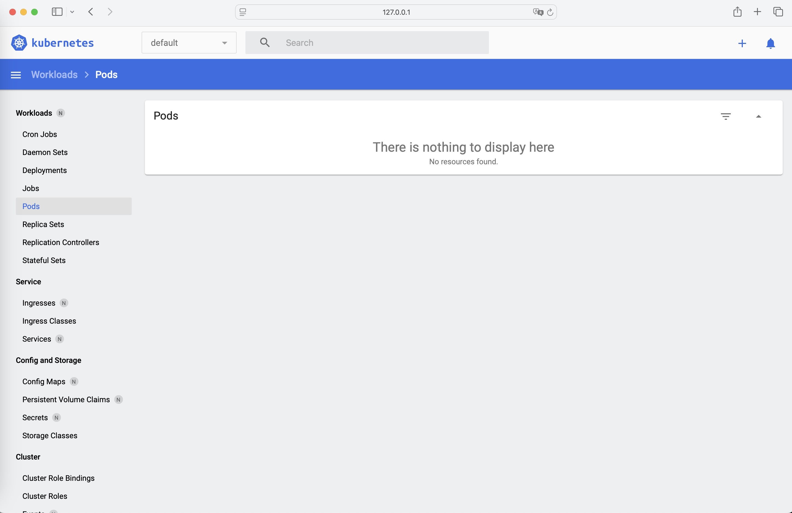

> minikube 安装
>
> 官方安装地址：https://minikube.sigs.k8s.io/docs/start/?arch=%2Fmacos%2Farm64%2Fstable%2Fbinary+download

## 安装所需配置

- 2 CPUs 或更多
- 2GB 可用内存
- 20GB 可用磁盘空间
- 网络连接
- 容器或虚拟机管理器，例如：Docker、QEMU、Hyperkit、Hyper-V、KVM、Parallels、Podman、VirtualBox 或 VMware Fusion/Workstation

## 1. 安装 MacOS 环境

~~~shell
$ brew install minikube

==> Auto-updating Homebrew...
Adjust how often this is run with HOMEBREW_AUTO_UPDATE_SECS or disable with
HOMEBREW_NO_AUTO_UPDATE. Hide these hints with HOMEBREW_NO_ENV_HINTS (see `man brew`).

==> Auto-updated Homebrew!
Updated 2 taps (homebrew/core and homebrew/cask).
==> New Formulae
ad                         comrak                     hcledit                    pgbackrest                 sdl3                       xeyes
aqtinstall                 dud                        hypopg                     pgrx                       sdl3_image                 xlsclients
astroterm                  evil-helix                 icann-rdap                 postgresql-hll             terraform-cleaner          xprop
behaviortree.cpp           gauth                      lazysql                    ramalama                   text-embeddings-inference  xwininfo
catgirl                    gdtoolkit                  libcdio-paranoia           redocly-cli                tf-summarize
cfnctl                     gnome-builder              ludusavi                   rink                       tfprovidercheck
cloud-provider-kind        gomi                       martin                     scryer-prolog              umka-lang
==> New Casks
chatwise                   flashspace                 gpt4all                    linearmouse@beta           startupfolder              valhalla-space-modulator
cherry-studio              font-maple-mono-cn         ik-product-manager         muteme                     thumbhost3mf               vernier-spectral-analysis
dana-dex                   font-maple-mono-nf-cn      imaging-edge-webcam        open-eid                   turbotax-2024
dockfix                    freelens                   leader-key                 oracle-jdk-javadoc@21      valhalla-freq-echo

You have 43 outdated formulae installed.

==> Downloading https://ghcr.io/v2/homebrew/core/minikube/manifests/1.35.0
############################################################################################################################################################# 100.0%
==> Fetching dependencies for minikube: kubernetes-cli
==> Downloading https://ghcr.io/v2/homebrew/core/kubernetes-cli/manifests/1.32.1
############################################################################################################################################################# 100.0%
==> Fetching kubernetes-cli
==> Downloading https://ghcr.io/v2/homebrew/core/kubernetes-cli/blobs/sha256:aac791b6b4f85b796c3d149d40eaffdba49182d9cb3c3bcc41bca1ebc0538334
############################################################################################################################################################# 100.0%
==> Fetching minikube
==> Downloading https://ghcr.io/v2/homebrew/core/minikube/blobs/sha256:7892fe64bf008ddcbb54b27bca16d162ba2ac2d6aae8c5a80459e4dc063fd6f7
############################################################################################################################################################# 100.0%
==> Installing dependencies for minikube: kubernetes-cli
==> Installing minikube dependency: kubernetes-cli
==> Downloading https://ghcr.io/v2/homebrew/core/kubernetes-cli/manifests/1.32.1
Already downloaded: /Users/h.a.hu/Library/Caches/Homebrew/downloads/47c7419673ed02e5314da5d2d37631aa9d7adb3bc34312665f7d68db0fc10834--kubernetes-cli-1.32.1.bottle_manifest.json
==> Pouring kubernetes-cli--1.32.1.arm64_sequoia.bottle.tar.gz
🍺  /opt/homebrew/Cellar/kubernetes-cli/1.32.1: 255 files, 60.7MB
==> Installing minikube
==> Pouring minikube--1.35.0.arm64_sequoia.bottle.tar.gz
==> Caveats
zsh completions have been installed to:
  /opt/homebrew/share/zsh/site-functions
==> Summary
🍺  /opt/homebrew/Cellar/minikube/1.35.0: 10 files, 118.2MB
==> Running `brew cleanup minikube`...
Disable this behaviour by setting HOMEBREW_NO_INSTALL_CLEANUP.
Hide these hints with HOMEBREW_NO_ENV_HINTS (see `man brew`).
==> Caveats
==> minikube
zsh completions have been installed to:
  /opt/homebrew/share/zsh/site-functions
~~~

## 2. 启动你的集群

~~~shell
$ minikube start

😄  minikube v1.35.0 on Darwin 15.3 (arm64)
✨  Automatically selected the docker driver
📌  Using Docker Desktop driver with root privileges
👍  Starting "minikube" primary control-plane node in "minikube" cluster
🚜  Pulling base image v0.0.46 ...
💾  Downloading Kubernetes v1.32.0 preload ...
    > preloaded-images-k8s-v18-v1...:  314.92 MiB / 314.92 MiB  100.00% 3.71 Mi
    > gcr.io/k8s-minikube/kicbase...:  452.84 MiB / 452.84 MiB  100.00% 4.07 Mi
🔥  Creating docker container (CPUs=2, Memory=7789MB) ...| E0211 17:47:35.000969   68322 network_create.go:103] failed to find free subnet for docker network minikube after 20 attempts: no free private network subnets found with given parameters (start: "192.168.49.0", step: 9, tries: 20)

❗  Unable to create dedicated network, this might result in cluster IP change after restart: un-retryable: no free private network subnets found with given parameters (start: "192.168.49.0", step: 9, tries: 20)
🐳  Preparing Kubernetes v1.32.0 on Docker 27.4.1 ...
    ▪ Generating certificates and keys ...
    ▪ Booting up control plane ...
    ▪ Configuring RBAC rules ...
🔗  Configuring bridge CNI (Container Networking Interface) ...
🔎  Verifying Kubernetes components...
    ▪ Using image gcr.io/k8s-minikube/storage-provisioner:v5
🌟  Enabled addons: storage-provisioner, default-storageclass
🏄  Done! kubectl is now configured to use "minikube" cluster and "default" namespace by default
~~~

## 3. 与您的集群交互

~~~shell
$ kubectl get po -A
NAMESPACE     NAME                               READY   STATUS    RESTARTS      AGE
kube-system   coredns-668d6bf9bc-hcwbb           1/1     Running   0             89s
kube-system   etcd-minikube                      1/1     Running   0             95s
kube-system   kube-apiserver-minikube            1/1     Running   0             95s
kube-system   kube-controller-manager-minikube   1/1     Running   0             95s
kube-system   kube-proxy-fj79v                   1/1     Running   0             90s
kube-system   kube-scheduler-minikube            1/1     Running   0             95s
kube-system   storage-provisioner                1/1     Running   1 (80s ago)   93s
~~~

或者，minikube 可以下载相应版本的 kubectl，你应该能够像这样使用它：

~~~shell
minikube kubectl -- get po -A
~~~

您还可以通过在 shell 配置中添加以下内容来使您的工作更轻松：

~~~shell
alias kubectl="minikube kubectl --"
~~~

最初，一些服务（如存储提供程序）可能尚未处于“运行”状态。这是集群启动期间的正常情况，并将立即自行解决。为了进一步了解你的集群状态，minikube 捆绑了 Kubernetes Dashboard，让你很容易适应你的新环境：

~~~shell
$ minikube dashboard

🔌  Enabling dashboard ...
    ▪ Using image docker.io/kubernetesui/dashboard:v2.7.0
    ▪ Using image docker.io/kubernetesui/metrics-scraper:v1.0.8
💡  Some dashboard features require the metrics-server addon. To enable all features please run:

	minikube addons enable metrics-server

🤔  Verifying dashboard health ...
🚀  Launching proxy ...
🤔  Verifying proxy health ...

🎉  Opening http://127.0.0.1:57728/api/v1/namespaces/kubernetes-dashboard/services/http:kubernetes-dashboard:/proxy/ in your default browser...
~~~

执行后，会弹出浏览器，进入到 dashboard 中。

## 4. 部署应用

### 4.1. Service

~~~shell
$ kubectl create deployment hello-minikube --image=kicbase/echo-server:1.0
deployment.apps/hello-minikube created

$ kubectl expose deployment hello-minikube --type=NodePort --port=8080
service/hello-minikube exposed
~~~

通过如下命令查询部署的服务：

~~~shell
$ kubectl get services hello-minikube
NAME             TYPE       CLUSTER-IP     EXTERNAL-IP   PORT(S)          AGE
hello-minikube   NodePort   10.96.20.192   <none>        8080:31157/TCP   32s
~~~

访问此服务的最简单方法是让 minikube 为您启动 web 浏览器：

~~~shell
$ minikube service hello-minikube

|-----------|----------------|-------------|-------------------------|
| NAMESPACE |      NAME      | TARGET PORT |           URL           |
|-----------|----------------|-------------|-------------------------|
| default   | hello-minikube |        8080 | http://172.17.0.3:31157 |
|-----------|----------------|-------------|-------------------------|
🏃  Starting tunnel for service hello-minikube.
|-----------|----------------|-------------|------------------------|
| NAMESPACE |      NAME      | TARGET PORT |          URL           |
|-----------|----------------|-------------|------------------------|
| default   | hello-minikube |             | http://127.0.0.1:60177 |
|-----------|----------------|-------------|------------------------|
🎉  Opening service default/hello-minikube in default browser...
❗  Because you are using a Docker driver on darwin, the terminal needs to be open to run it.
~~~

或者，使用 kubectl 来转发端口：

~~~shell
$ kubectl port-forward service/hello-minikube 7080:8080
Forwarding from 127.0.0.1:7080 -> 8080
Forwarding from [::1]:7080 -> 8080

Handling connection for 7080
Handling connection for 7080
Handling connection for 7080
Handling connection for 7080
Handling connection for 7080
~~~

执行上述命令后，可以在http://localhost:7080/上请求接口，展示如下：

~~~txt
Request served by hello-minikube-ffcbb5874-zvrq2

HTTP/1.1 GET /

Host: localhost:7080
Accept: text/html,application/xhtml+xml,application/xml;q=0.9,image/avif,image/webp,image/apng,*/*;q=0.8,application/signed-exchange;v=b3;q=0.7
Accept-Encoding: gzip, deflate, br, zstd
Accept-Language: en-US,en;q=0.9
Cache-Control: max-age=0
Connection: keep-alive
Sec-Ch-Ua: "Not(A:Brand";v="99", "Google Chrome";v="133", "Chromium";v="133"
Sec-Ch-Ua-Mobile: ?0
Sec-Ch-Ua-Platform: "macOS"
Sec-Fetch-Dest: document
Sec-Fetch-Mode: navigate
Sec-Fetch-Site: cross-site
Sec-Fetch-User: ?1
Upgrade-Insecure-Requests: 1
User-Agent: Mozilla/5.0 (Macintosh; Intel Mac OS X 10_15_7) AppleWebKit/537.36 (KHTML, like Gecko) Chrome/133.0.0.0 Safari/537.36
~~~

