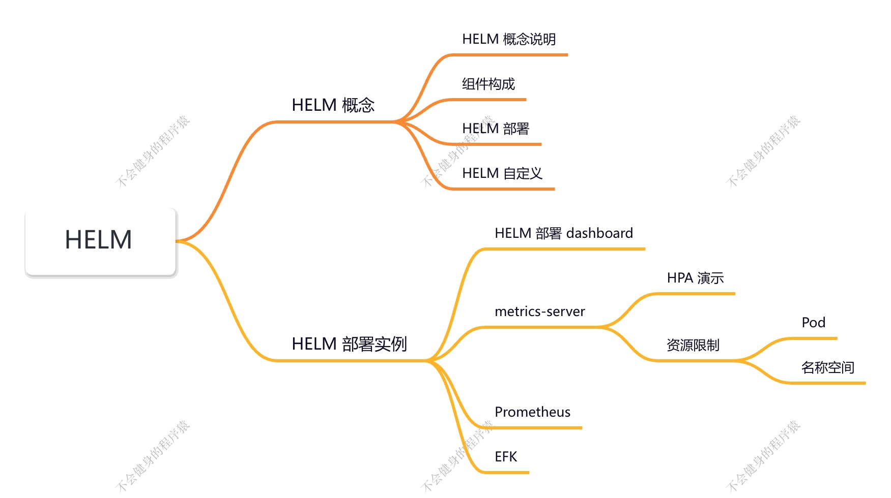
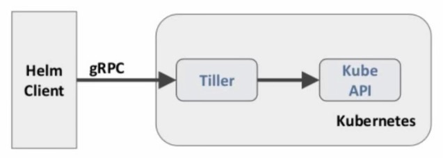
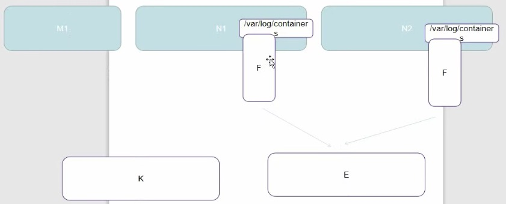

# HELM

## 什么是 HELM

> https://helm.sh/
>
> https://github.com/helm/helm

在没使用 helm 之前，向 kubernetes 部署应用，我们要依次部署 deployment、svc 等，步骤较繁琐。况且随着很多项目微服务化，复杂的应用在容器中部署以及管理显得较为复杂，helm 通过打包的方式，支持发布的版本管理和控制，很大程度上简化了 Kubernetes 应用的部署和管理。

Helm 本质就是让 K8S 的应用管理（Deployment，service 等）可配置，能动态生成。通过动态生成 K8S 资源清单文件（deployment.yaml，service.yaml）。然后调用 Kubectl 自动执行 K8s 资源部署。

Helm 是官方提供的类似于 YUM 的包管理器，是部罢环境的流程封装。Helm 有两个重要的概念：**chart** 和 **release**

- chart 是创建一个应用的信息集合，包括各种 Kubernetes 对象的配置模板、参数定义、依赖关系、文档说明等。chart 是应用部署的自包含逻辑单元。可以将 chart 想象成 apt、yum中的软件安装包。
- release 是 chart 的运行实例，代表了一个正在运行的应用。当 chart 被安装到 Kubernetes 集群，就生成一个 release。chart 能够多次安装到同一个集群，每次安装都是一个 release。

Helm 包含两个组件：Helm 客户端和 Tiller 服务器，如下图所示：

**Helm 客户端**负责 chart 和 release 的创建和管理以及和 Tiller 的交互。

**Tiller 服务器**运行在 Kubernetes 集群中，它会处理 Helm 客户端的请求，与 Kubernetes APl Server 交互。

## HELM 部署

https://helm.sh/docs/intro/install/

> 越来越多的公司和团队开始使用 Helm 这个 Kubernetes 的包管理器，我们也将使用 Helm 安装 Kubernetes 的常用组件。Helm 由客户端 helm 命令行工具和服务端 tiller 组成，Helm 的安装十分简单。 下载 helm 命令行工具到 master 节点 node1 的 `/usr/local/bin` 下，这里下载的 2.13.1 版杰：

~~~bash
$ ntpdate  ntp1.aliyun.com

$ wget https://storage.googleapis.com/kubernetes-helm/helm-v2.13.1-linux-amd64.tar.gz

$ tar -zxvf helm-v2.13.1-linux-amd64.tar.gz

$ cd linux-amd64/

$ cp helm/usr/local/bin/

# 赋予权限
$ chmod a+x /usr/local/bin/helm
~~~

为了安装服务端 tiler，还需要在这台机器上配置好 kubectl 工具和 kubeconfig 文件，确保 kubectl 工具可以在这台机器上访问 apiserver 且正常使用。 这里的 node1 节点以及配置好了 kubectl。

因为 Kubernetes APIServer 开启了 RBAC 访问控制，所以需要创建 tiller 使用的 service account: tiller 并分配合适的角色给它。详细内容可以查看 helm 文档中的 Role-based Access Control。这里简单起见直接分配 cluster-admin 这个集群内置的 ClusterRole 给它。

创建 rbac-config.yaml 文件：

~~~yaml
apiversion: v1
kind: ServiceAccount
metadata:
  name: tiller
  namespace: kube-system
---
apiversion: rbac.authorization.k8s.io/vlbetal
kind: clusterRoleBinding
metadata:
  name: tiller
roleRef:
  apiGroup: rbac.authorization.k8s.io
  kind: ClusterRole
  name: cluster-admin
subjects:
- kind: serviceAccount
  name: tiller
  namespace: kube-system
~~~

~~~bash
$ kubectl create -f rbac-config.yaml
~~~

~~~bash
# 在集群中部署 tiller
$ helm init --service-account tiller --skip-refresh

$ kubectl get pod -n kube-system

$ sz rbac.yaml # 从服务器上下载 rbac.yaml 文件

$ docker save -o tiller.tar.gz gci.io/kubernetes-helm/tiller:v2.13.1
~~~

## tiller 默认被部署在 K8S 集群中的 kube-system namespace 下

~~~bash
$ kubectl get pod -n kube-system -l app=helm
NAME														READY 	STATUS	RESTARTS	AGE
tiller-deploy-c4fd4cd68-dwkhv		1/1			Running	0					83s

$ helm version
~~~

## HELM 自定义模版

**Step1. 创建文件夹**

~~~bash
$ mkdir ./hello-world
$ cd /hello-world
~~~

**Step2. 创建自描述文件 Chart.yaml，这个文件必须有 name 和 version 定义**

~~~bash
$ cat <<'EOF' > ./Chart.yaml
name: hello-world
version: 1.0.0
EOF
~~~

**Step3. 创建模版文件，用于生成 K8S 资源清单（manifests）**

~~~bash
$ mkdir ./templates

$ cat <<'EOF' > ./templates/deployment.yaml
apiversion: extensions/vibeta1
kind: Deployment
metadata:
  name: hello-world
spec:
  replicas: 1
  template:
    metadata:
      labels:
        app: hello-world
    spec:
      containers:
      - name: hello-world
        image: hub.atguigu.com/library/myapp:v1
        ports:
          containerPort: 80
          protocol: TCP
EOF

$ cat <<'EOF' > ./templates/service.yaml
apiversion: v1
kind: Service
metadata:
  name: hello-world
spec:
  type: NodePort
  ports:
  - port: 80
    targetPort: 80
    protocol: TCP
  selector:
    app: hello-world
EOF
~~~

**Step4. 使用命令 helm install RELATIVE_PATCH_TO_CHART 创建一次 Release**

~~~bash
$ helm install .
~~~

~~~bash
$ helm list

$ helm upgrade {helm-name} .

$ helm help

$ helm history {helm-name}

$ helm status {helm-name}

# 可以使用外部浏览器访问：{集群 IP}:{暴露端口号}
~~~

~~~bash
#列出已经部署的 Release
$ helm 1s
#查询一个特定的 Release 的状志
$ helm status RELEASE_NAME
#移除所有与这个 Release 相关的 Kubernetes 资源
$ helm delete cautious-shrimp
$ helm rollback RELEASE_NAME REVISION_NUMBER
$ helm rollback cautious-shrimo 1
# 使用 helm delete --purge RELEASE_NAME 移除所有与指定 Release 相关的 Kubernetes 资源和所有这个Release 的记录
$ helm delete --purge cautious-shrimp
$ helm ls --deleted
$ helm list --deleted
~~~

### **如何动态更新 image：**

**配置提现在配置文件：values.yaml**

~~~bash
$ cat <<'EOF' > ./values.yaml
image:
  repository: gcr.io/google-samples/node-hello
  tag:'2.0'
EOF
~~~

~~~bash
$ cat <<'EOF' >./templates/deployment.yaml
apiversion: extensions/v1beta1
kind: Deployment
metadata:
  name: hello-world
spec:
  replicas: 1
  template:
    metadata:
      labels:
        app: hello-world
    spec:
      containers:
      - name: hello-world
        image: {{ .values.image.repository }}:{{ .Values.image.tag }}
        ports:
        - conteinerPort: 8080
          protoco1: TCP
EOF
~~~

升级版本

~~~bash
$ helm upgrade {helm-name} .
~~~

在 valves.yaml 中的值可以被部署 release 时用到的参数 --values YAML_FILE_PATH 或 --set key1=value1, key2=value2 覆盖掉

> 手动设置

~~~bash
$ kubectl upgrade {helm-name} --set image.tag='v3' .

$ helm install --set image.tag='latest' .
~~~

### Debug

使用模板动态生成 K8S 资源清单，非常需要能提前预览生成的结果。

使用 --dry-run --debug 选项来打印出生成的清单文件内容，而不执行部署

~~~bash
$ helm install . --dry-run --debug --set image.tag=latest
~~~

# Dashboard

> Dashboard 可以操作集群了

> 使用 helm 部署 dashboard

~~~bash
$ mkdir dashboard

$ cd dashboard

$ helm repo list

$ helm fetch stable/kubernetes-dashboard

# 先解压，然后进入到文件夹中

$ docker load -i dashboard.tar # 加载 image
~~~

**kubernetes-dashboard.yaml**

~~~yaml
image:
  repository: k8s.gcr.io/kubernetes-dashboard-amd64
  tag: v1.18.1
ingress:
  enabled: true
  hosts:
  - k8s.frognew.com
  annotations:
    nginx.ingress.kubernetes.io/ssl-redirect: "true"
    nginx.ingress.kubernetes.io/backend-protocol: "HTTPS"
  t1s:
  - secretName: frognew-com-tls-secret
    hosts:
    - k8s.frognew.com
rbac:
  clusterAdminRole: true
~~~

**进行安装：**

> 根据本地目录安装

~~~bash
$ helm install . -n kubernetes-dashboard --namespace kube-system -f kubernetes-dashboard.yaml
~~~

~~~bash
$ kubectl get pod -n kube-system -o wide

$ kubectl get svc -n kube-system

~~~

**获取 dashboard token：**

~~~bash
$ kubectl -n kube-system get secret | grep kupernetes-dasnboard-token

$ kubectl describe secret {token-name} -n kube-system
~~~

# Metrics-server

https://kubernetes.io/zh-cn/docs/tasks/debug/debug-cluster/resource-metrics-pipeline/

https://github.com/kubernetes-sigs/metrics-server

# Prometheus

Prometheus github：https://github.com/prometheus-operator/kube-prometheus

## 组件说明

1. MetricServer：是 kubernetes 集群资源使用情况的聚合器，收集数据给 kubernetes 集群内使用，如 kubectl、hpa、scheduler 等。
2. PrometheusOperator：是一个系统监测和警报工具箱，用来存储监控数据。
3. NodeExporter：用于各 node 的关键度量指标状态数据。
4. KubeStateMetrics：收集 kubernetes 集群内资源对象数据，制定告警规则。
5. Prometheus：采用 pull 方式收集 apiserver、scheduler、controller-manager、kubelet 组件数据，通过 http 协议传输。
6. Grafana：是可视化数据统计和监控平台。

## 构建记录

~~~bash
$ mkdir prometheus
$ cd prometheus

$ git clone https://github.com/coreos/kube-prometheus.git

$ cd kube-prometheus/manifests/ # 目录中，会发现很多 yaml 文件
~~~

**修改 grafana-service.yaml 文件，使用 nodepode 方式访问 grafana：**

~~~bash
$ vim grafana-service.yaml
apiVersion: v1
kind: Service
metadata:
  name: grafana
  namespace: monitoring
spec:
  type: NodePort		#添加内容
  ports:
  - name: http
    port: 3000
    targetPort: http
    nodePort: 30100	#添加内容
  selector:
    app: grafana
~~~

**修改 prometheus-service.yaml，改为 nodepode**

~~~bash
$ vim prometheus-service.yaml
apiVersion: v1
kind: Service
metadata:
  labels: 
    prometheus: k8s
  name: prometheug-k8s
  namespace: monitoring
spec:
  type: NodePort
  ports:
  - name: web
    port: 9090
    targetPort: web
    nodePort: 30200
  selector:
    app: prometheus
    prometheus: k8s
~~~

**修改 alertmanager-service.yaml，改为 nodepode**

~~~bash
$ vim alertmanager-service.yaml
apiversion:v1
kind: Service
metadata:
  labels:
    alertmanager: main
  name: alertmanager-main
  namespace: monitoring
spec:
  type: NodePort
  ports:
  - name: web
    port: 9093
    targetPort: web
    nodePort: 30300
  selector:
    alertmanager: main
    app: alertmanager
~~~

~~~bash
$ cd kube-prometheus/manifests/

$ kubectl apply -f ../manifests/ # 可以多运行几次

$ kubectl get pod -n monitoring

$ kubectl top node 

$ kubectl top pod

$ kubectl get svc --all-namespace
~~~

这时就可以在浏览器访问到 prometheus 了。

### 访问 prometheus

prometheus 对应的 nodeport 端口为 30200，访问 http://MasterlP:30200

通过访问 http://MasterlP:30200/target 可以看到 prometheus 已经成功连接上了 k8s 的 apiserver

### 访问 grafana

# Horizontal Pod Autoscaling

官方网站：https://kubernetes.io/zh-cn/docs/tasks/run-application/horizontal-pod-autoscale-walkthrough/

Horizontal Pod Autoscaling 可以根据 CPU 利用率自动伸缩一个 Replication Controller、Deployment 或者 Replica Set 中的 Pod 数量。

> 为了演示 Hoxizontal Pod Autoscaler，我们将使用一个基于 php-apachs 镜像的定制 Docker 镜像：在[这里](https://k8smeetup.github.io/áocs/user-guide/horizontai-pod-autoscaling/image/Dockerfile)您可以直看完整的Dockerfile 定义。
>
> 镜像中包括一个[index.php)(https://k8smeetup,github.io/docs/user-guide/horizontai-pod-autoscaling/image/index.php)页面，其中包含了一些可以运行CPD毫集计算仔务的代码

~~~bash
# --requests-cpu=200m 这也是 docker 的资源限定
$ kubectl run php-apache --image=gcr.io/google_containers/hpa-example --requests-cpu=200m --expose --port=80
~~~

创建 HPA 控制器 

~~~bash
$ kubectl autoscale deployment php-apache --cpu-percent=50 --min=1 --max=10

# 获取到资源的命令
$ kubectl top pod php-apache-*****-***

# hpa 的资源查询命令
$ kubectl get hpa 
~~~

增加负载，查看负载节点数目

~~~bash
# 启动一个 pod ，然后请求我们不熟的 php 的接口
$ kubectl run -i --tty load-generator --image=busybox /bin/sh
$ while true; do wget -q -O- http://php-apache.default.svc.cluster.local; done
~~~

~~~bash
# 持续监控
$ kubectl get hpa -w
~~~

# 资源限制 - Pod

Kubernetes 对资源的限制实际上是通过 cgroup 来控制的，cgroup 是容器的一组用来控制内核如何运行进程的相关属性集合。针对内存、CPU 和各种设备都有对应的cgroup。

默认情况下，Pod 运行没有 CPU 和内存的限额。这意味着系统中的任何 Pod 将能够像执行该 Pod 所在的节点一样，消耗足够多的 CPU 和内存。一般会针对某些应用的 pod 资源进行资源限制，这个资源限制是通过 resources 的 requests 和 limits 来实现

~~~yaml
spec:
  containers:
  - image: XXXX
    imagepullpolicy: Always
    name: auth
    ports:
    - containerPort: 8080
      protoco1: TCP
    resources:
      limits:
        cpu: "4"
        memory: 2Gi
      requests:
        cpu: 250m
        memory: 258Mi
~~~

requests 要分配的资源（初始值），limits 为最高请求的资源值（最大值）。可以简单理解为初始值和最大值。

# 资源限制 - 命名空间

1. **计算资源配额**

~~~yaml
apiVersion: v1
kind: ResourceQuota
metadata:
  name: compute-resources
  namespace: spark-cluster
spec:
  hard:
    pods: "20"
    requests.cpu: "20"
    requests.memory: 100Gi
    limits.cpu: "40"
    limits.memory: 200Gi
~~~

2. **配置对象数量配额限制**

~~~yaml
apiVersion: v1
kind: ResourceQuota
metadata:
  name: object-counts
  namespace: spark-cluster
spec:
  hard:
    configmaps: "10"
    persistentvolumeclaims: "4"
    replicationcontrollers: "20"
    secrets: "10"
    services: "10"
    services.loadbalancers: "2"
~~~

3. 配置 CPU 和 内存 LimitRange

~~~yaml
apiVversion: v1
kind: LimitRange
metadata:
  name: mem-limit-range
spec:
  limits:
  - default:
      memory: 50Gi
      cpu: 5
    defaultRequest:
      memory: 1Gi
      cpu: 1
    type: container
~~~

- `default` 即 limit 的值
- `defaultRequest` 即 request 的值

# EFK 日志

> Logstash 
>
> ELK -> EFK  
>
> 用 Fluentd 替换 Logstash
>
> E：Elasticsearch
>
> K：kibana

~~~bash
$ cd /var/log/containers/ # 这里就是当前节点中所有 Pod 的日志信息

$ mkdir efk # 先创建一个 efk 的目录

~~~

## 添加 Google incubator 仓库

~~~bash
$ helm repo add incubator http://storage.googleapis.com/kubernetes-charts-incubator
~~~

## 部署 Elasticsearch

~~~bash
$ kubectl create namespace efk		# 创建 efk 命名空间

$ helm fetch incubator/elasticsearch
elasticsearch-1.10.2.tgz

$ tar -zxvf elasticsearch-1.10.2.tgz # 打开 values.yaml 文档，修改一下 MINIMUM_MASTER_NODES 为 1，客户端副本 client.replicas 为 1。master.replicas 为 1。PV 关闭。data.replicas 为 1。data.persistence.enabled 为 false。

# 启动 es
$ helm install --name els1 --namespace=efk -f values.yaml incubator/elasticsearch

$ kubectl get pod -n efk

$ kubectl get svc -n efk # 获取 CLUSTER IP

# 进行验证一下
$ kubectl run cirror-$RANDOM --rm -it --image=cirros -- /bin/sh
/ # curl {CLUSTER IP}:9200/_cat/nodes
~~~

## 部署 Fluentd

~~~bash
$ helm fetch stable/fluentd-elasticsearch
fluentd-elasticsearch-2.0.7.tgz

$ tar -zxvf fluentd-elasticsearch-2.0.7.tgz

$ cd fluentd-elasticsearch

$ vim values.yaml # 更改其中 Elasticsearch 访问地址 {CLUSTER IP}

$ helm install -name flu1 --namespace=efk -f values.yaml .

$ kubectl get pod -n efk

$ kubectl get pod -n efk -o wide
~~~

## 部署 Kibana

~~~bash
$ helm fetch stable/kibana --version 0.14.8 # 修改 es 的信息

# 部署
$ helm install --name kibana1 --namespace=efk -f values.yaml stable/kibana -version 0.14.8 

$ kubectl get svc -n efk

$ kubectl edit s v c kibana1-kibana -n efk # 修改 类型为 NodePort

$ kubectl get svc -n efk	# 浏览器中打开
~~~

> E、K 的版本一定要一致

