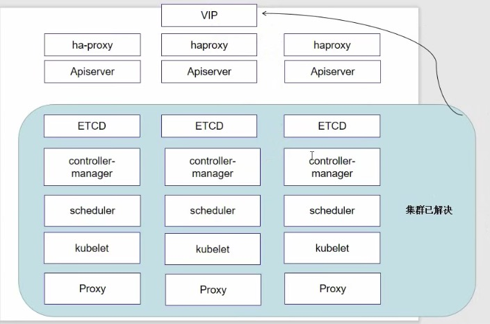

# 高可用的 K8S 构建

当有多台 master 节点时

Apiserver 不影响

ETCD 会自动形成高可用集群

controller-manager：只会有一个会执行，其他的会挂起

schduler：只会有一个会执行，其他的会挂起

## 瑞云

> 通过实现 ha-proxy 来实现的
>
> https://github.com/wise2c-devops/breeze/blob/master/BreezeManual-CN.md

### 操作步骤

#### 设置系统主机名以及 Host 文件的相互解析

> `hostnamectl` 是 **Linux 命令**，属于 `systemd` 工具集的一部分，用于管理系统的主机名（Hostname）及相关信息。

~~~bash
$ hostnamectl set-hostname k8s-master01
$ hostnamectl set-hostname k8s-master02
$ hostnamectl set-hostname k8s-master03
~~~

#### 安装依赖包

> 每个节点都需要安装

~~~bash
$ yum install -y conntrack ntpdate ntp ipvsadm ipset jq iptables curl sysstat libseccomp wget vim net-tools git

# 修改每个节点的 etc/hosts
$ vim etc/hosts
192.168.*.* k8s-master01
192.168.*.* k8s-master01
192.168.*.* k8s-master02
192.168.*.* k8s-vip

# 可以是用 scp 命令进行传递
$ scp /etc/hosts root@k8s-master02:/etc/hosts
$ scp /etc/hosts root@k8s-master03:/etc/hosts
~~~

#### 设置防火墙为 Iptables 并设置空规则

~~~bash
$ systemctl stop firewalld && systemctl disable firewalld
$ yum -y install iptables-services && systemctl start iptables && systemctl 
$ enable iptables && iptables -F && service iptables save
~~~

#### 关闭 SELINUX

~~~bash
$ swapoff -a && sed -i '/ swap / s/^(.*\)$/#\1/g' /etc/fstab

$ setenforce 0 && sed -i 's/^SELINUX=.*/SELINUX=disabled/" /etc/selinux/config
~~~

#### 调整内核参数，对于 K8S

~~~bash
$ cat > kubernetes.conf <<EOF> 
net.bridge.bridge-nf-call-iptables=1
net.bridge.bridge-nf-call-ip6tables=1
net.ipv4.ip forward=1
net.ipv4.tcp tw recycle=0
vm.swappiness=0 # 禁止使用 swap 空间，只有当系统 00M 时才允许使用它
vm.overcommit_memory=1 #不检查物理内存是否够用
vm.panic_on_oom=0 #开启 00M
fs.inotify.max_user_instances=8192
fs.inotify.max_user_watches=1048576
fs.file-max=52706963
fs.nr_open=52706963
net.ipv6.conf.all.disable ipv6=1
net.netfilter.nf_conntrack_max=2310720
EOF

$ cp kubernetes.conf /etc/sysctl.d/kubernetes.conf

$ sysctl -p /etc/sysctl.d/kubernetes.conf	# 刷新生效
~~~

#### 调整系统时区

~~~bash
# 设置系统时区为 中国/上海
$ timedatectl set-timezone Asia/Shanghai
# 将当前的 UTC 时间写入硬件时钟
$ timedatectl set-local-rtc 0
# 重启依赖于系统时间的服务
$ systemctl restart rsyslog
$ systemctl restart crond
~~~

#### 关闭系统不需要服务

~~~bash
$ systemctl stop postfix && systemctl disable postfix
~~~

#### 设置 rsyslog 和 systemd journald

#### 升级系统内核至 4.4

#### 关闭 NUMA

## kubeadm 部署

#### kube-proxy 开启 ipvs 的前置条件

#### 安装 Docker 软件

#### 在主节点启动 Haproxy 与 Keepalived 容器

导入脚本 -> 运行 -> 查看可用节点

#### 安装 Kubeadm（主从配置）

第二个主节点执行后，运行加入集群的主节点命令。

