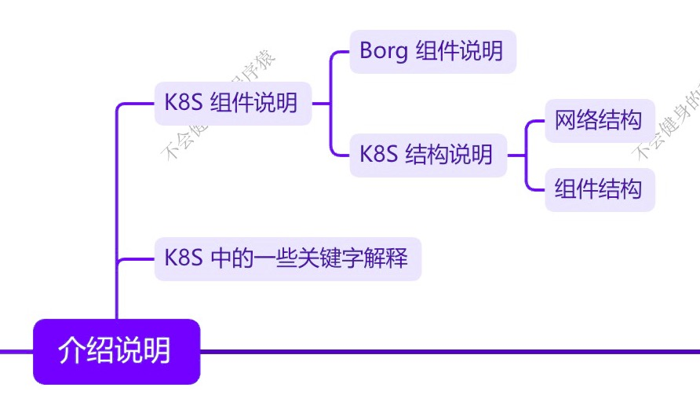

## K8S 组件介绍

### Control Plane

**Scheduler** 把任务交给 **API Server**，**API Server** 会写入到 **etcd**。**Scheduler** 不会跟 **etcd** 直接进行交互。

在 1.32 版本中，**ReplicaSet** 替换掉了原来的 **ReplicationController** 组件。

**API Server** 一切服务的访问的入口。

**ETCD**  持久化存储，可信赖的分布式键值存储服务，它能够为整个分布式集群存储一些关键数据，协助分布式集群的正常运转。保存整个分布式系统需要持久化的配置文件或配置信息。一旦集群挂掉，需要借助 etcd 中的数据进行恢复。K8S 集群中使用 ETCD V3 （Database）版本，而 V2（Memory） 版本被弃用。

### Node

**kubelet** 的作用：会与 CRI（Container、Runtime、Interface） 交互，也就是 Docker 在 Node 中的表现形式。kubelet 会与 Docker 进行交互，操作 Docker 创建对应的容器。**kubelet** 会维持 **Pod** 的生命周期。

**kube proxy**：操作 firewall（或IPVS） 来进行 Pod 的映射。

---

**API Server**：所有服务访问的统一入口。

**Scheduler**：负责接口任务，选择合适的节点进行分配任务。

**ETCD**：键值对数据库，存储K8S集群所有重要信息（需要持久化的数据）

**kubelet**：直接跟容器引擎进行交互，实现容器的生命周期管理

**kube proxy**：负责写入规则至 iptables、IPVS 实现服务映射访问的。

DNS：可以为集群中的 SVC 创建一个域名 IP 的对应关系解析。

Dashboard：给 K8S 集群提供一个 B/S 结构访问体系。

Ingress controller：官方只能实现四层代理、ingress 可以实现七层代理。

federation：提供一个可以跨集群中心多 K8S 统一管理功能。它允许你跨多个 Kubernetes 集群管理资源。

Prometheus：提供一个 K8S 集群的监控能力

ELK：提供 K8S 集群日志统一分析介入平台。

tips：高可用集群副本数最好是 >= 3 奇数个

