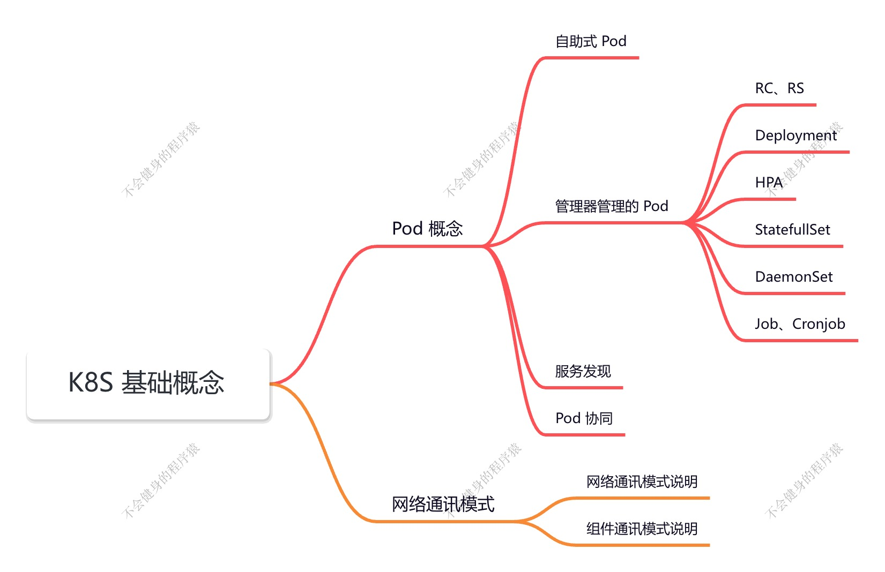
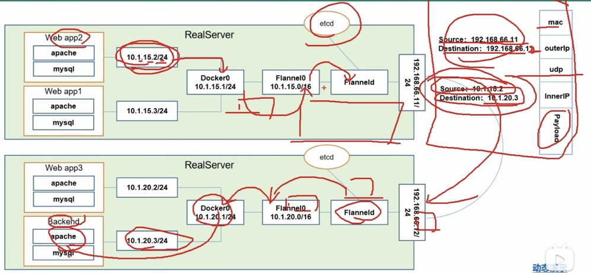
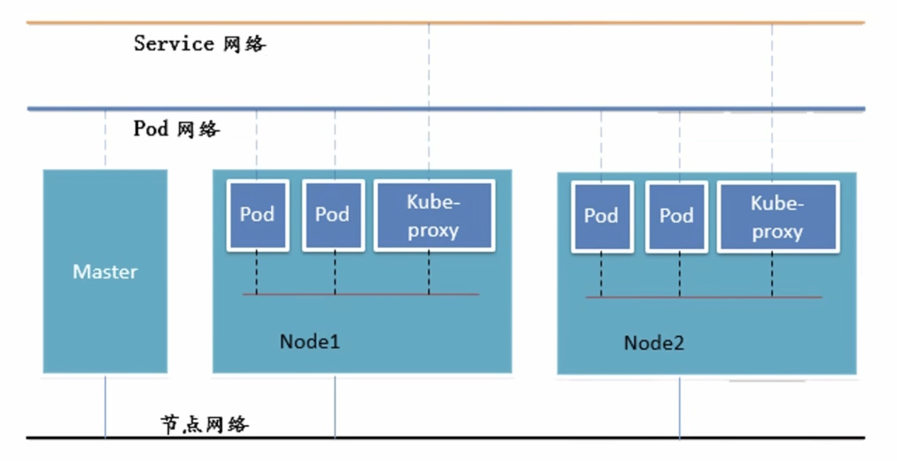

## K8S 基础概念

### Pod 概念

Pod 分为两类：

- 自助式 Pod
- 控制器管理的 Pod

只要 Pod 启动，他里边就会启动一个 pause 容器。

在同一 Pod 中，容器的端口不能冲突。

在同一 Pod 即共享网络，又共享存储卷。

#### Pod 控制器类型

- ReplicaSet & Deployment

  > **ReplicaSet**：确保容器应用的副本数始终保持在用户定义的副本数，即如果有容器异常退出，会自动创建新的 Pod 来替代；而如果异常多出来的容器也会自动回收。支持集合式的 selector。
  >
  > 
  >
  > Deployment 部署后，创建 ReplicaSet，ReplicaSet 来创建 Pod。
  >
  > Deployment 在滚动更新时，会保存老版本的 RS。

  - HPA（HorizontalPodAutoScale）

    > 仅适用于 Deployment 和 ReplicaSet，在 V1 版本中仅支持根据 Pod 的 CPU 利用率扩缩容，在 vlalpha 版本中，支持根据内存和用户自定义的 metric 扩缩容。
    >
    > 例如：HPA（定义：CPU>80, max 10, min 2） -> RS -> 2 Pod，当 pod 的利用率 > 80 时，会自动创建 Pod，直到最大值，但是如果说创建第 3 个 pod ，平均利用率到 80 了，就不会再创建了。

- StatefulSet

  > StatefuSet 是为了解决又状态服务的问题（对应 Deployments 和 ReplicaSets 是为无状态服务而设计），其应用场景包括：
  >
  > 1. 稳定的持久化存储，即 Pod 重新调度后还能访问到相同的持久化数据，基于 PVC 来实现
  > 2. 稳定的网络标志，即 Pod 重新调度后其 PodName 和 HostName 不变，基于 Headless Service（即没有 Cluster IP 的 Service） 来实现
  > 3. 有序部署，有序扩展，即 Pod 是有顺序的，在部署或者扩展的时候要依据定义的顺序依次依次进行（即从 0 到 N-1，在下一个 Pod 运行之前所有之前的 Pod 必须都是 Running 和 Ready 状态），基于 init containers 实现
  > 4. 有序收缩，有序删除（即从 N-1 到 0）

- DaemonSet

  > DaemonSet 确保全部（或者一些 - 打了污点的node 不运行）Node 上运行一个 Pod 的副本。当有 Node 加入集群时，也会为他们新增一个 Pod。当有 Node 从集群移除时，这些 Pod 也会被回收。删除 DaemonSet 将会删除它创建的所有 Pod。
  >
  > 使用DamonSet 的一些典型用法：
  >
  > 1. 运行集群存储 daemon，例如在每个 Node 上运行 glusterd、ceph
  > 2. 在每个 Node 上运行日志手机 daemon，例如 fluentd、logstash
  > 3. 在每个 Node 上运行监控 daemon，例如 Prometheus Node Exporter

- Job，CronJob

  > Job 负责批处理任务，即仅执行一次的任务，它保证批处理任务的一个或多个 Pod 成功结束。
  >
  > Cron Job 管理基于时间的 Job，即：
  >
  > 1. 在给定时间点只运行一次
  > 2. 周期性地在给定时间点运行

  

#### 服务发现

Service

通过 Service 来连接 Pod，进行服务发现。外部流量请求 Pod 中，先请求 Service。

## 网络通讯方式

K8S 的网络模型假定了所有 Pod 都在一个可以直接连通的扁平的网络空间中，这在 GCE（Google Compute Engine）里边是现成的网络模型，K8S 假定这个网络已经存在。而在私有云里搭建 K8S 集群，就不能假定这个网络已经存在了。我们需要自己实现这个网络架设，将不同节点上的 Docker 容器之间的互相访问先打通，然后运行 K8S。

同一个 Pod 内的多个网络之间：lo

各 Pod 之间的通讯：Overlay Network

Pod 与 Service 之间的通讯：各节点的 Iptables 规则

Flannel 是 CoreOS 团队针对 K8S 设计的一个网络规划服务，简单来说，它的功能是让集群中的不同节点主机创建的 Docker 容器都具有全集唯一的虚拟 IP 地址。而且它还能在这些 IP 地址之间建立一个覆盖网络（Overlay Network），通过这个覆盖网络，将数据包原封不动地传递到目标容器中。

ETCD 之 Flannel 提供说明：

1. 存储管理 Flannel 可分配的 IP 地址段资源
2. 监控 ETCD 中每个 Pod 的实际地址，并在内存中建立维护 Pod 节点路由表

---

通一个 Pod 内部通讯：同一个 Pod 共享同一个网络命名空间，共享同一个 linux 协议栈

Pod1 至 Pod2：

- Pod1 与 Pod2 不在同一台主机，Pod的地址是与docker0在同一个网段的，但docker0网段与宿主机网卡是两个完全不同的IP网段，并且不同Node之间的通信只能通过宿主机的物理网卡进行。将Pod的IP和所在Node的IP关联起来，通过这个关联让Pod可以互相访问
- Pod1 与 Pod2 在同一台机器，由 Docker0 网鞒直接转发请求至 Pod2，不需要经过 Flannel

Pod 至 Service 的网络:

​	目前基于性能考虑，全部为 iptables 维护和转发，现在应该是用的 LVS

Pod 到外网：

​	Pod 向外网发送请求，查找路由表，转发数据包到宿主机的网卡，宿主网卡完成路由选择后，iptables 执行 Masquerade，把源 IP 更改为宿主网卡的 IP，然后向外网服务器发送请求

外网访问 Pod：Service

