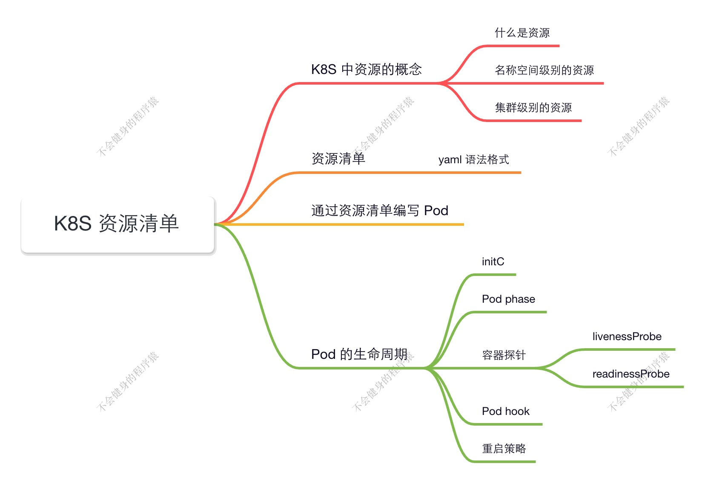
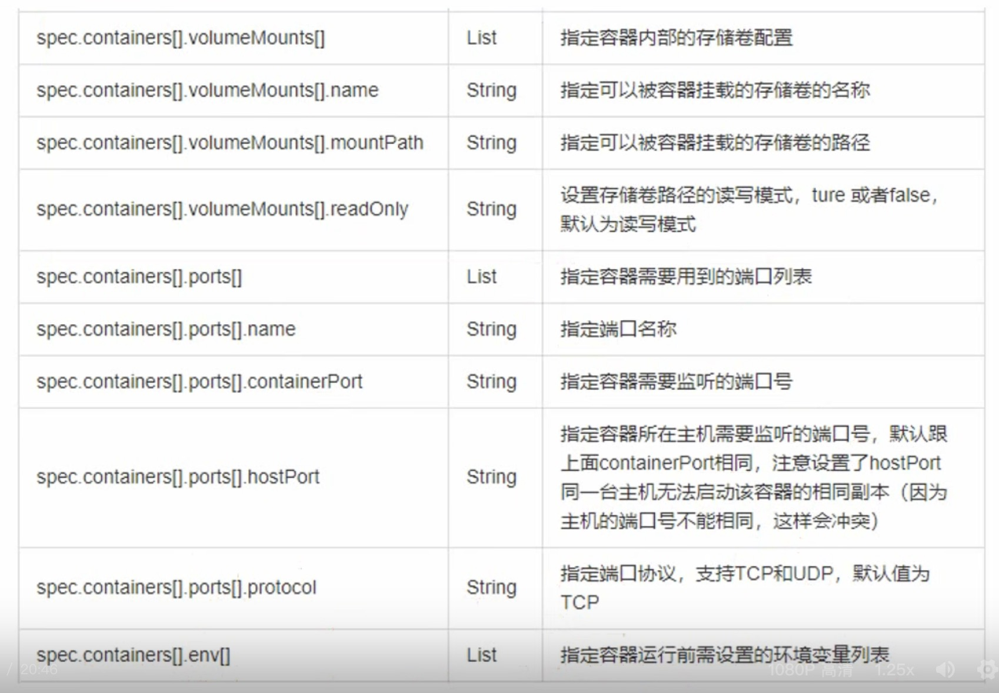
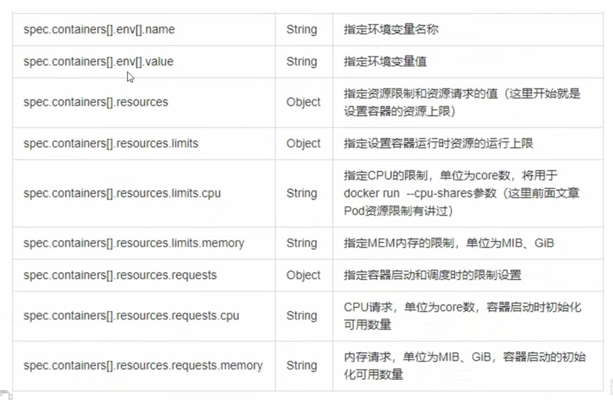
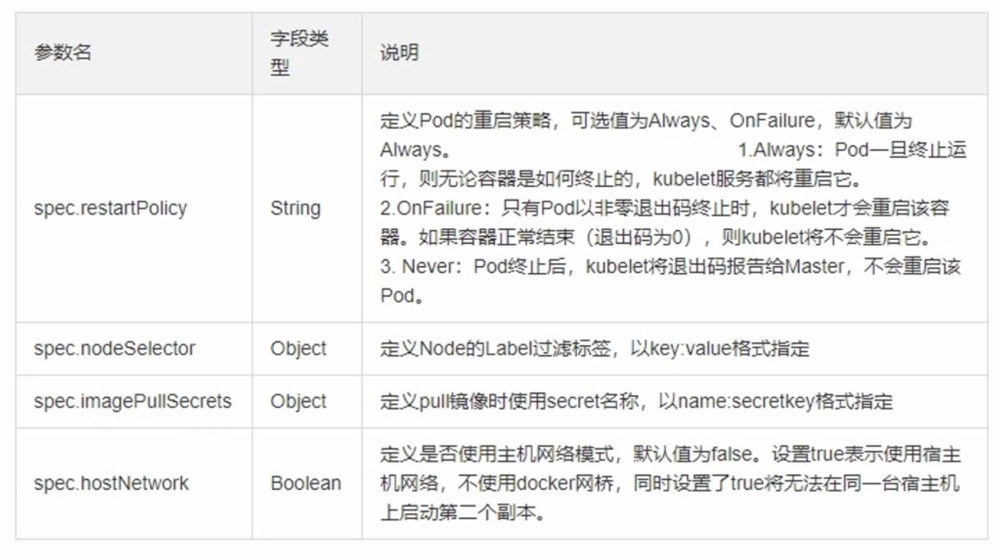
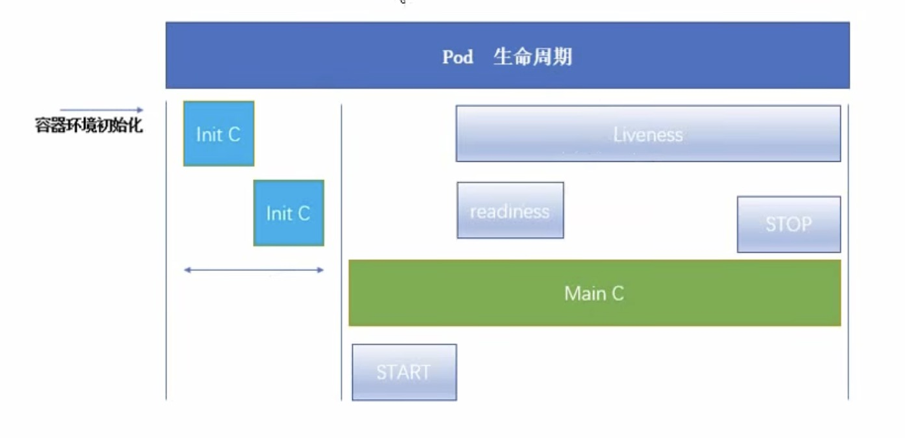

## K8S 资源清单

### K8S 中的资源

集群资源分类：

- 名称空间级别：

  kubeadmin 安装 k8s 集群时，K8S 本身的组件，是安装在 kube-system 名称空间下

  kubectl get pod （默认会带 -n default 命名空间下获取）

- 集群级别

  role，一旦定义后，在在全集群中都能被可见，并调用。

- 元数据型

  HPA 典型的元数据型，根据指标来进行扩缩容

K8S 中所有的内容都抽象为资源，资源实例化之后，叫做对象。

**名称空间级别资源**

工作负载型资源（workload）：Pod、ReplicaSet、Deployment、StatefuSet、DaemonSet、Job、CronJob（ReplicationController 在 v1.11 版本被废弃）

服务发现及负载均衡型资源（ServiceDiscovery LoadBalance）：Service、Ingress、...

配置与存储型资源：Volume（存储卷）、CSI（容器存储接口，可以扩展各种各样的第三方存储卷）

特殊类型的存储卷：ConfigMap（当配置中心来使用的资源类型）、Secret（保存敏捷数据）、DownwardAPI（把外部环境中的信息输出给容器）

**集群级资源**

Namespace、Node、Role、ClusterRole、RoleBingding、ClusterRoleBinding

**元数据型资源**

HPA、PodTemplate、LimitRange

### 资源清单 - YAML 格式

在 k8s 中，一般使用 yaml 格式的文件来创建符合我们预期期望的 pod，这样的 yaml 文件我们一般称为资源清单。

**简单说明**

是一个可读性高，用来表达数据序列的格式。

YAML 的意思其实是：仍是一种标记语言，但为了强调这种语言以数据做为中心，而不是以标记语言为重点。

**基本语法**

- 缩进时不允许使用Tab键，只允许使用空格缩进的
- 空格数目不重要，只要相同层级的元素左侧对齐即可
- #标识注释，从这个字符一直到行尾，都会被解释器忽略

**YAML 支持的数据结构**

- 对象：键值对的集合，又称为映射(mapping)/哈希(hashes)/字典(dictionary)。

  >对象类型：对象的一组键值对，使用冒号结构表示
  >
  >~~~yaml
  >name: steve
  >age: 18
  >~~~
  >
  >Yaml 也允许另一种写法，将所有键值对写成一个行内对象
  >
  >~~~yaml
  >hash: { name: steve, dge: 18 }
  >~~~

- 数组：一组按次序排列的值，又称为序列(sequence)/列表(list)。

  > 数组类型：一组连词线开头的行，构成一个数组
  >
  > ~~~yaml
  > animal
  > - Cat
  > - Dog
  > ~~~
  >
  > 数组也可以采用行内表示法
  >
  > ~~~ymal
  > animal: [cat, Dog]
  > ~~~

- 复合结构：对象和数组可以结合使用，形成复合结构

  > ~~~yaml
  > languages:
  > - Ruby
  > - Perl
  > - Python
  > websites:
  > YAML: yaml.org
  > Ruby: ruby-lang.org
  > Python: python.org
  > Perrl: user.perl.org
  > ~~~

- 纯量(scalars)：单个的、不可再分的值

  > 1. 字符串、布尔值、整数、浮点数、Null
  > 2. 时间、日期
  >
  > 数值直接以字面量的形式表示
  > ~~~yaml
  > number: 12.38
  > ~~~
  >
  > 布尔值用true和false表示
  >
  > ~~~yaml
  > isSet: true
  > ~~~
  >
  > null 用 ~表示
  >
  > ~~~yaml
  > parent: ~
  > ~~~
  >
  > 时间采用 IS08681 格式
  >
  > ~~~yaml
  > iso8601: 2801-12-14t21:59:43.10-05:80
  > ~~~
  >
  > 日期采用复合 iso8601 格式的年、月、日表示
  >
  > ~~~yaml
  > date: 1976-87-31
  > ~~~
  >
  > YAML 允许使用两个感叹号，强制转换数据类型
  >
  > ~~~yaml
  > e: !!str 123
  > f: !!str true  
  > ~~~

**字符串**

字符串默认不使用引号表示

~~~yaml
str: 这是一行字符串
~~~

如果字符串之中包含空格或特殊字符，需要放在引号之中

~~~yaml
str: '内容:字符串'
~~~

单引号和双引号都可以使用，双引号不会对特殊字符转义

~~~yaml
s1: '内容\字符串'
s2: "内容\n字符串"
~~~

单引号之中如果还有单引号，必须连续使用两个单引号转义

~~~yaml
str: 'labor''s day'
~~~

字符串可以写成多行，从第二行开始，必须有一个单空格缩进。换行符会被转为 空格

~~~yaml
str: 这是一段
  多行
  字符串
~~~

多行字符串可以使用|保留换行符，也可以使用>折叠换行

~~~yaml
this: |
Foo
Bar
that: >
Foo
Bar
~~~

+表示保留文字块未尾的换行，-表示删除字符串未尾的换行

~~~yaml
s1: |
Foo

s2: |+
Foo

s3: |-
FoD
~~~

### 常用字段解释说明

**必须存在的属性**

| 参数名                  | 字段类型 | 说明                                                         |
| ----------------------- | -------- | ------------------------------------------------------------ |
| version                 | String   | 这里是指的是 K8S API的版本，目前基本上是v1，可以用 `kubectl api-versions` 命令查询 |
| kind                    | String   | 这里指的是yaml文件定义的资源类型和角色，比如:Pod             |
| metadata                | Object   | 元数据对象，固走值就写 metadata                              |
| metadata.name           | String   | 元数据对象的名字，这里由我们编写，比如命名 Pod 的名字        |
| metadata.namespace      | String   | 元数据对象的命名空间，由我们自身走义                         |
| Spec                    | Object   | 详细定义对象，固走值就写Spec                                 |
| spec.containers[]       | List     | 这里是Spec对象的容器列表走义，是个列表                       |
| spec.containers[].name  | String   | 这里定义容器的名字                                           |
| spec.containers[l.image | String   | 这里定义要用到的镜像名称                                     |

**主要对象**

| 参数名                            | 字段类型 | 说明                                                         |
| --------------------------------- | -------- | ------------------------------------------------------------ |
| spec.containers[].name            | String   | 这里定义容器的名字                                           |
| spec.containers[].image           | String   | 这里定义要用到的镜像名称                                     |
| spec.containers[].imagePullPolicy | String   | 定义镜像拉取策略，有Always、Never.IfNotPresent三个值可选(1)Always:意思是每次都尝试重新拉取镜像 (2)Never:表示仅使用本地镜像 (3)IfNotPresent:如果本地有镜像就使用本地镜像，没有就拉取在线镜像。上面三个值都没设置的话，默认是Always。 |
| spec.containers[].command[]       | List     | 指走容器启动命令，因为是数组可以指定多个，不指走则使用镜像打包时使用的启动命 |
| spec.containers[].args[]          | List     | 指定容器启动命令参数，因为是数组可以指定多个。               |
| spec.containers[].workingDir      | String   | 指定容器的工作目录                                           |

**额外的参数项**

#### 通过集群来查看字段的解释说明

~~~shell
[root@master-88 ~]# kubectl explain pod
KIND:       Pod
VERSION:    v1

DESCRIPTION:
    Pod is a collection of containers that can run on a host. This resource is
    created by clients and scheduled onto hosts.
    
FIELDS:
  apiVersion	<string>
    APIVersion defines the versioned schema of this representation of an object.
    Servers should convert recognized schemas to the latest internal value, and
    may reject unrecognized values. More info:
    https://git.k8s.io/community/contributors/devel/sig-architecture/api-conventions.md#resources

  kind	<string>
    Kind is a string value representing the REST resource this object
    represents. Servers may infer this from the endpoint the client submits
    requests to. Cannot be updated. In CamelCase. More info:
    https://git.k8s.io/community/contributors/devel/sig-architecture/api-conventions.md#types-kinds

  metadata	<ObjectMeta>
    Standard object's metadata. More info:
    https://git.k8s.io/community/contributors/devel/sig-architecture/api-conventions.md#metadata

  spec	<PodSpec>
    Specification of the desired behavior of the pod. More info:
    https://git.k8s.io/community/contributors/devel/sig-architecture/api-conventions.md#spec-and-status

  status	<PodStatus>
    Most recently observed status of the pod. This data may not be up to date.
    Populated by the system. Read-only. More info:
    https://git.k8s.io/community/contributors/devel/sig-architecture/api-conventions.md#spec-and-status

[root@master-88 ~]# kubectl explain pod.apiVersion
KIND:       Pod
VERSION:    v1

FIELD: apiVersion <string>

DESCRIPTION:
    APIVersion defines the versioned schema of this representation of an object.
    Servers should convert recognized schemas to the latest internal value, and
    may reject unrecognized values. More info:
    https://git.k8s.io/community/contributors/devel/sig-architecture/api-conventions.md#resources
    
~~~

#### 最简单的 Pod 模版

~~~yaml
apiVersion: v1
kind: Pod
metadata:
  name: myapp-pod
  lables: 
    app: myapp
    version: v1
spec:
  containers: 
  - name: app
    image: hub.atguigu.com/lirary/myapp:v1
  - name: test
    image: hub.atguigu.com/lirary/myapp:v1
~~~

### Pod 生命周期

Pause：Pod 初始化最初的容器

Readiness： 检测容器是否启动

Liveness：检测容器是否存活

#### Init C

Pod 能够具有多个容器，应用运行在容器里面，但是它也可能有一个或多个先于应用容器启动的 Init 容器。

Init 容器与普通的容器非常像，除了如下两点:

- Init 容器总是运行到成功完成为止
- 每个 Init 容器都必须在下一个 Init 容器启动之前成功完成

如果 Pod 的 Init 容器失败，Kubernetes 会不断地重启该 Pod，直到 Init 容器成功为止。然而，如果 Pod 对应的 restartPolic为 Never，它不会重新启动。

##### Init C 的作用

因为 Init 容器具有与应用程序容器分离的单独镜像，所以它们的启动相关代码具有如下优势：

- 它们可以包含并运行实用工具，但是出于安全考虑，是不建议在应用程序容器镜像中包含这些实用工具的
- 它们可以包含使用工具和定制化代码来安装，但是不能出现在应用程序镜像中。例如，创建镜像没必要 FROM 另一个镜像，只需要在安装过程中使用类似 sed、 awk、 python 或 dig这样的工具
- 应用程序镜像可以分离出创建和部署的角色，而没有必要联合它们构建一个单独的镜像
- Init 容器使用 Linux Namespace，所以相对应用程序容器来说具有不同的文件系统视图。因此，它们能够具有访问 Secret 的权限，而应用程序容器则不能
- 它们必须在应用程序容器启动之前运行完成，而应用程序容器是并行运行的，所以 Init 容器能够提供了一种简单的阻塞或延迟应用容器的启动的方法，直满足了一组先决条件

##### Init 模版 - 示例 demo ✅

提前需要拉取 busybox

~~~shell
$ docker pull busybox
~~~

~~~yaml
apiVersion: v1
kind: Pod
metadata:
  name: myapp-pod
  labels:
    app: myapp
spec:
  containers:
  - name: myapp-container
    image: registry.cn-hangzhou.aliyuncs.com/mingyuan_cloud_native/busybox
    command: ['sh','-c','echo The app is running! && sleep 3608']
  initContainers:
  - name: init-myservice
    image: registry.cn-hangzhou.aliyuncs.com/mingyuan_cloud_native/busybox
    command: ['sh','-c', 'until nslookup myservice.default.svc.cluster.local; do echo waiting for myservice.default.svc.cluster.local; sleep 2; done;']
  - name: init-mydb
    image: registry.cn-hangzhou.aliyuncs.com/mingyuan_cloud_native/busybox
    command: ['sh','-c', 'until nslookup mydb; do echo waiting for mydb; sleep 2; done;']
~~~

> ​    command: ['sh','-c', 'until nslookup myservice; do echo waiting for myservice; sleep 2; done;']
>
> ~~~
> 执行流程
> 1.执行 nslookup myservice。
> 2.如果失败：
> 	输出 "waiting for myservice"。
> 	等待 2 秒。
> 	重复步骤 1~2。
> 3.如果成功：
> 	退出循环，不再执行后续命令。
> ~~~

~~~shell
$ kubectl create -f init-pod.yaml
~~~

~~~shell
$ kubectl create -f myapp-pod.yaml 
pod/myapp-pod created

$ kubectl describe pod myapp-pod

$ kubectl logs myapp-pod -c init-myservice
** server can't find myservice.svc.cluster.local: NXDOMAIN
** server can't find myservice.svc.cluster.local: NXDOMAIN
waiting for myservice
Server:		10.96.0.10
Address:	10.96.0.10:53

~~~

~~~yaml
apiVersion: v1
kind: Service
metadata:
  name: myservice
spec:
  ports:
    - protocol: TCP
      port: 80
      targetPort: 9376
---
apiVersion: v1
kind: Service
metadata:
  name: mydb
spec:
  ports:
  - protocol: TCP
    port: 80
    targetPort: 9377
~~~

~~~shell
$ vim myservice.yaml

[root@master-88 ~]$ kubectl create -f myservice.yaml 
service/myservice created

[root@master-88 ~]# kubectl create -f mydb.yaml 
service/mydb created

[root@master-88 ~]$ kubectl logs myapp-pod -c init-mydb
# 下面的日志说明找到了这个的 DNS 解析
Name:	mydb.default.svc.cluster.local
Address: 10.96.3.111
~~~

**最终主容器启动后，查看他的输出日志：**

~~~shell
[root@master-88 ~]$ kubectl logs myapp-pod -c myapp-container
The app is running!
~~~

##### Init C 特殊说明

- 在 Pod 启动过程中，Init 容器会按顺序在网络和数据卷初始化之后启动。每个容器必须在下一个容器启动之前成功退出
- 如果由于运行时或失败退出，将导致容器启动失败，它会根据 Pod 的 restartPolicy 指定的策略进行重试。然而，如果 Pod 的 restartPolicy 设置为 Always，Init 容器失败时会使用 RestartPolicy 策略
- 在所有的 Init 容器没有成功之前，Pod 将不会变成 Ready 状态。Init 容器的端口将不会在 Service 中进行聚集。 正在初始化中的 Pod 处于 Pending 状态，但应该会将 Initializing 状态设置为 true
- 如果 Pod 重启，所有 Init 容器必须重新执行
- 对 Init 容器 spec 的修改被限制在容器 image 字段，修改其他字段都不会生效。更改 Init 容器的 image 字段，等价于重启该 Pod
-  Init 容器具有应用容器的所有字段。除了 readinessProbe，因为 Init 容器无法定义不同于完成(completion)的就绪(readiness)之外的其他状态。这会在验证过程中强制执行
- 在 Pod 中的每个 app 和 Init 容器的名称必须唯一；与任何其它容器共享同一个名称，会在验证时抛出错误

#### 探针

探针是由 kubelet 对容器执行的定期诊断。要执行诊断，kubelet 调用由容器实现的 Handler。

有三种类型的处理程序：

- ExecAction：在容器内执行指定命令。如果命令退出时返回码为 0 则认为诊断成功。
- TCPSocketAction：对指定端口上的容器的 IP 地址进行 TCP 检査。如果端口打开，则诊断被认为是成功的。
- HTTPGetActiop：对指定的端口和路径上的容器的 IP 地址执行 HTTP Get 请求。如果响应的状态码大于等于200且小于 400，则诊断被认为是成功的

每次探测都将获得以下三种结果之一：

- 成功:容器通过了诊断。
- 失败:容器未迎过诊断。
- 未知:诊断失败，因此不会采取任何行动。

**探测方式：**

- livenessProbe：指示容器是否正在运行。如果存活探测失败，则 kubelet 会杀死容器，并且容器将受到其**重启策略**的影响。如果容器不提供存活探针，则默认状态为 Success。
- readinessProbe：指示容器是否准备好服务请求。如果就绪探测失败，端点控制器将从与 pod 匹配的所有 Service 的端点中删除该 Pod 的 IP 地址。初始延迟之前的就绪状态默认为 Failure。如果容器不提供就绪探针，则默认状态为 Success

##### 探针模版 -  readinessProbe 检测示例 demo ✅

> 需要等 yongzhe 的镜像中心账号和密码

**创建需要的镜像：**

1. 创建文件夹

   ~~~shell
   $ mkdir readiness-probe
   ~~~

2. 创建 index.html 文件

   ~~~shell
   $ echo "Hello, readinessProbe! " > index1.html
   ~~~

3.  创建 Dockerfile 文件

   ~~~dockerfile
   # 使用基础镜像（例如 Nginx 或 Apache）
   FROM registry.cn-hangzhou.aliyuncs.com/mingyuan_cloud_native/nginx:alpine
   
   # 将本地的 index1.html 复制到容器中
   COPY index1.html /usr/share/nginx/html/index1.html
   
   # 暴露端口 80（如果基础镜像未声明）
   EXPOSE 80
   ~~~

   ~~~shell
   vim Dockerfile
   ~~~

4. 构建镜像

   ~~~shell
   $ docker build -t my-readiness-probe-app:latest .
   ~~~

5. 查询构建的镜像

   ~~~shell
   $ docker images
   REPOSITORY                                                        TAG       IMAGE ID       CREATED              SIZE
   readiness-httpget-app                                             latest    68e864b35bbb   About a minute ago   47.9MB
   registry.cn-hangzhou.aliyuncs.com/mingyuan_cloud_native/nginx     alpine    1ff4bb4faebc   3 weeks ago          47.9MB
   registry.cn-hangzhou.aliyuncs.com/mingyuan_cloud_native/busybox   latest    31311c5853a2   5 months ago         4.27MB
   ~~~

6. 打阿里云标签

   ~~~shell
   [root@master-88 ~]$ docker tag readiness-httpget-app:latest registry.cn-hangzhou.aliyuncs.com/mingyuan_cloud_native/readiness-httpget-app:latest
   ~~~

7. 登录阿里云容器镜像服务

   ~~~shell
   [root@master-88 ~]$ docker login --username=love747947072 registry.cn-hangzhou.aliyuncs.com
   Password:  # 这里需要你录入密码
   ~~~

8. 登陆成功后，推送镜像

   ~~~shell
   [root@master-88 ~]$ docker push registry.cn-hangzhou.aliyuncs.com/mingyuan_cloud_native/readiness-httpget-app:latest
   The push refers to repository [registry.cn-hangzhou.aliyuncs.com/mingyuan_cloud_native/readiness-httpget-app]
   ca86039bc87f: Pushed 
   c18897d5e3dd: Mounted from mingyuan_cloud_native/nginx 
   9af9e76ea07f: Mounted from mingyuan_cloud_native/nginx 
   f1f70b13aacc: Mounted from mingyuan_cloud_native/nginx 
   252b6db79fae: Mounted from mingyuan_cloud_native/nginx 
   c9ce8cb4e76a: Mounted from mingyuan_cloud_native/nginx 
   8f3c313eb124: Mounted from mingyuan_cloud_native/nginx 
   c1761f3c364a: Mounted from mingyuan_cloud_native/nginx 
   08000c18d16d: Mounted from mingyuan_cloud_native/nginx 
   latest: digest: sha256:5d0ada763ff3c1948b545eb1cf6015822650e71a118cd2bc9fb571eda041cbf4 size: 2196
   ~~~

9. 在 K8S 中构建 Pod

   ~~~yaml
   apiVersion: v1
   kind: Pod
   metadata:
     name: readiness-httpget-pod
     namespace: default
   spec:
     containers:
     - name: readiness-httpget-container
       image: registry.cn-hangzhou.aliyuncs.com/mingyuan_cloud_native/readiness-httpget-app:latest
       imagePullPolicy: IfNotPresent
       readinessProbe:
         httpGet:
           port: 80
           path: /index1.html
         initialDelaySeconds: 1    <- 容器初始化后，延迟 1 秒开始调用
         periodSeconds: 3					<- 重试检测时间，3s 检测一次
   ~~~

10. 校验

    ~~~shell
    $ kubectl create -f readiness-httpget-pod.yaml 
    pod/readiness-httpget-pod created
    
    $ kubectl get pod readiness-httpget-pod
    NAME                    READY   STATUS    RESTARTS   AGE
    readiness-httpget-pod   1/1     Running   0          6m56s		# 证明 Pod 成功运行
    
    $ kubectl describe pod readiness-httpget-pod # 获取一下 readiness-httpget-pod 的 ip
    Status:           Running
    IP:               100.104.229.176
    
    $ curl 100.104.229.176/index1.html # 获取 readiness-httpget-pod 网页内容
    Hello, readinessProbe! 
    
    $ kubectl exec readiness-httpget-pod -it -- /bin/sh  # 进入 readiness-httpget-pod 容器中删除 index1.html，看看是否会重启 Pod
    / # cd /usr/share/nginx/html/
    /usr/share/nginx/html # ls
    50x.html     index.html   index1.html
    
    /usr/share/nginx/html # mv index1.html index2.html
    
    $ kubectl get pod readiness-httpget-pod 
    NAME                    READY   STATUS    RESTARTS   AGE
    readiness-httpget-pod   0/1     Running   0          14m 		# Pod 从 READY 变成 不 READY
    
    $ curl 100.104.229.176/index1.html		# 再次访问页面变为 404
    <html>
    <head><title>404 Not Found</title></head>
    <body>
    
<h1>404 Not Found</h1>

    

nginx/1.27.4

    </body>
    </html>
    ~~~

---

##### 探针模版 -  livenessProbe 检测示例 demo

###### **livenessProbe-exec** ✅

1. 创建 liveness-exec-pod.yaml 

   ~~~yaml
   apiVersion: v1
   kind: Pod
   metadata:
     name: liveness-exec-pod
     namespace: default
   spec:
     containers:
     - name: liveness-exec-container
       image: registry.cn-hangzhou.aliyuncs.com/mingyuan_cloud_native/busybox
       imagePullPolicy: IfNotPresent
       command: ["/bin/sh","-c","touch /tmp/live ; sleep 60; rm -rf /tmp/live; sleep 3600"] 
       # 在 /tmp 目录下创建一个空文件 live，作为临时标志文件。
       # 暂停进程 60 秒，此时容器保持运行，/tmp/live 文件存在。
       # 60 秒后强制删除 /tmp/live 文件。-rf 确保即使文件不存在或权限问题也不报错。
       # 再次暂停进程 1 小时（3600 秒），容器继续运行但无操作。
       livenessProbe:
         exec:
           command: ["test","-e","/tmp/live"]
         initialDelaySeconds: 1
         periodSeconds: 3
   ~~~

2. 根据 yaml 配置文件创建 Pod

   ~~~shell
   $ kubectl create -f liveness-exec-pod.yaml # 创建 Pod
   pod/liveness-exec-pod created
   ~~~

3. 查看 Pod 信息

   ~~~shell
   $ kubectl get pod liveness-exec-pod
   NAME                READY   STATUS    RESTARTS   AGE
   liveness-exec-pod   1/1     Running   0          89s
   
   $ kubectl get pod liveness-exec-pod
   NAME                READY   STATUS    RESTARTS      AGE
   liveness-exec-pod   1/1     Running   1 (98s ago)   3m17s
   
   $ kubectl get pod liveness-exec-pod
   NAME                READY   STATUS    RESTARTS     AGE
   liveness-exec-pod   1/1     Running   2 (1s ago)   3m19s
   ~~~

4. 可以看到 Pod 在执行一段时间后，会重启，这是因为 60s 过后，Pod 把校验的地址删除后，liveness 检测不到这个 /tmp/live 空文件，导致 Pod 重启

~~~shell
$ kubectl delete pod -all	 #删除 default 空间所有 pod
$ kubectl delete svc {service-name}
$ kubectl get pod -w
~~~

###### **livenessProbe-httpget** ✅

1. liveness-httpget-pod.yaml

   ~~~shell
   $ vim liveness-httpget-pod.yaml
   ~~~

   ~~~yaml
   apiVersion: v1
   kind: Pod
   metadata:
     name: liveness-httpget-pod
     namespace: default
   spec:
     containers:
     - name: liveness-httpget-container
       image: registry.cn-hangzhou.aliyuncs.com/mingyuan_cloud_native/readiness-httpget-app:latest
       imagePullPolicy: IfNotPresent
       ports:
       - name: http
         containerPort: 80
       livenessProbe:
         httpGet:
           port: http
           path: /index.html
         initialDelaySeconds:
         periodSeconds: 3
         timeoutSeconds: 10
   ~~~

2. 根据 yaml 创建 Pod

   ~~~shell
   $ kubectl create -f liveness-httpget-pod.yaml
   pod/liveness-httpget-pod created
   ~~~

3. 通过获取 pod 信息，查看运行状态

   ~~~shell
   $ kubectl get pod liveness-httpget-pod
   NAME                   READY   STATUS    RESTARTS   AGE
   liveness-httpget-pod   1/1     Running   0          36s
   ~~~

4. 获取 pod IP 地址，通过 curl 获取 index.html 内容

   ~~~shell
   $ kubectl get pod liveness-httpget-pod
   <Snip>
   IP:               100.85.190.23
   <Snip>
   
   $ curl 100.85.190.23/index.html
   <!DOCTYPE html>
   <html>
   <head>
   <title>Welcome to nginx!</title>
   </head>
   <Snip>
   </html>
   ~~~

5. 进入 Pod，删除 index.html 并推出

   >  /usr/share/nginx/html/ 因为 nginx 默认会在这个里边

   ~~~shell
   $  kubectl exec liveness-httpget-pod -it -- /bin/sh 		# 进入容器中进行交互
   / # cd /usr/share/nginx/html/
   /usr/share/nginx/html # ls
   50x.html     index.html   index1.html
   / # exit;
   ~~~

6. 检查 Pod 状态，发现他重启了，因为重启后，会在 nginx 下创建 index.html，所以不会再次重启。

   ~~~shell
   root@master-88 liveness-probe]# kubectl get pod liveness-httpget-pod 
   NAME                   READY   STATUS    RESTARTS   AGE
   liveness-httpget-pod   1/1     Running   0          8m18s
   [root@master-88 liveness-probe]# kubectl get pod liveness-httpget-pod 
   NAME                   READY   STATUS    RESTARTS     AGE
   liveness-httpget-pod   1/1     Running   1 (0s ago)   8m19s
   ~~~

   

###### **livenessProbe-tcp** ✅

1. liveness-tcp-pod.yaml

   ~~~yaml
   apiVersion: v1
   kind: Pod
   metadata:
     name: liveness-tcp-pod
   spec:
     containers:
     - name: nginx
       image: registry.cn-hangzhou.aliyuncs.com/mingyuan_cloud_native/readiness-httpget-app:latest
       livenessProbe:
         initialDelaySeconds: 5
         timeoutSeconds: 1
         tcpSocket:
           port: 80
         periodSeconds: 3
   ~~~

2. 根据 yaml 创建 Pod

   ~~~shell
   $ kubectl create -f liveness-tcp-pod.yaml 
   pod/probe-tcp created
   ~~~

3. 检查 Pod 状态

   ~~~shell
   $ kubectl get pod liveness-tcp-pod
   NAME               READY   STATUS    RESTARTS   AGE
   liveness-tcp-pod   1/1     Running   0          9s
   ~~~

###### **readinessProbe 可以和 livenessProbe 合并检测**  ✅

1. 创建 yaml

   ~~~shell
   $ vim readiness-liveness-conbine.yaml
   ~~~

   ~~~yaml
   apiVersion: vl
   kind: Pod
   metadata:
     name: readiness-liveness-conbine
     namespace: default
   spec:
     containers:
     - name: readiness-httpget-container
       image: registry.cn-hangzhou.aliyuncs.com/mingyuan_cloud_native/readiness-httpget-app:latest
       imagePullPolicy: IfNotPresent
       readinessProbe:
         httpGet:
           port: 80
           path: /index1.html
         initialDelaySeconds: 1		   # 容器初始化后，延迟 1 秒开始调用
         periodSeconds: 3					   # 重试检测时间，3s 检测一次
       livenessProbe:
         httpGet:
           port: http
           path: /index.html
         initialDelaySeconds:
         periodSeconds: 3
         timeoutSeconds: 10
   ~~~

2. 根据 yaml 创建 Pod

   ~~~shell
   $ kubectl create -f readiness-liveness-conbine.yaml
   pod/readiness-liveness-conbine created
   ~~~

3. 检查 Pod 状态

   ~~~shell
   $ kubectl get pod readiness-liveness-conbine     
   NAME                         READY   STATUS    RESTARTS   AGE
   readiness-liveness-conbine   1/1     Running   0          65s
   ~~~

   

#### Pod hok

Pod hook(钩子)是由 kubernetes 管理的 kubelet 发起的，当容器中的进程启动前或各容器中的边程终止之前运行，这是包含在容器的生命周期之中。可以同时为 Pod 中的所有容器都配置 hook
Hook的类型包括两种：

- exec：执行一段命令
- HTTP：发送HTTP请求

#### 重启策略

PodSpec 中有一个 restartPolicy 字段，可能的值为 Always、OnFailure 和 Never。默认为Always。 

restartPolicy 适用于 Pod 中的所有容器。restartPolicy 仅指通过同一节点上的kubelet 重新启动容器。失败的容器由 kubelet 以五分钟为上限的指数退避延迟(10秒，20秒，40秒...)重新启动，并在成功执行十分钟后重置。如 pod 文档中所述，一旦绑定到一个节点，pod 将永远不会重新绑定到另一个节点。

#### 启动、退出动作 ✅

1. 创建 yaml 

   ~~~shell
   $ vim start-stop-pod.yaml
   ~~~

   ~~~yaml
   apiVersion: v1
   kind: Pod
   metadata:
     name: start-stop-demo
   spec:
     containers:
     - name: lifecycle-demo-container
       image: registry.cn-hangzhou.aliyuncs.com/mingyuan_cloud_native/readiness-httpget-app:latest
       lifecycle:
         postStart:
           exec:
             command: ["/bin/sh", "-c", "echo Hello from the poststart handler > /tmp/live"]
         preStop:
           exec:
             command: ["/bin/sh", "-c", "echo Hello from the prestop handler > /tmp/live"]
   ~~~

2. 根据 yaml 创建 Pod

   ~~~shell
   $ kubectl create -f start-stop-pod.yaml 
   pod/start-stop-demo created
   ~~~

3. 在 /tmp 中就可以看到 postStart 打印的内容

   ~~~shell
   /tmp # cat live 
   Hello from the poststart handler
   ~~~

   

