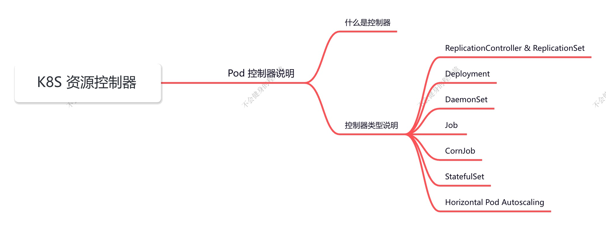
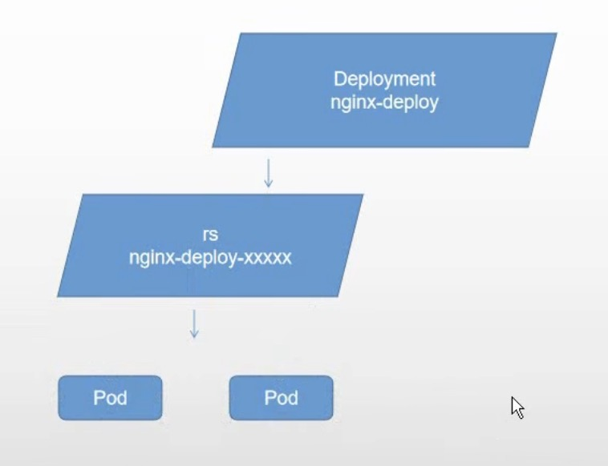
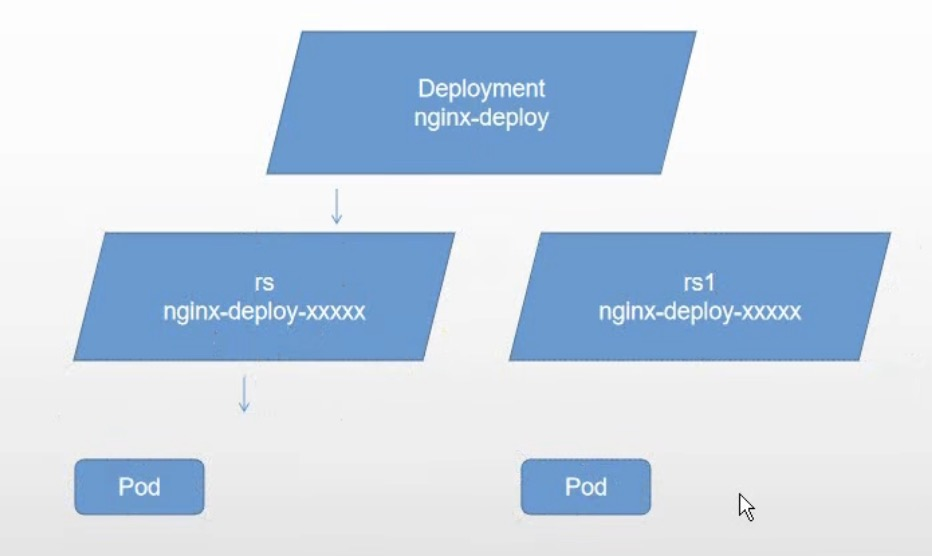
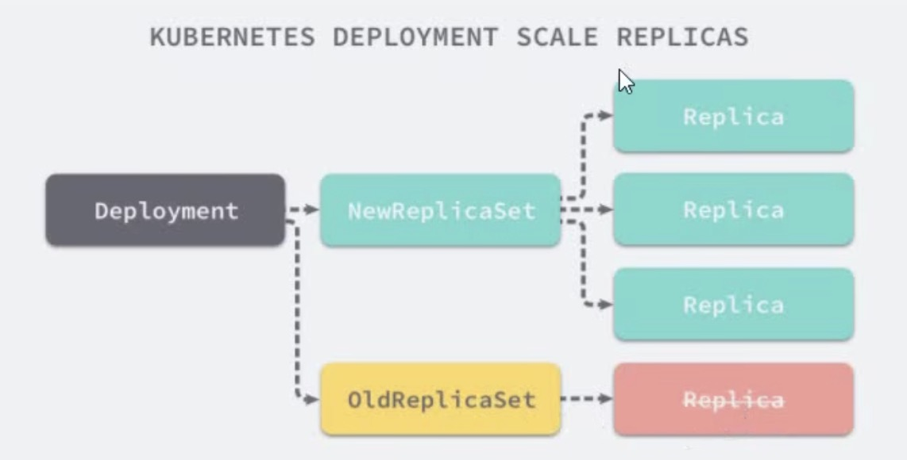

## K8S 资源控制器

Pod 的分类：

- 自主式 Pod：Pod 退出了，此类型的 Pod 不会被创建
- 控制器管理的 Pod：在控制器的生命周期中，始终要维持 Pod 的副本数目

### 什么是控制器

Kubernetes 中内建了很多 controller (控制器)，这些相当于一个状态机，用来控制 Pod 的具体状态和行为

### 控制器类型

- ReplicaSet
- Deployment
- DaemonSet
- StateFulSet
- Job/Cronjob
- Horizontal Pod Autoscaling

#### ReplicationController和 ReplicaSet

ReplicationController（RC）用来确保容器应用的副本数始终保持在用户定义的副本数，即如果有容器异常退出，会自动创建新的 Pod 来替代；而如果异常多出来的容器也会自动回收；

在新版本的 Kubernetes 中建议使用 ReplicaSet 来取代 ReplicationController。ReplicaSet 跟 ReplicationController 没有本质的不同，只是名字不一样，并且 ReplicaSet 支持集合式的 selector；selector 是通过 标签来进行选择的。

> **命令式编程（apply）：**它侧重于如何实现程序，就像我们刚接触编程的时候那样，我们需要把程序的实现过按照逻辑结果一步步写下来。尽量用 create 命令
>
> **声明式编程（create  apply）：**它侧重于定义想要什么，然后告诉计算机/引擎，让他帮你去实现。尽量用 apply 命令

#### Deployment

Deployment 为 Pod 和 ReplicaSet 提供了一个声明式定义（declarative）方法，用来替代以前的 ReplicationController 来方便的管理应用。典型的应用场景包括：

- 定义Deployment来创建 Pod和 Replicaset
- 滚动升级和回滚应用
- 扩容和缩容
- 暂停和继续 Deployment

下图为 Deployment 部署的流程图

下图为 Deployment 滚动升级和回滚部署流程图

#### DaemonSet

> 副本数只能是 1 个

DaemonSet 确保全部（或者一些）Node 上运行一个 Pod 的副本。当有 Node 加入集群时，也会为他们新增个 Pod 。当有 Node 从集群移除时，这些 Pod 也会被回收。删除 DaemonSet 将会删除它创建的所有 Pod 使用。

DaemonSet 的一些典型用法：

- 运行集群存储 daemon，例如在每个 Node 上运行 glusterd、ceph
- 在每个 Node 上运行日志收集 daemon，例如 fluentd、logstash
- 在每个 Node 上运行监控 daemon，例如 Prometheus Node Exporter、 collectd 、Datadog 代理、New Relic 代理，或 Ganglia `gmond`

#### Job

Job 负责批处理任务，即仅执行一次的任务，它保证批处理任务的一个或多个 Pod 成功结束

#### CronJob 在特定的时间循环创建 Job

CronJob 管理基于时间的 Job，即：

- 在给定时间点只运行一次
- 周期性地在给定时间点运行

**使用前提条件: **当前使用的 Kubernetes 集群，版本>=1.8(对 Cronjob)。对于先前版本的集群，版本<1.8，启动 APlServer时，通过传递选项 --runtime-config=batch/v2alpha1-true 可以开启 batch/v2alpha1 APl

**典型的用法如下所示：**

- 在给定的时间点调度 Job 运行
- 创建周期性运行的 Job，例如：数据库备份、发送邮件

#### StatefulSet

Statefulset 作为 Controller 为 Pod 提供唯一的标识。它可以保证部署和 scale 的顺序。

Statefulset 是为了解决有状态服务的问题（对应 Deployments 和 Replicasets 是为无状态服务而设计），其应用场景包括：

- 稳定的持久化存储，即 Pod 重新调度后还是能访问到相同的持久化数据，基于PVC来实现
- 稳定的网络标志，即 Pod 重新调度后其 PodName 和 HostName 不变，基于 Headless Service(即没有ClusterIP的Service)来实现
- 有序部署，有序扩展，即Pod是有顺序的，在部署或者扩展的时候要依据定义的顺序依次依次进行(即从0到N-1，在下一个Pod运行之前所有之前的Pod必须都是 Running 和 Ready 状态)，基于 init containers 来实现
- 有序收缩，有序删除(即从N-1到0)

#### Horizontal Pod Autoscaling

应用的资源使用率通常都有高峰和低谷的时候，如何削峰填谷，提高集群的整体资源利用率，让 service 中的 Pod 个数自动调整呢？

这就有赖于 Horizontal Pod Autoscaling 了，顾名思义，使 Pod 水平自动缩放

## RS 与 Deployment 关联

~~~bash
$ kubectl explain rs # rs 详细信息，并且有官方的解释
~~~

RC（ReplicationController）主要的作用就是用来确保容器应用的副本数始终保持在用户定义的副本数。即如果有容器异常退出，会自动创建新的 Pod 来替代；而如果异常多出来的容器也会自动回收。

Kubernetes 官方建议使用RS（ReplicaSet）替代RC（ReplicationController）进行部署，RS 跟 RC 没有本质的不同，只是名字不一样，并且 RS 支持集合式的 selector。

~~~yaml
apiVersion: apps/v1
kind: ReplicaSet
metadata:
  name: frontend
spec:
  replicas: 3
  selector:
    matchLabels:	# 匹配标签，所以如果修改标签后，则会再次启动一个正确的标签 Pod
      tier: frontend
  template:
    metadata:
      labels:
        tier: frontend
    spec:
      containers:
      - name: nginx
        image: registry.cn-hangzhou.aliyuncs.com/mingyuan_cloud_native/readiness-httpget-app:latest
        env:
        - name: GET_HOSTS_FROM
          value: dns
        ports:
        - containerPort: 80
~~~

~~~shell
$ kubectl create -f replica_set.yaml 
replicaset.apps/frontend created

$ kubectl get pod

$ kubectl delete pod --all 					# 会发现我们部署的 Pod 又启动

$ kubectl get pod --show-labels	 		# 展示 Pod 的标签

$ kubectl label pod ${pod-name} tier=frontend1 --override=True	 	# 修改 Pod 标签

$ kubectl get pod --show-labels			# 会发现，出现了四个 Pod

$ kubectl delete rs --all 	#	则会发现标签为 frontend1 的 Pod 没被删除

~~~

## Deployment

Deployment 为 Pod 和 ReplicaSet 提供了一个声明式定义(declarative)方法，用来替代以前的 ReplicationController 来方便的管理应用。典型的应用场景包括：

- 定义 Deployment 来创建 Pod 和 ReplicaSet
- 滚动升级和回滚应用
- 扩容和缩容
- 暂停和继续 Deployment

1. **部署一个简单的 Nginx 应用**

   ~~~yaml
   apiversion: apps/v1
   kind: Deployment
   metadata:
     name: nginx-deployment
   spec:
     replicas: 3
     template:
       metadata:
         labels:
           app: nginx
       spec:
         containers:
         - name: nginx
           image: nginx:1.7.9
           ports:
           - containerPort: 80
   ~~~

   ~~~shell
   $ kubectl create -f https://kubernetes.io/docs/user-guide/nginx-deployment.yaml --record
   ## --record 参数可以记录命令，我们可以很方便的查看每次 revision 的变化
   ~~~

   ~~~shell
   $ kubectl create -f deployment.yaml --record
   
   $ kubectl get deployment
   
   $ kubectl get rs 			# 部署 deployment，会部署一个 rs
   
   $ kubectl get pod 	# 部署的 Pod 名字，会带着 RS 的名字
   
   $ kubectl get pod -o wide # 可以看到 Pod 更多信息
   
   $ curl IP 			# 进行服务访问
   ~~~

2. **扩容**

   ~~~shell
   $ kubectl scale deployment nginx-deployment --replicas 10		# 会创建新的 RS
   
   $ kubectl get pod -o wide # 可以看到 Pod 更多信息
   ~~~

3. 如果集群支持 horizontal pod autoscaling 的话，还可以为 Deployment 设置自动扩展

   ~~~shell
   $ kubectl autoscale deployment nginx-deployment --min=10 --max=15 --cpu-percent=80
   ~~~

4. 更新镜像也比较简单

   ~~~shell
   $ kubectl set image deployment/nginx-deployment nginx=nginx:1.9.1		# 镜像更新会创建 RS
   
   $ kubectl get rs
   
   $ kubectl get pod -o wide # 可以看到 Pod 更多信息
   ~~~

5. 回滚

   ~~~shell
   $ kubectl rollout undo deployment/nginx-deployment
   
   $ kubectl get pod		# 有序回滚
   
   $ kubectl get rs		# 有序回滚
   ~~~

   

### Deployment 更新策略

Deploymment 可以保证在升级时只有一定数是的 Pod 是down 的。默认的，它会确保至少有比期望的Pod数量少一个是 up 状态（最多一个不可用）

Deployment 同时也可以确保只创建出超过期望数量的一定数量的 Pod。默认的，它会确保最多比期望的 Pod 数显多一个的 Pod 是 up 的（最多1个 surge）

未来的 Kuberentes 版本中，将从 1-1 变成 25%-25%

~~~shell
$ kubectl describe deployments
~~~

### Rollover（多个 rollout 并行）

假如您创建了一个有 5 个 niginx:1.7.9 replica 的 Deployment，但是当还只有 3 个 nginx:1.7.9 的 replica 创建出来的时候您就开始更新含有 5 个 nginx:1.9.1 replica 的 Deployment。在这种情况下，Deployment 会立即杀掉已创建的 3 个 nginx:1.7.9 的 Pod，并开始创建 nginx:1.9.1 的 Pod。它不会等到所有的 5 个 nginx:1.7.9 的 Pod 都创建完成后才开始改变航道。

### 回退 Deployment

> 只要 Deployment 的 rollout 被触发就会创建一个 revision。也就是说当且仅当 Deployment 的 Pod template（如`.spec.template`）被更改，例如更新 template 中的 label 和容器镜像时，就会创建出一个新的 revision。
>
> 其他的更新，比如扩容 Deployment 不会创建 revision —— 因此我们可以很方便的手动或者自动扩容。这意味着当您回退到历史revision 时，只有 Deployment 中的 Pod template 部分才会回退。

~~~shell
$ kubectl set image deployment/nginx-deployment nginx=nginx:1.91
$ kubectl rollout status deployments nginx-deployment
$ kubectl get pods
$ kubectl rollout history deployment/nginx-deployment		# 查看部署的历史版本
$ kubectl rollout undo deployment/nginx-deployment
$ kubectl rollout undo deployment/nginx-deployment --to-revision=2 		# 可以使用revision参数指定某个历史版本
$ kubectl rollout pause deployment/nginx-deployment			# 暂停 deployment 的更新
~~~

您可以用 `kubectl rollout status` 命令查看 Deployment 是否完成。如果 rollout 成功完成，`kubectl rollout status` 将返回一个 0 值的 Exit Code。

~~~shell
$ kubectl rollout status deploy/nginx
Waiting for rollout to finish: 2 of 3 updated replicas are available...
deployment "nginx" successfully rolled out
$ echo $? # 方便管理，的一个退出码
0
~~~

### 清理 Policy

您可以通过设置 `.spec.revisonHistoryLimit` 项来指定 deployment 最多保留多少 revision 历史记录。

默认的会保留所有的 revision；如果将该项设置为0，Deployment 就不允许回退了。

## DaemonSet

DaemonSet 确保全部（或者一些）Node 上运行一个 Pod 的副本。当有 Node 加入集群时，也会为他们新增个 Pod。当有 Node 从集群移除时，这些 Pod 也会被回收。删除 DaemonSet 将会删除它创建的所有 Pod 。

使用 DaemonSet 的一些典型用法：

- 运行集群存储 daemon，例如在每个Node上运行 `glusterd`、`ceph`
- 在每个 Node 上运行日志收集 daemon，例如 `fluentd` 、 `logstash`
- 在每个 Node 上运行监控 daemon，例划 `Prometheus Node Exporter`、 `collectd` 、`Datadog` 代理、New Relic 代理，或Ganglia `gmond`

 ~~~yaml
 apiversion: apps/v1
 kind: DaemonSet
 metadata:
   name: daemonset-example
   labels:
     app: daemonset
 spec:
   selector:
     matchLabels:
       name: daemonset-example			# 要与 metadata 的标签一致，要不会一直启动
   template:
     metadata:
       labels:
         name: deamonset-example
     spec:
       containers:
       - name: deamonset-example
         image: wangyanglinux/myapp:v1
 ~~~

~~~shell
$ kubectl create -f daemonset.yaml

$ kubectl get pod
~~~

所有的节点都不会在主节点运行，这个和污点有关。主节点不会参与调度任务中。

## Job

Job 负责批处理任务，即仅执行一次的任务，它保证批处理任务的一个或多个 Pod 成功结束。

特殊说明：

- spec.template 格式同 Pod
- RestartPolicy 仅支持 Never 或 OnFailure
- 单个 Pod 时，默认 Pod 成功运行后 Job 即结束
- `.spec.completions` 标志 job 结束需要成功运行的 Pod 个数，默认为 1
- `.spec.parallelism` 标志并行运行的 Pod 的个数，默认为 1
- spec.activeDeadlineSeconds 标志失败 Pod 的重试最大时间，超过这个时间不会继续重试

~~~yaml
apiversion: batch/v1
kind: Job
metadata:
  name: pi
spec:
  template:
    metadata:
      name: pi
    spec:
      containers:
      - name: pi
        image: perl
        command: ["perl","-Mbignum-bpi","-wle","print bpi(2888)"]
      restartpolicy: Never
~~~

~~~shell
$ kubectl create -f job.yaml

$ kubectl get pod

$ kubectl get job

$ kubectl get pod -o wide

$ docker load -i  perl.tar # 手动加在镜像 tar

$ kubectl log {pod-name}
~~~

## CronJob

Cron Job 管理基于时间的 Job，即：

- 在给定时间点只运行一次
- 周期性地在给定时间点运行

使用条件：当前使用的 Kubernetes 集群，版本 >=1.8（对 Cron Job）

典型的用法如下所示：

- 在给定的时间点调度Job 运行
- 创建周期性运行的Job，例如：数据库备份、发送邮件

###  Spec

- `spec.template` 格式同 Pod
- RestartPolicy 仅支持 Never 或 OnFailure
- 单个 Pod 时，默认 Pod 成功运行后 Job 即结束
- `.spec.completions` 标志 Job 结束需要成功运行的Pod个数，默认为1
- `.spec.parallelism` 标志并行运行的 Pod 的个数，默认为 1
- `spec.activeDeadlineSeconds` 标志失败 Pod 的重试最大时间，超过这个时间不会继续重试

- `.spec.schedule`：调度，必需字段，指定任务运行周期，格式同 Cron

- `.spec.jobTemplate`：Job 模板，必需字段，指定需要运行的任务，格式同 Job

- `.spec.startingDeadlineSeconds`：启动 Job 的期限（秒级别），该字段是可选的。如果因为任何原因而错过了被调度的时间，那么错过执行时间的 Job 将被认为是失败的。如果没有指定，则没有期限。

- `.spec.concurrencyPolicy`：并发策略，该字段也是可选的。它指定了如何处理被 Cron Job 创建的 Job 的并发执行。只允许指定下面策略中的一种：

  - Allow（默认）：允许并发运行 Job
  - Forbid：禁止并发运行，如果前一个还没有完成，则直接跳过下一个 - 前一个没执行完，第二个就不会创建
  - Replace：取消当前正在运行的 Job，用一个新的来替换

  注意，当前策略只能应用于同一个 Cron Job 创建的 Job。如果存在多个 Cron Job，它们创建的 Job 之间总是允许并发运行。

- `.spec.suspend`：挂起，该字段也是可选的。如果设置为 true ，后续所有执行都会被挂起。它对已经开始执行的 Job 不起作用。默认值为 false 。

- `.spec.successfulJobsHistoryLimit` 和 `spec.failed]obsHistoryLimit`：历史限制，是可选的字段。它们指定了可以保留多少完成和失败的 Job。默认情况下，它们分别设置为 3 和 1。设置限制的值为0，相关类型的 Job 完成后将不会被保留。

~~~yaml
apiVersion: batch/v1beta1
kind: CronJob
metadata:
  name: hello
spec:
  schedule: "*/1 * * * *""
  jobTemplate:
    spec:
      template:
        spec:
          containers:
          - nane: hello
            image: busybox
            args:
            - /bin/sh
            - -c 
            - date; echo Hello from Kubernetes cluster
          restartPolicy: onFailure
~~~

~~~shell
$ kubectl create -f cronjob.yaml

$ kubectl get cornjob

$ kubectl get job 

$ kubectl delete depolyment --all

$ kubectl delete deamonset --all

$ kubectl get job 

$ kubectl get job -w

$ kubectl log {pod-name}

~~~

~~~shell
$ kubectl get cronjob

$ kubectl get jobs

$ pods=$(kubectl get pods --selector=job-name=hel10-1202839834 --output=jsonpath={.items..metadata.name})

$ kubectl logs $pods
Mon Aug 29 21:34:09 UTC 2816
Hello from the Kubernetes cluster

#注意，删除 cronjob 的时候不会自动删除job，这些 job 可以用 kubectl delete job 来删除
$ kubectl delete cronjob hello
cronjob "hello" deleted
~~~

### CronJob 本身的一些限制

创建 Job 操作应该是**幂等的**

Cron Job 的成功状态不好判断，因为他不会获取 Job 的状态。

