## K8S Service

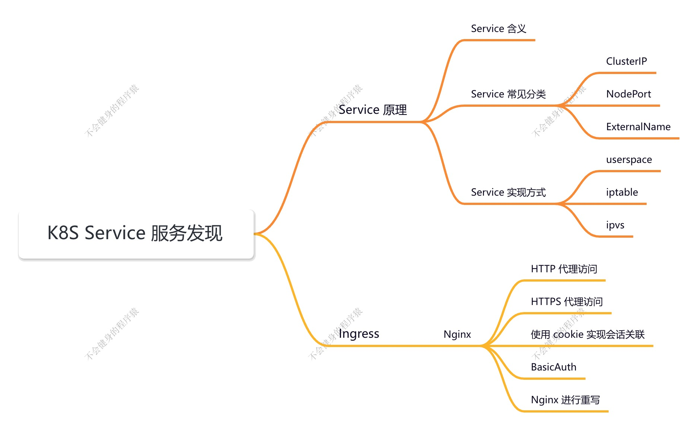

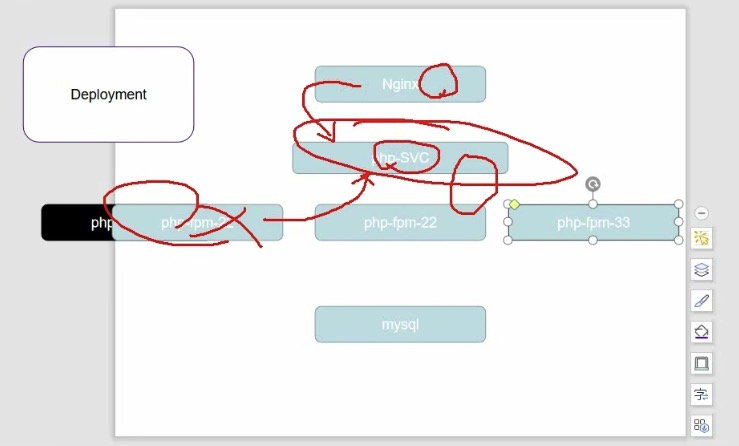

### Service 的概念

K8S Service 定义了这样一个抽象：一个 Pod 的逻辑分组，一种可以访问他们的策略 —— 通常称为微服务。

这一组 Pod 能够被 Service 访问到，通常是通过 `Label Selector`

 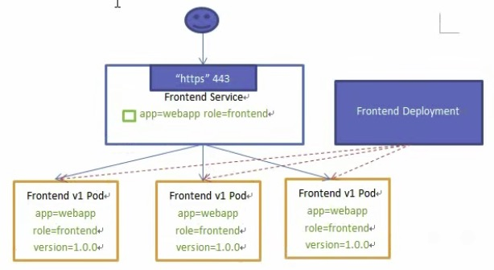

Service 能够提供负载均衡的能力，但是在使用上有以下限制：

- 只提供 4 层负载均衡能力，而没有 7 层功能，但有时我们可能需要更多的匹配规则来转发请求，这点上 4 层负载均衡是不支持的，可以通过 ingress 来实现。

### Service 的类型

Service 在 K8S 中有以下四种类型：

- ClusterIp：默认类型，自动分配一个仅 Cluster 内部可以访问的虚拟 IP。

  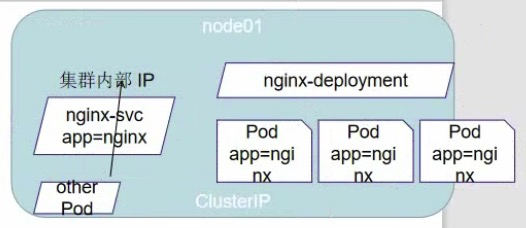

- NodePort：在 ClusterIp 基础上为 Service 在每台机器上绑定一个端口，这样就可以通过 <Nodelp>:NodePort 来访问该服务

  > 常见用于暴露集群内部服务的方式。

  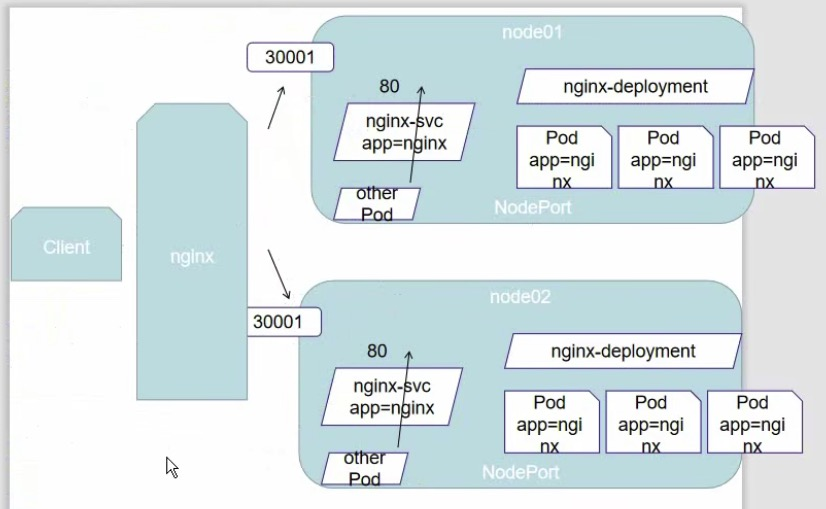

  

- LoadBalancer：在 NodePort 的基础上，借助 cloud provider 创建一个外部负载均衡器，并将请求转发到 <NodelP>: NodePort

  > 云供应商提供，需要收费

  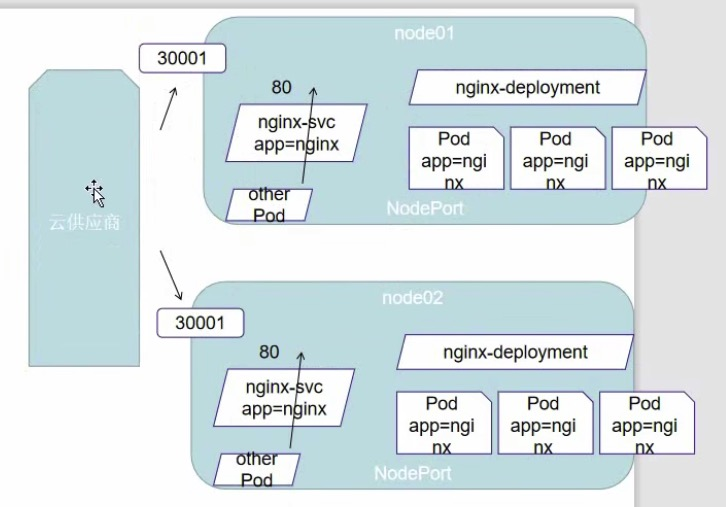

- ExternalName：把集群外部的服务引入到集群内部来，在集群内部直接使用。没有任何类型代理被创建，这只有 kubernetes 1.7 或更高版本的 kube-dns才支持

  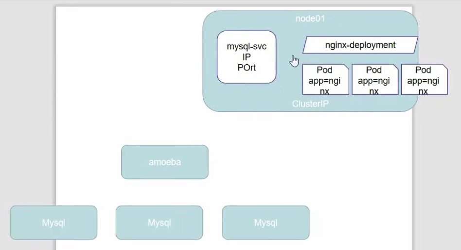

  

  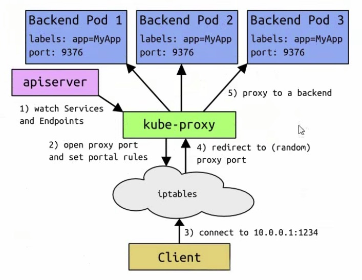

  

### VIP 和 Service 代理

在 Kubernetes 集群中，每个 Node 运行一个 kube-proxy 进程。kube-proxy 负责为 service 实现了一种 VIP（虚拟 IP）的形式，而不是 ExternalName 的形式。

在 Kubernetes v1.0 版本，代理完全在 **userspace**。

在 Kubernetes v1.1 版本，新增了 **iptables** 代理，但并不是默认的运行模式。

从 Kubernetes v1.2起，默认就是 iptables 代理。

在Kubernetes v1.8.0-beta.0 中，添加了 **ipvs** 代理。
在Kubernetes 1.14 版本开始默认使用 ipvs 代理

在Kubernetesv1.0版本，service 是”4层”（TCP/UDP over IP）概念。在Kubernetes v1.1版本，新增了 Ingress APl（beta 版），用来表示“7层”（HTTP）服务

!为何不使用 round-robin DNS? 因为 DNS 会缓存 IP

### 代理模式的分类

#### userspace 代理模式

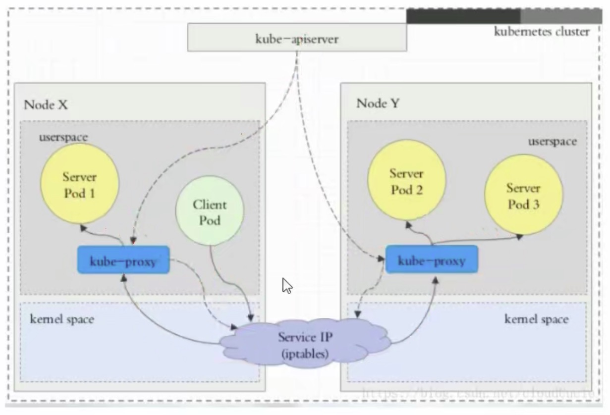

#### iptables 代理模式

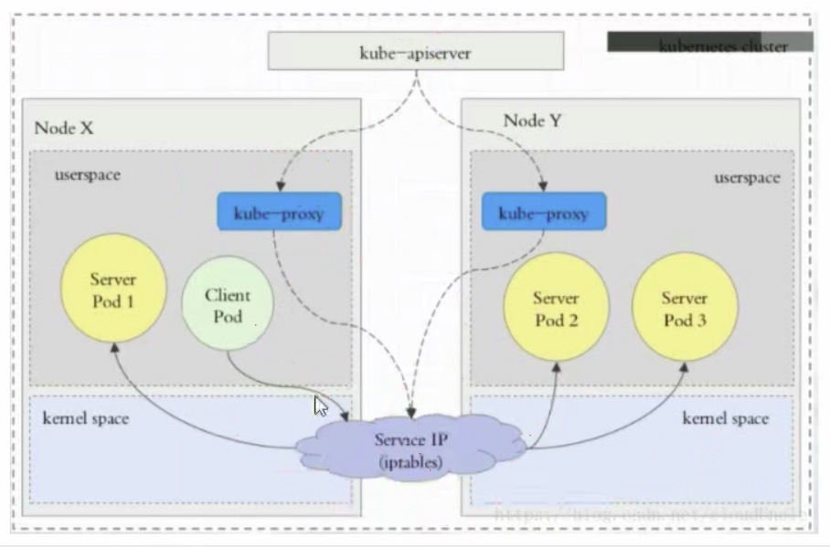

#### ipvs 代理模式

这种模式，kube-proxy 会监视 Kubernetes `Service` 对象和 `Endpoints` ，调用 netlink 接囗以相应地创建 ipvs 规则并定期与Kubernetes `Service` 对象和 `Endpoints` 对象同步 ipvs 规则，以确保 ipvs 状态与期望一致。访问服务时，流量将被重定向到其中一个后端 Pod。

与 iptables 类似，ipvs 于 netfilter 的 hook 功能，但使用哈希表作为底层数据结构并在内核空间中工作。这意味着 ipvs 可以更快地重定向流量，并且在同步代理规则时具有更好的性能。此外，ipvs 为负载均衡算法提供了更多选项，例如:

- rr：轮询调度
- lc：最小连接数
- dh：目标hash
- sh：源哈希
- sed：最短期望延迟
- nq：不排队调度

> **注意：**
>
> ipvs 模式假定在运行 kube-proxy 之前在节点上都已经安装了 IPVS 内核模块。
>
> 当 kube-proxy 以 ipvs 代理模式启动时，kube-proxy 将验证节点上是否安装了 IPVS 模块，如果未安装，则 kube-proxy 将回退到 iptables 代理模式

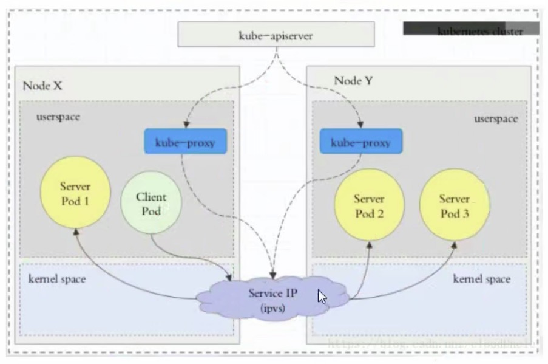

~~~shell
$ ipvsadm -Ln

$ kubectl get svc

~~~

## Service 的类型：ClusterIp 

ClusterIP 主要在每个 node 节点使用 iptables，将发向 ClusterIP 对应端口的数据，转发到 kube-proxy 中。

然后 kube-proxy 自己内部实现有负载均衡的方法，并可以查询到这个 service 下对应 pod 的地址和端口，进而把数据转发给对应的 pod 的地址和端口。

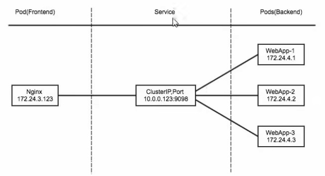

为了实现图上的功能，主要需要以下几个组件的协同工作：

- apiserver 用户通过 kubectl 命令向 apiserver 发送创建 Service 的命令，apiserver 接收到请求后将数据存储到 etcd 中
- kube-proxy kubernetes 的每个节点中都有一个叫做 kube-porxy 的进程，这个进程负责感知 Service，Pod 的变化，并将变化的信息写入本地的 iptables 规则中。
- iptables 使用 NAT 等技术将 virtuallP 的流量转至 endpoint 中

### 创建 myapp-deploy.yaml 文件

~~~shell
$ vim myapp-deploy.yaml
~~~

~~~yaml
apiVersion: apps/v1
kinb: Deployment
metadata:
  name: myapp-deploy
  namespace: default
spec:
  replicas: 3
  selector:
    matchLabels:
      app: myapp
      release: stabel
  template:
    metadata:
      labels:
        app: myapp
        release: stabel
        env: test
    spec:
      containers:
      - name: myapp
        image: wangyanglinux/myapp:v2
        imagePullPolicy: IfNotPresent
        ports:
        - name: http
          containerPort: 80
~~~

~~~shell
$ kubectl create -f myapp-deploy.yaml

$ kubectl get pod

~~~

### 创建 Service 信息

~~~shell
$ vim myapp-service.yaml
~~~

~~~yaml
apiVersion: v1
kind: Service
metadata:
  name: myapp
  namespace: default
spec:
  type: ClusterIp
  selector:
    app: myapp
    release: stabel
  ports:
  - name: http
    port: 80
    targetPort: 80
~~~

~~~shell
$ kubectl create -f myapp-service.yaml

$ kubectl get svc

$ ipvsadm -Ln

$ kubectl delete -f myapp-service.yaml
~~~

## Headless Service

> 虽然没有 svc，但是依然可以使用域名的方式使用 svc

有时不需要或不想要负载均衡，以及单独的 ServicelP。

遇到这种情况，可以通过指定 clusterIP（spec.clusterlP）的值为 "None" 来创建 Headless Service。这类 Service 并不会分配 Cluster IP，kube-proxy 不会处理它们，而且平台也不会为它们进行负载均衡和路由。

~~~shell
$ vim myapp-svc-headless.yaml
~~~

~~~yaml
apiversion: v1
kind: Service
metadata:
  name: myapp-headless
  namespace: default
spec:
  selector:
    app: myapp
  clusterIP: "None"
  ports:
  - port:80
    targetPort: 80
~~~

~~~shell
$ kubectl create -f myapp-svc-headless.yaml

$ kubectl get svc
 
$ kubectl get pod -n kube-system # 会写入到 dns

$ dig -t A myapp-headless.default.svc.cluster.local. @18.96.8.10

$ yum -y install bind-utils

$ kubectl get pod -n kube-system -o wide
~~~

## NodePort

> 将内部服务暴露给外部服务的一种方式。
>
> 一组 Pod 可以对应多个 SVC，只要标签对得上

NodePort 的原理在于在 Node 上开了一个端口，将向该端口的流量导入到 kube-proxy，然后由 kube-proxy 进一步给到对应的 pod

~~~shell
$ vim myapp-service.yaml
~~~

~~~yaml
apiVersion: v1
kind: service
metadata:
  name: myapp
  namespace: default
spec:
  type: NodePort
  selector:
    app: myapp
    release: stabel
  ports:
  - name: http
    port: 80
    targetPort: 80
~~~

~~~shell
$ kubectl get svc # 根据 ports 可以在外部系统进行请求访问，三个节点都会开启这个端口

$ netstat -anpt | grep :30715
~~~

**查询流程：**

~~~shell
iptables -t nat -nvL
	KUBE-NODEPORTS
~~~

## LoadBalancer

> 需要花钱，通过云厂商

LoadBalancer 和 NodePort 其实是同一种方式。区别在于 LoadBalancer 比 NodePort 多了一步，就是可以调用 Cloud Provider 去创建LB 来向节点导流。

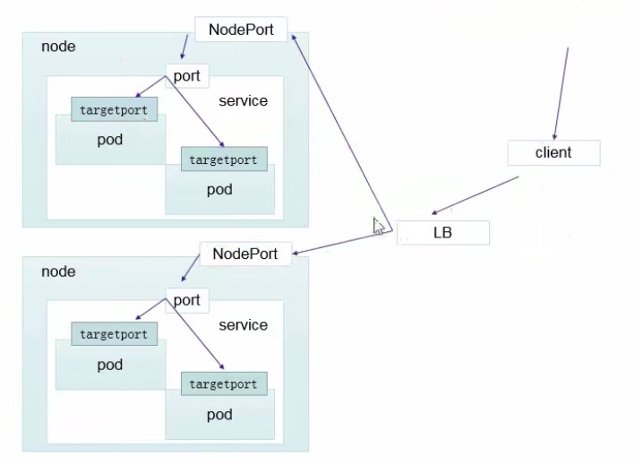

## ExternalName

> 主要是把外部的服务引入服务内部

这种类型的 Service 通过返回 CNAME 和它的值，可以将服务映射到 externalName 字段的内容（例如：hub.atguigu.com）。

ExternalName Service 是 Service 的特例，它没有 Selector，也没有定义任何的端口和 Endpoint。相反的，对于运行在集群外部的服务，它通过返回该外部服务的别名这种方式来提供服务。

~~~yaml
apiVersion: v1
kind: Service
metadata:
  name: my-service-1
  namespace: default
spec:
  type: ExternalName
  externalName: hub.atguigu.com
~~~

当查询主机 my-service.defalut.svc.cluster.local（SVC NAME.NAMESPACE.svc.cluster.local）时，集群的 DNS 服务将返回一个值 my.database.example.com 的 CNAME 记录。访问这个服务的工作方式和其他的相同，唯一不同的是重定向发生在 DNS 层，而且不会进行代理或转发。

~~~shell
$ kubectl create ex.yaml

$ kubectl get svc

$ dig -t A my-service-1.default.svc.cluster.local. @18.96.8.10
~~~

## Ingress

### 资料信息

Ingress-Nginx github 地址：https://github.com/kubernetes/ingress-nginx

Ingress-Nginx 官方网站：https://kubernetes.github.io/ingress-nginx	根据这个官方来进行安装 Ingress-Nginx

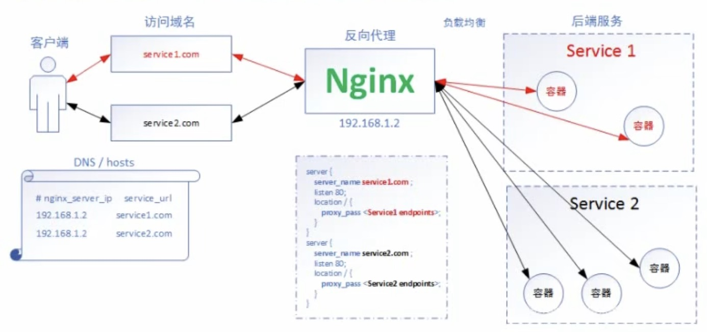

> Nginx 的部署方案依然是 NodePort 的部署方案。
>
> Nginx 的配置文件会自动的添加

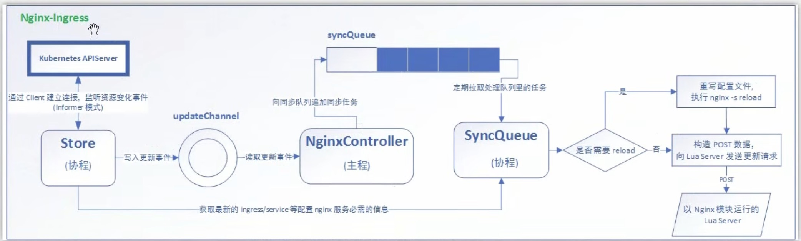

> wget https://raw.githubusercontent.com/kubernetes/ingress-nginx/master/deploy/static/mandatory.yaml

~~~shell
$ cat mandatory.yaml | grep image

# 保存镜像为压缩文件：
$ docker save -o ingress.contr.tar 镜像名
~~~

~~~shell
$ kubectl get pod -n ingress
~~~

> helm upgrade --install ingress-nginx ingress-nginx \
>   --repo https://kubernetes.github.io/ingress-nginx \
>   --namespace ingress-nginx --create-namespace

~~~shell
kubectl get pod -n ingress-nginx
~~~

选择暴露方案：

~~~shell
kubectl apply -f https://raw.githubusercontent.com/kubernetes/ingress-nginx/controller-v1.12.0/deploy/static/provider/baremetal/deploy.yaml
~~~

~~~shell
$ kubectl get svc -n ingress-nginx
~~~

### 部署 Ingress-Nginx

1. 如果安装过 helm，安装 Ingress Nginx

   ~~~shell
   $ helm upgrade --install ingress-nginx ingress-nginx \
     --repo https://kubernetes.github.io/ingress-nginx \
     --namespace ingress-nginx --create-namespace
   ~~~

2. 验证

   ~~~shell
   kubectl get pods -n ingress-nginx
   kubectl get svc -n ingress-nginx
   ~~~

#### Ingress HTTP 代理访问

deployment、Service、Ingress Yaml 文件

**deployment.yaml**

~~~yaml
apiVersion: extensions/v1beta1
kind: Deployment
metadata:
  name: nginx-dm
spec:
  replicas: 2
  template:
    metadata:
      labels:
        name: nginx
    spec:
      containers:
      - name: nginx
        image: wangyanglinux/myapp:v1
        imagePullPolicy: IfNotPresent
        ports:
        - containerPort: 80
~~~

**标准 SVC Service  service.yaml**

~~~yaml
apiVersion: v1
kind: Service
metadata:
  name: nginx-svc
spec:
  ports:
  - port: 80
    targetPort: 80
    protocol: TCP
  selector:
    name: nginx
~~~

**ingress.yaml**

~~~yaml
apiversion: extensions/v1beta1
kind: Ingress
metadata:
  name: nginx-test
spec:
  rules:
  - host: foo.bar.com
    http:
      paths: 
      - path: /
        backend :
          serviceName: nginx-svc
          servicePort: 80
~~~

通过修改 hosts，域名 + ip 的映射，来进行请求

~~~shell
# 请求端口为 ingress nginx 的端口
$ kubectl get svc -n ingress-nginx # 这个命令查出来的端口

~~~

#### 下面是通过 Ingress 实现虚拟主机的方案

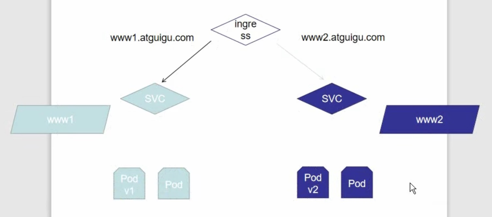

**deployment1.yaml**

~~~yaml
apiVersion: extensions/v1beta1
kind: Deployment
metadata:
  name: deployment1
spec:
  replicas: 2
  template:
    metadata:
      labels:
        name: nginx
    spec:
      containers:
      - name: nginx
        image: wangyanglinux/myapp:v1
        imagePullPolicy: IfNotPresent
        ports:
        - containerPort: 80
---
apiVersion: v1
kind: Service
metadata:
  name: svc1
spec:
  ports:
  - port: 80
    targetPort: 80
    protocol: TCP
  selector:
    name: nginx
~~~

**deployment2.yaml**

~~~yaml
apiVersion: extensions/v1beta1
kind: Deployment
metadata:
  name: deployment2
spec:
  replicas: 2
  template:
    metadata:
      labels:
        name: nginx2
    spec:
      containers:
      - name: nginx2
        image: wangyanglinux/myapp:v2
        imagePullPolicy: IfNotPresent
        ports:
        - containerPort: 80
---
apiVersion: v1
kind: Service
metadata:
  name: svc2
spec:
  ports:
  - port: 80
    targetPort: 80
    protocol: TCP
  selector:
    name: nginx2
~~~

Ingress-rule.yaml

~~~yaml
apiversion: extensions/v1beta1
kind: Ingress
metadata:
  name: ingress1
spec:
  rules:
  - host: www1.wolfman.com
    http:
      paths: 
      - path: /
        backend :
          serviceName: svc1
          servicePort: 80
---
apiversion: extensions/v1beta1
kind: Ingress
metadata:
  name: ingress2
spec:
  rules:
  - host: www2.wolfman.com
    http:
      paths: 
      - path: /
        backend :
          serviceName: svc2
          servicePort: 80
~~~

~~~shell
$ kubectl get pod -n ingress-nginx

$ kubectl exec nginx-ingress-controller-7995bd9c47-p4xcp -n ingress-nginx -it -- /bin/bash

# cat nginx.conf	# 可以看下 ingress nginx 的配置文件
~~~

~~~shell
$ kubectl get ingress
~~~

#### Ingress HTTPS 代理访问

**创建证书，以及 cert 存储方式**

~~~shell
$ openssl req -x509 -sha256 -nodes -days 365 -newkey rsa:2048 -keyout tls.key -out tls.crt -subj 
"/CN=nginxsvc/0=nginxsvc"

$ kubectl create secret tls tls-secret --key tls.key --cert tls.crt
~~~

**deployment、Service、Ingress Yaml 文件**

**deployment3.yaml**

~~~yaml
apiVersion: extensions/v1beta1
kind: Deployment
metadata:
  name: deployment3
spec:
  replicas: 2
  template:
    metadata:
      labels:
        name: nginx3
    spec:
      containers:
      - name: nginx
        image: wangyanglinux/myapp:v3
        imagePullPolicy: IfNotPresent
        ports:
        - containerPort: 80
---
apiVersion: v1
kind: Service
metadata:
  name: svc3
spec:
  ports:
  - port: 80
    targetPort: 80
    protocol: TCP
  selector:
    name: nginx3
~~~

**Ingress.yaml**

~~~yaml
apiVersion: extensions/v1beta1
kind: Ingress
metadata:
  name: nginx-test
spec:
  tls:
    - hosts:
      - www3.wolfman.com
      secretName: tls-secret
    rules:
    - host: www3.wolfman.com
      http:
        paths:
        - path: /
          backend:
            serviceName: svc3
            servicePort: 80
~~~

~~~shell
$ kubectl get svc -n ingress-nginx
~~~

#### Nginx 进行 BasicAuth

~~~shell
$ yum -y install httpd

$ mkdri basic-auth

$ cd basic-auth

$ htpasswd -c auth foo

$ kubectl create secret generic basic-auth --from-file=auth
~~~

**Ingress-auth.yaml**

~~~yaml
apiVersion: extensions/v1beta1
kind: Ingress
metadata:
  name: ingress-with-auth
  annotations:
    nginx.ingress.kubernetes.io/auth-type: basic
    nginx.ingress.kubernetes.io/auth-secret: basic-auth
    nginx.ingress.kubernetes.io/auth-realm: 'Authentication Required - foo'
spec:
  rules:
  - host: auth.wolfman.com
    http:
      paths:
      - path: /
        backend:
          serviceName: svc1
          servicePort: 80
~~~

### Nginx 进行重写

| 名称                                           | 描述                                                         | 值     |
| ---------------------------------------------- | ------------------------------------------------------------ | ------ |
| nginx.ingress.kubernetes.io/rewrite-target     | 必须重定向流是的目标URI                                      | 字符串 |
| nginx.ingress.kubernetes.io/ssl-redirect       | 指示位置部分是否仅可访问SSL（当Ingress包含证书时默认为 True） | 布尔   |
| nginx.ingress.kubernetes.io/force-ssl-redirect | 即使 Ingress 未启用 TLS，也强制重定向到 HTTPS                | 布尔   |
| nginx.ingress.kubernetes.io/app-root           | 定义 Controller 必须重定向的应用程序根，如果它在 '/' 上下文中 | 字符串 |
| nginx.ingress.kubernetes.io/use-regex          | 指示 Ingress 上定义的路径是否使用正则表达式                  | 布尔   |

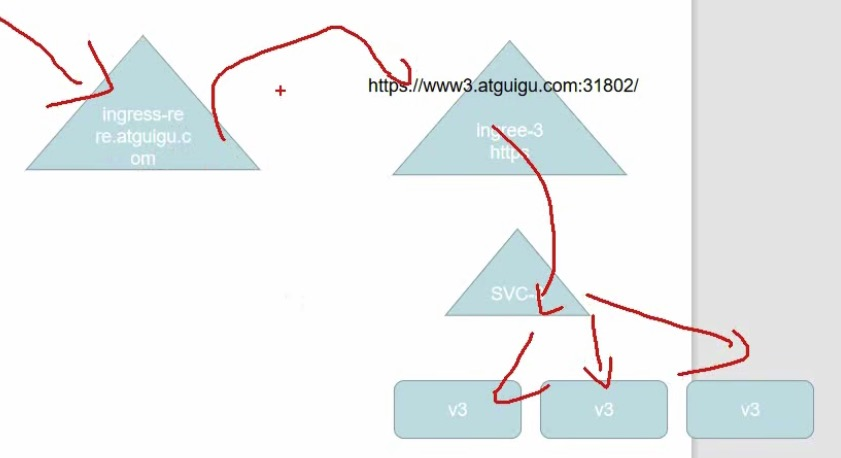

~~~yaml
apiVersion: extensions/v1beta1
kind: Ingress
metadata:
  name: nginx-test
  annotations:
    nginx.ingress.kubernetes.io/rewrite-target: http://www3.wolfman.com:31795
spec:
  rules:
  - host: re.wolfman.com
    http:
      paths:
      - path: /
        backend:
          serviceName: nginx-svc
          servicePort: 80
~~~

