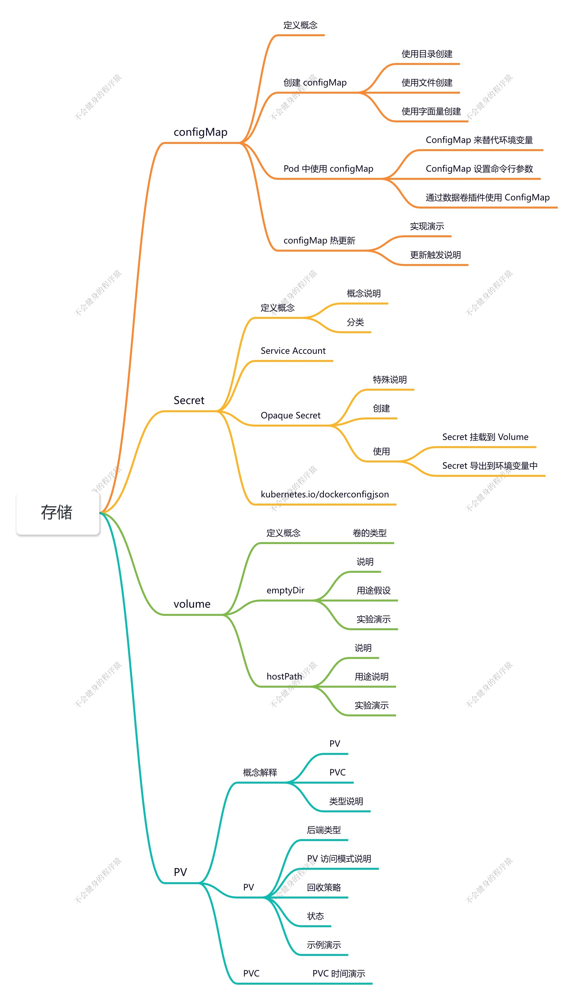
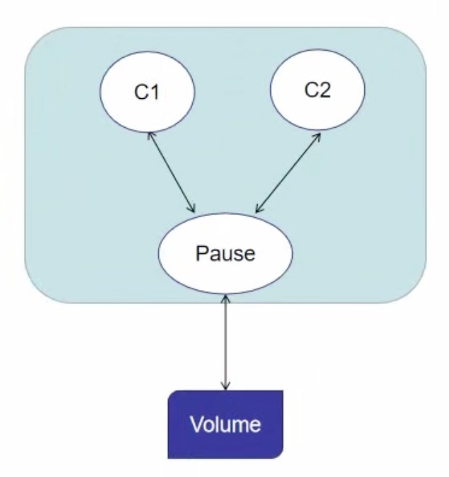
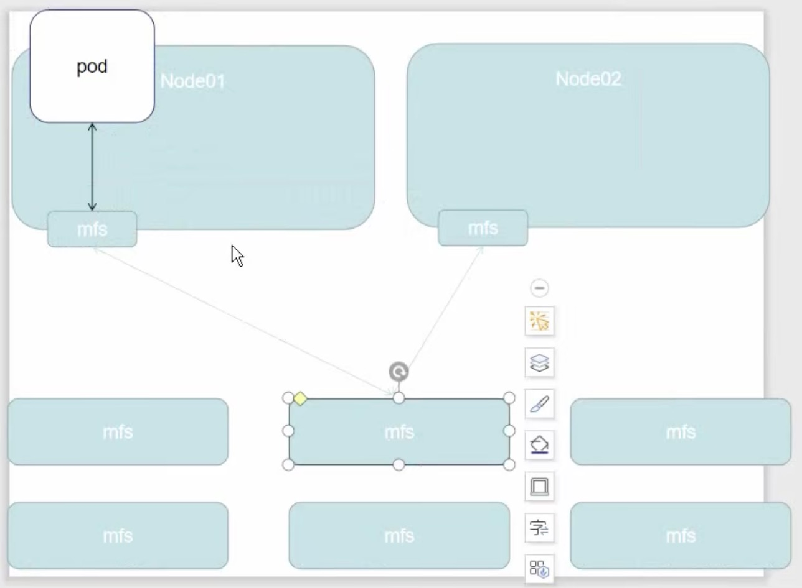
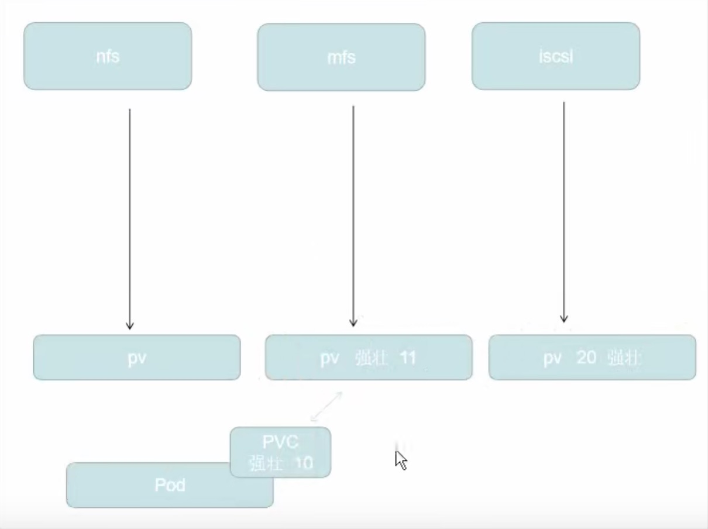
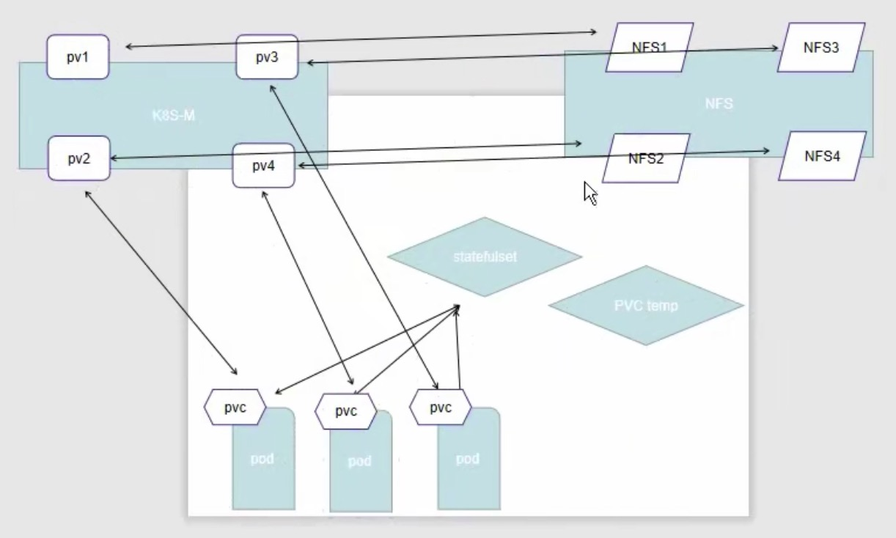

# K8S 存储

- ConfigMap：存储配置文件的目的
- Secret：存储一些加密的信息，加密的方案 已 Base64
- volume：共享存储卷的能力
- Persistent Volume：持久卷，通过其他的服务构建持久卷

## ConfigMap

> 类似配置文件注册中心的角色

### ConfigMap 描述信息

ConfigMap 功能在 Kubernetes1.2 版本中引入，许多应用程序会从配置文件、命令行参数或环境变量中读取配置信息。

ConfigMap API 给我们提供了向容器中注入配置信息的机制，ConfigMap 可以被用来保存单个属性，也可以用来保存整个配置文件或者JSON 二进制大对象。

### ConfigMap 的创建

1. 使用目录创建

   ~~~bash
   $ ls docs/user-guide/configmap/kubectl/
   game.properties
   ui.propertles
   
   $ cat docs/user-guide/configmap/kubectl/game.properties
   enemies=aliens
   lives=3
   enemies.cheat=true
   enemies.cheat.level=noGoodRotten
   secret.code.passphrase=UUDDLRLRBABAS
   secret.code.allowed=true
   secret.code.lives=30
   
   
   
   $ cat docs/user-guide/configmap/kubectl/ui.propertles
   color.good=purple
   color.bad=yellow
   allow.textmode=true
   how.nice.to.look=fairlyNice
   
   $ kubectl create configmap game-config --from-file=docs/user-guide/configmap/kubectl
   ~~~

   `-from-file` **指定在目录下的所有文件都会被用在 ConfigMap 里面创建一个键值对，键的名字就是文件名，值
   就是文件的内容**

   ~~~bash
   $ kubectl get cm
   
   $ kubectl get cm game-congif
   
   $ kubectl get cm game-congif -o yaml
   
   $ kubectl describe cm game-config
   
   ~~~

2. 使用文件创建

   只要指定为一个文件就可以从单个文件中创建 ConfigMap

   ~~~bash
   $ kubectl create configmap game-config-2 --from-file=docs/user-guide/configmap/kubectl/game.properties
   
   $ kubectl get configmaps game-config-2 -o yaml
   ~~~

   `-from-file` **这个参数可以使用多次，你可以使用两次分别指定上个实例中的那两个配置文件，效果就跟指定整个目录是一样的**

3. 使用字面值创建

   使用文字值创建，利用 `-from-literal` 参数传递配置信息，该参数可以使用多次，格式如下

   ~~~bash
   $ kubectl create configmap special-config --from-literal=special.how=very --from-literal=special.type=charm
   
   
   $ kubectl get configmaps special-config -o yaml
   ~~~

### Pod 中使用 ConfigMap

#### 1. 使用 ConfigMap 来替代环境变量

~~~yaml
apiversion: v1
kind: ConfigMap
metadata:
  name: special-config
  namespace: default
data:
  special.how: very
  special.type: charm
~~~

**env.yaml**

~~~yaml
apiversion: v1
kind: configMap
metadata:
  name: env-config
  namespace: default
data:
  log_level: INFO
~~~

**config-pod.yaml**

~~~yaml
apiVersion: v1
kind: Pod
metadata: 
  name: dapi-test-pod
spec:
  containers:
  - name: test-container
    image: hub.atguigu.com/library/myapp:v1
    command: ["/bin/sh","-c","env”]
    env:
    - name: SPECIAL_LEVEL_KEY	# 这个是把 special-config 的 configMap 中的 special.how 值倒入到 SPECIAL_LEVEL_KEY 值
      valueFrom:
        configMapKeyRef:
          name: special-config
          key: special.how
    - name: SPECIAL_TYPE_KEY
      valueFrom:
        configMapKeyRef:
          name: special-config
          key: special.type
    envFrom:
    - configMapRef:
      name: env-config
  restartPolicy: Never
~~~

~~~bash
$ kubectl create -f config-pod.yaml

$ kubectl get pod

$ kubectl log dapi-test-pod

$ kubectl log dapi-test-pod | grep TYPE
~~~

#### 2. 使用 ConfigMap 设置命令行参数

~~~yaml
apiversion: v1
kind: ConfigMap
metadata:
  name: special-config
  namespace: default
data:
  special.how: very
  special.type: charm
~~~

~~~yaml
apiVersion: v1
kind: Pod
metadata:
  name: dapi-test-pod
spec:
  containers:
  - name: test-container
    image: hub.atguigu.com/library/myapp:v1
    command: [ "/bin/sh", "-c", "echo $(SPECIAL_LEVEL_KEY) $(SPECIAL_TYPE_KEY)”]
    env:
    - name: SPECIAL_LEVEL_KEY
      valueFrom:
        configMapKeyRef:
          name: special-config
          key: special.how
    - name: SPECIAL_TYPE_KEY
      valueFrom:
        configMapKeyRef:
          name: special-config
          key: special.type
  restartPolicy: Never
~~~

#### 3. 通过数据卷插件使用 ConfigMap

~~~yaml
apiversion: v1
kind: ConfigMap
metadata:
  name: special-config
  namespace: default
data:
  special.how: very
  special.type: charm
~~~

在数据卷里面使用这个 configMap，有不同的选项。最基本的就是将文件填入数据卷，在这个文件键就是文件名，键值就是文件内容中，

~~~yaml
apiVersion: v1
kind: Pod
metadata:
  name: dapi-test-pod
spec:
  containers:
  - name: test-containen
    image: hub.atguigu.com/library/myapp:v1
    command: [ "/bin/sh","-c","sleep 600s" ]
    volumeMounts :
    - name: config-volume
      mountPath:/etc/config
  volumes:
  - name: config-volume
    configMap:
      name: special-config
  restartPolicy: Never
~~~

~~~bash
$ kubectl get pod 

$ kubectl exec dapi-test-pod -it -- /bin/sh

/ # cd /etc/config

/ # cat special.how

/ # cat special.type
~~~

### ConfigMap 的热更新

~~~yaml
apiVersion: v1
kind: ConfigMap
metadata:
  name: log-config
  namespace: default
data:
  log_level: INFO
---
apiVersion: extensions/v1beta1
kind: Deployment
metadata:
  name: my-nginx
spec:
  replicas: 1
  template:
    metadata:
      labels:
        run: my-nginx
    spec:
      containers:
      - name: my-nginx
        image: hub.atguigu.com/library/myapp:v1
        ports:
        - containerPort: 80
        volumeMounts :
        - name: config-volume
          mountPath: /etc/config
      volumes:
      - name: config-volume
        configMap:
          name: log-config
~~~

~~~bash
$ kubectl exec {pod-name} -it -- cat /etc/congif/log_level
~~~

**修改 ConfigMap** 

~~~bash
$ kubectl edit configmap log-config
~~~

修改 **log_level** 的值为 **DEBUG** 等待大概 10 秒钟时间，再次查看环境变量的值

~~~bash
$ kubectl exec {pod-name} -it -- cat /etc/congif/log_level
DEBUG
~~~

<!--!!!特别注意 confiqMap 如果以 ENV 的方式挂载至容器，修改 configMap 并不会实现热更新-->

**ConfigMap 更新后滚动更新 Pod**

更新 ConfigMap 目前并不会触发相关 Pod 的滚动更新，可以通过修改 pod annotations 的方式强制触发滚动更新

~~~bash
$ kubectl patch deployment my-nginx --patch '{"spec": {"template": {"metadata":
{"annotations":{"version/config":"2190411”}}}}}'
~~~

这个例子里我们在`.spec.template.metadata.annotations` 中添加 `version/config`，每次通过修改 `version/config` 来触发滚动更新
！！！更新 ConfigMap 后：

- 使用该 ConfigMap 挂载的 Env 不会同步更新
- 使用该 ConfigMap 挂载的 Volume 中的数据需要一段时间(实测大概10秒)才能同步更新。

## Secret

### Secret 存在意义

Secret 解决了密码、token、密钥等敏感数据的配置问题，而不需要把这些敏感数据暴露到镜像或者 Pod Spec中。Secret 可以以 Volume 或者环境变量的方式使用。

Secret 有三种类型：

- **Service Account**：用来访问 Kubernetes APl，由 Kubernetes 自动创建，并且会自动挂载到 Pod 的 `/run/secrets/kubernetes.io/serviceaccount` 日录中
- **Opaque**：base64 编码格式的 Secret，用来存储密码、密钥等。
- **kubernetes.io/dockerconfigjson**：用来存储私有 docker registry 的认证信息。

#### Service Account

用来访问 Kubernetes APl，由 Kubernetes 自动创建，并且会自动挂载到 Pod 的 `/run/secrets/kubernetes.io/serviceaccount` 日录中

~~~shell
$ kubectl run nginx --image nginx
deployment "nginx" created

$ kubectl get pods
NAME
READYSTATUSRESTARTS AGE
nginx-3137573819-md1u21/1Running@135

$ kubectl exec kube-proxy-fb85x -n kube-system -it -- /bin/sh

$ kubectl exec nginx-3137573819-md1u2 1s /run/secrets/kubernetes.io/serviceaccount
ca.crt
namespace
token
~~~

由 ca.crt、namespace、token 组成了 SA。

#### Opaque Secret

1. 创建说明

   **Opaque 类型的数据是一个 map 类型，要求 value 是 base64 编码格式：**

   ~~~bash
   $ echo -n "admin" | base64	# 对 admin 进行 base64 加密
   YWRtaW4=
   
   $ echo -n "1f2d1e2e67df" | base64
   MWYYZDFIMTU2N2Rm
   ~~~

   secrets.yaml

   ~~~yaml
   apiVersion: v1
   kind: secret
   metadata:
     name: mysecret
   type: Opaque
   data:
     password: MWYYZDFIMTU2N2Rm
     username: yuRtaw4=
   ~~~

   ~~~shell
   $ kubectl get secret
   ~~~

2. 使用方式

   1. 将 Secret 挂载到 Volume 中

      ~~~yaml
      apiVersion: v1
      kind: pod
      metadata:
        1abe1s:
          name: seret-test
        name: seret-test
      spec:
        volumes:
        - name: secrets
          secret:
            secretName: mysecret
        containers:
        - image: hub.atguigu.com/library/myapp:v1
          name: db
          volumeMounts:
          - name: secrets
            mountPath: "/etc/secrets"
            readonly: true
      ~~~

      ~~~shell
      $ kubectl create -f pod1.yaml
      
      $ kubectl get pod
      
      $ kubectl exec seret-test -it -- /bin/sh
      
      / # cd /etc/secrets
      ~~~

   2. 将 Secret 导出到环境变量中

      ~~~yaml
      apiVersion: extensions/v1beta1
      kind: Deployment
      metadata:
        name: pod-deployment
      spec:
        replicas: 2
        template:
          metadata:
            labels:
              app: pod-deployment
          spec:
            containers:
            - name: pod-1
              image: hub.atguigu.com/library/myapp:v1
              ports:
              - containerport: 88
              env: 
              - name: TEST_USER
                valueFrom:
                  secretKeyRef:
                    name: mysecret
                    key: username
              - name: TEST_PASSWORD
                valueFrom:
                  secretkeyRef:
                    name: mysecret
                    key: password
      ~~~

      ~~~bash
      $ kubectl create -f pod-deployment
      
      $ kubectl exec pod-name -it -- /bin/sh
      / # echo $TEST_USER
      
      / # echo $TEST_PASSWORD
      
      ~~~

#### kubernetes.io/dockerconfigjson

> 通过私有仓库进行配合

**使用 Kuberctl 创建 docker registry 认证的 secret**

~~~bash
$ kubectl create secret docker-registry myregistrykey --docker-server=${DOCKER_REGISTRY_SERVER} --docker-username=${DOCKER_USER} --docker-password=${DOCKER_PASSWORD} --docker-ema11=${DOCKER_EMAIL}

secret "myregistrykey" created.
~~~

**在创建 Pod 的时候，通过 imagePullsecrets 来引用刚创建的 myregistrykey**

~~~yaml
apiVersion: v1
kind: Pod
metadata:
  name: foo
spec:
  containers:
  - name: foo
    image: roc/awangyang:vl
  imagePullsecrets:
  - name: myregistrykey
~~~

## Volume

容器磁盘上的文件的生命周期是短暂的，这就使得在容器中运行重要应用时会出现一些问题。

首先，当容器崩溃时，kubelet 会重启它，但是容器中的文件将丢失 —— 容器以干净的状态（镜像最初的状态）重新启动。

其次，在 pod 中同时运行多个容器时，这些容器之间通常需要共享文件。

Kubernetes 中的 volume 抽象就很好的解决了这些问题。

### 背景

Kubernetes 中的卷有明确的寿命 —— 与封装它的 Pod 相同。所以，卷的生命比 Pod 中的所有容器都长，当这个容器重启时数据仍然得以保存。当然，当Pod 不再存在时，卷也将不复存在。

也许更重要的是，Kubernetes 支持多种类型的卷，Pod 可以同时使用任意数量的卷

### 卷的类型

K8S 支持以下卷的类型：

官方文档地址：https://kubernetes.io/zh-cn/docs/concepts/storage/volumes/#csi

#### emptyDir

对于定义了 `emptyDir` 卷的 Pod，在 Pod 被指派到某节点时此卷会被创建。 就像其名称所表示的那样，`emptyDir` 卷最初是空的。尽管 Pod 中的容器挂载 `emptyDir` 卷的路径可能相同也可能不同，但这些容器都可以读写 `emptyDir` 卷中相同的文件。 当 Pod 因为某些原因被从节点上删除时，`emptyDir` 卷中的数据也会被永久删除。

<!--注意：容器崩溃并不会导致 Pod 被从节点上移除，因此容器崩溃期间 emptyDir 卷中的数据是安全的。-->

`emptyDir` 的一些用途：

- 缓存空间，例如基于磁盘的归并排序。
- 为耗时较长的计算任务提供检查点，以便任务能方便地从崩溃前状态恢复执行。
- 在 Web 服务器容器提供数据时，保存内容管理器容器提供的文件。

~~~yaml
apiVersion: v1
kind: Pod
metadata:
  name: test-pd
spec:
  containers:
  - image: registry.k8s.io/test-webserver
    name: test-container
    volumeMounts:
    - mountPath: /cache
      name: cache-volume
  volumes:
  - name: cache-volume
    emptyDir:
      sizeLimit: 500Mi
~~~

~~~shell
$ ntpdate ntp1.aliyun.com 			# 同步时间

$ kubectl get pod

$ kubectl exec test-pd -it -- /bin/sh

/ # cd /cache
~~~

一个 Pod 中，有两个容器

~~~yaml
apiVersion: v1
kind: Pod
metadata:
  name: test-pd1
spec:
  containers:
  - image: registry.k8s.io/test-webserver
    name: test-container
    volumeMounts:
    - mountPath: /cache
      name: cache-volume
  - image: busybox
    name: liveness-exec-container
    volumeMounts:
    - mountPath: /test
      name: cache-volume
  volumes:
  - name: cache-volume
    emptyDir:
      sizeLimit: 500Mi
~~~

~~~shell
$ kubectl get pod

$ kubectl exec test-pd -c test-container -it -- /bin/sh
/ # cd /cache
/cache # data -> index.html   -- 把 data 放到 index.html 中，这是替换操作
/cache # ls

$ kubectl exec test-pd -c liveness-exec-container -it -- /bin/sh
/ # cd /test
/test # data ->> index.html   -- 把 data 数据追加到 index.html 中
/test # ls
~~~

相当于，同一个 volumn，可以共享数据到不同的 container，共享数据

#### hostPath

`hostPath` 卷能将主机节点文件系统上的文件或目录挂载到你的 Pod 中。 虽然这不是大多数 Pod 需要的，但是它为一些应用提供了强大的逃生舱。

`hostPath` 的一些用法有：

- 运行一个需要访问节点级系统组件的容器 （例如一个将系统日志传输到集中位置的容器，使用只读挂载 `/var/log` 来访问这些日志）
- 让存储在主机系统上的配置文件可以被[静态 Pod](https://kubernetes.io/zh-cn/docs/tasks/configure-pod-container/static-pod/) 以只读方式访问；与普通 Pod 不同，静态 Pod 无法访问 ConfigMap。

除了必需的 `path` 属性外，你还可以选择为 `hostPath` 卷指定 `type`。

| 取值                | 行为                                                         |
| :------------------ | :----------------------------------------------------------- |
| `‌""`                | 空字符串（默认）用于向后兼容，这意味着在安装 hostPath 卷之前不会执行任何检查。 |
| `DirectoryOrCreate` | 如果在给定路径上什么都不存在，那么将根据需要创建空目录，权限设置为 0755，具有与 kubelet 相同的组和属主信息。 |
| `Directory`         | 在给定路径上必须存在的目录。                                 |
| `FileOrCreate`      | 如果在给定路径上什么都不存在，那么将在那里根据需要创建空文件，权限设置为 0644，具有与 kubelet 相同的组和所有权。 |
| `File`              | 在给定路径上必须存在的文件。                                 |
| `Socket`            | 在给定路径上必须存在的 UNIX 套接字。                         |
| `CharDevice`        | **（仅 Linux 节点）** 在给定路径上必须存在的字符设备。       |
| `BlockDevice`       |                                                              |

Pod 就可以利用 hostPath 方式进行存储

<!-- `FileOrCreate` 模式**不会**创建文件的父目录。如果挂载文件的父目录不存在，Pod 将启动失败。 为了确保这种模式正常工作，你可以尝试分别挂载目录和文件，如 `hostPath` 的 [`FileOrCreate` 示例](https://kubernetes.io/zh-cn/docs/concepts/storage/volumes/#hostpath-fileorcreate-example)所示。 -->

**使用这种卷类型是请注意，因为：**

- 由于每个节点上的文件都不同，具有相同配置（例如从 podTemplate 创建的）的pod 在不同节点上的行为可能会有所不同
- 当 Kubernetes 按照计划添加资源感知调度时，将无法考虑 hostpath 使用的资源
- 在底层主机上创建的文件或目录只能由 root 写入。您需要在特权容器中以 root 身份运行进程，或修改主机上的文件权限以便写入`hostpath` 卷

~~~yaml
# 此清单将主机上的 /data/foo 挂载为 hostpath-example-linux Pod 中运行的单个容器内的 /foo
#
# 容器中的挂载是只读的
apiVersion: v1
kind: Pod
metadata:
  name: hostpath-example-linux
spec:
  os: { name: linux }
  nodeSelector:
    kubernetes.io/os: linux
  containers:
  - name: example-container
    image: registry.k8s.io/test-webserver
    volumeMounts:
    - mountPath: /foo
      name: example-volume
      readOnly: true
  volumes:
  - name: example-volume
    # 挂载 /data/foo，但仅当该目录已经存在时
    hostPath:
      path: /data/foo # 主机上的目录位置
      type: Directory # 此字段可选
~~~

## PV（Persistent Volumes） - PVC

### 概念

**持久卷（PersistentVolume，PV）** 

是集群中的一块存储，可以由管理员事先制备， 或者使用存储类（Storage Class）来动态制备。 持久卷是集群资源，就像节点也是集群资源一样。

PV 持久卷和普通的 Volume 一样， 也是使用卷插件来实现的，只是它们拥有独立于任何使用 PV 的 Pod 的生命周期。 此 API 对象中记述了存储的实现细节，无论其背后是 NFS、iSCSI 还是特定于云平台的存储系统。

**持久卷申领（PersistentVolumeClaim，PVC）**

表达的是用户对存储的请求。概念上与 Pod 类似。 Pod 会耗用节点资源，而 PVC 申领会耗用 PV 资源。Pod 可以请求特定数量的资源（CPU 和内存）。同样 PVC 申领也可以请求特定的大小和访问模式 （例如，可以挂载为 ReadWriteOnce、ReadOnlyMany、ReadWriteMany 或 ReadWriteOncePod， 请参阅访问模式）。

**静态 PV**

集群管理员创建若干 PV 卷。这些卷对象带有真实存储的细节信息， 并且对集群用户可用（可见）。PV 卷对象存在于 Kubernetes API 中，可供用户消费（使用）。

**动态**

如果管理员所创建的所有静态 PV 卷都无法与用户的 PersistentVolumeClaim 匹配， 集群可以尝试为该 PVC 申领动态制备一个存储卷。 这一制备操作是基于 StorageClass 来实现的：PVC 申领必须请求某个 存储类， 同时集群管理员必须已经创建并配置了该类，这样动态制备卷的动作才会发生。 如果 PVC 申领指定存储类为 ""，则相当于为自身禁止使用动态制备的卷。

为了基于存储类完成动态的存储制备，集群管理员需要在 API 服务器上启用 DefaultStorageClass 准入控制器。 举例而言，可以通过保证 DefaultStorageClass 出现在 API 服务器组件的 --enable-admission-plugins 标志值中实现这点；该标志的值可以是逗号分隔的有序列表。 关于 API 服务器标志的更多信息，可以参考 kube-apiserver 文档。

### 持久化卷声明的保护

PVC 保护的目的是确保由 pod 正在使用的 PVC 不会从系统中移除，因为如果被移除的话可能会导致数据丢失。

<!-- 注意，当 pod 状态为 `pending` 并且 pod 已经分配给节点或 pod 为 `Running` 状态时，PVC 处于活动状态 -->

当启用 PVC 保护 alpha 功能时，如果用户删除了一个 pod 正在使用的 PVC，则该 PVC 不会被立即删除。PVC 的删除将被推迟，直到 PVC 不再被任何 pod 使用

### 持久化卷的类型

**PV 持久卷是用插件的形式来实现的。Kubernetes 目前支持以下插件：**

官方网站：https://kubernetes.io/zh-cn/docs/concepts/storage/persistent-volumes/#types-of-persistent-volumes

**持久卷演示代码**

~~~yaml
apiVersion: v1
kind: PersistentVolume
metadata:
  name: pv0003
spec:
  capacity:
    storage: 5Gi
  volumeMode: Filesystem
  accessModes:
    - ReadWriteOnce
  persistentVolumeReclaimPolicy: Recycle
  storageClassName: slow	# 存储类型的指标：慢，中，快，超快
  mountOptions:
    - hard
    - nfsvers=4.1
  nfs:
    path: /tmp
    server: 172.17.0.2
~~~

### PV 访问模式

官方地址：https://kubernetes.io/zh-cn/docs/concepts/storage/persistent-volumes/#access-modes

`PersistentVolume` 可以以资源提供者支持的任何方式挂载到主机上。如下表所示，供应商具有不同的功能，每个 PV 的访问模式都将被设置为该卷支持的特定模式。例如，NFS 可以支持多个读/写客户端，但特定的 NFS PV 可能以只读方式导出到服务器上。每个 PV 都有一套自己的用来描述特定功能的访问模式。

- ReadWriteOnce —— 该卷可以被单个节点以读/写模式挂载。
- ReadonlyMany —— 该卷可以被多个节点以只读模式挂载。
- ReadWriteMany ——该卷可以被多个节点以读/写模式挂载

在命令行中，访问模式缩写为：

- RWO —— ReadWriteOnce
- ROX —— ReadOnlyMany
- RWX —— ReadWriteMany

<!-- !一个卷一次只能使用一种访问模式挂载，即使它支持很多访问模式。例如，GCEPersistentDisk 可以由单个节点作为 Readwriteonce 模式挂载，或由多个节点以 ReadonlyManyt 模式挂载，但不能同时挂载 -->

Volume 插件支持的访问模式：

https://kubernetes.io/zh-cn/docs/concepts/storage/persistent-volumes/#access-modes

### 回收策略

- Retain —— 手动回收
- Recycle —— 简单擦除（`rm -rf /thevolume/*`）
- Delete —— 删除存储卷

对于 Kubernetes 1.32 来说，只有 `nfs` 和 `hostPath` 卷类型支持回收（Recycle）。

### 状态

- `Available`：卷是一个空闲资源，尚未绑定到任何申领
- `Bound`：该卷已经绑定到某申领
- `Released`：所绑定的申领已被删除，但是关联存储资源尚未被集群回收
- `Failed`：卷的自动回收操作失败

你可以使用 `kubectl describe persistentvolume <name>` 查看已绑定到 PV 的 PVC 的名称。

### 持久化演示说明 - NFS

#### **安装 NFS 服务器**

如果是多个目录，重复执行下面的命令

~~~bash
$ yum install -y nfs-common nfs-utils rpcbind

$ mkdir /nfsdata

$ chmod 666 /nfsdata

$ chown nfsnobody /nfsdata

$ cat /etc/exports
		/nfsdata *(rw,no_root_squash,no_all_squash,sync)
		/nfsdata1 *(rw,no_root_squash,no_all_squash,sync)
		/nfsdata2 *(rw,no_root_squash,no_all_squash,sync)
		/nfsdata3 *(rw,no_root_squash,no_all_squash,sync)

$ systemctl start rpcbind

$ systemctl start nfs

$ systemctl restart rpcbind

$ systemctl restart nfs
~~~

在集群的每个 Node 进行安装 nfs-utils 和 rpcbind

~~~bash
$ yum -y install nfs-utils rpcbind
~~~

对 NFS 进行挂载测试

~~~bash
$ showmount -e {nfs 服务器地 IP 地址}

$ mount -t nfs {nfs 服务器地 IP 地址}:/nfs /test/

$ cd /test

$ vim 1.html

$ unmount /test/

$ rm -rf /test/
~~~

#### **部署 PV** 

~~~yaml
apiVersion: v1
kind: PersistentVolume
metadata:
  name: nfspv1
spec:
  capacity:
    storage: 10Gi
  accessModes:
  - ReadWriteOnce
  persistentVolumeReclaimPolicy: Retain
  storageClassName: nfs
  nfs:
    path: /nfsdata  # nfs 的挂载目录
    server: ${nfs 服务器地址}
~~~

~~~bash
$ kubectl create -f pv.yaml

$ kubectl get pv

~~~

如果创建 StatefulSet 之前，必须要创建一个无头服务

#### 创建服务并使用 PVC

~~~yaml
apiversion: v1
kind: Service
metadata:
  name: nginx
  labels:
    app: nginx
spec:
  ports:
  - port: 80
    name: web
  clusterIp: None
  selector:
    app: nginx
---
apiVersion: apps/v1
kind: StatefulSet
metadata:
  name: web
spec:
  selector:
    matchlabels:
      app: nginx
  serviceName: "nginx"
  replicas: 3
  template:
    metadata:
      labels:
        app: nginx
    spec:
      containers:
      - name: nginx
        image: k8s.gcr.io/nginx-slim:6.8 # 可以使用自己的镜像
        ports:
        - containerPort: 80
          name: web
          volumeMounts:
          - name: www
          mountPath: /usr/share/nginx/html
  volumeClaimTemplates:
  - metadata:
      name: www
    spec:
     accessModes: [ "ReadWriteonce" ]	# 所以 spec 的条件都需要满足
     storageClassName: "nfs"
     resources:
       requests:
         storage: 1Gi		# 只要资源比他大就行，但是会选择较小的资源进行绑定
~~~

StatefulSet 是按顺序创建的。

~~~bash
$ kubectl get pvc

$ kubectl get pv

$ vim 1.html # 修改 nfs 服务器上的内容

$ kubectl get pod -o wide

$ curl IP # 在集群中访问 pod

$ kubectl delete pod web-0 # 删除 web-0 的 pod

$ curl {web-0 IP}	# 数据还在
~~~

### 关于 StatefulSet

- 匹配 Pod name（网络标识）的模式为：{statefulset名称}-{序号}，比如上面的示例：web-0，web-1，web-2
- StatefulSet 为每个 Pod 副本创建了一个 DNS 域名，这个域名的格式为：$(podname).(headless server name)，也就意味着服务间是通过 Pod 域名来通信而非 PodIP，因为当 Pod 所在 Node 发生故障时，Pod 会被飘移到其它 Node 上，Pod IP 会发生变化，但是 Pod 域名不会有变化。
- StatefulSet 使用 Headless 服务来控制 Pod 的域名，这个域名的 FQDN 为：(servicenamme).(namespace).svc.cluster.local，其中，"cluster.local" 指的是集群的域名
- 根据 volumeclaimTemplates，为每个 Pod 创建一个 pvc，pvc 的命名规则匹配模式：(volumeClaimTemplates.name)-(pod name)，比如上面的 volumeMounts.name=www, Pod name=web-[0-2]，因此创建出来的 PVC 是 www-web-0、www-web-1、www-web-2
- 删除 Pod 不会删除其 pvc，手动删除 pvc 将自动释放 pv

~~~shell
$ kubectl exec test-pd -it -- bash/sh    # 进入到一个其他的 Pod
/ # ping web-0.nginx   -- nginx 是 svc 的名称

$ dig -t A nginx.default.svc.cluster.local. @10.244.0.8 # 该 IP:10.244.0.8 地址属于集群中 ​CoreDNS（或 kube-dns）服务的 Pod，

~~~

**StatefulSet的启停顺序：**

- 有序部署：部署 StatefulSet 时，如果有多个 Pod 副本，它们会被顺序地创建（从0到N-1）并且，在下一个 Pod 运行之前所有之前的 Pod 必须都是 Running 和 Ready 状态。
- 有序删除：当 Pod 被删除时，它们被终止的顺序是从 N-1 到 0。
- 有序扩展：当对 Pod 执行扩展操作时，与部署一样，它前面的 Pod 必须都处于 Running 和 Ready 状态。

**StatefulSet使用场景：**

- 稳定的持久化存储，即 Pod 重新调度后还是能访问到相同的持久化数据，基于 PVC 来实现
- 稳定的网络标识符，即 Pod 重新调度后其 PodName和 HostName 不变。
- 有序部署，有序扩展，基于 init containers 来实现。
- 有序收缩。

~~~bash
$ kubectl delete -f pv/pod.yaml

$ kubectl get starefulset

$ kubectl delete pvc --all

$ rf -rm /nfsdata/*						# 清理 PV 时，需要在 NFS 服务器把对应的文件夹中的内容清理掉
$ rf -rm /nfsdata1/*				  # 清理 PV 时，需要在 NFS 服务器把对应的文件夹中的内容清理掉
$ rf -rm /nfsdata2/*					# 清理 PV 时，需要在 NFS 服务器把对应的文件夹中的内容清理掉

$ kubectl get pv nfspv1 -o yaml # 查看 pv 的信息, 看 claimRef，可以看到他还有一些连接的信息

# 手动回收

$ kubectl edit pv nfspv1 # 先把 claimRef 信息删除

$ kubectl get pv # 这时会看到从 released 变为 Available

~~~

**创建服务并使用 PVC 的调度关系**

