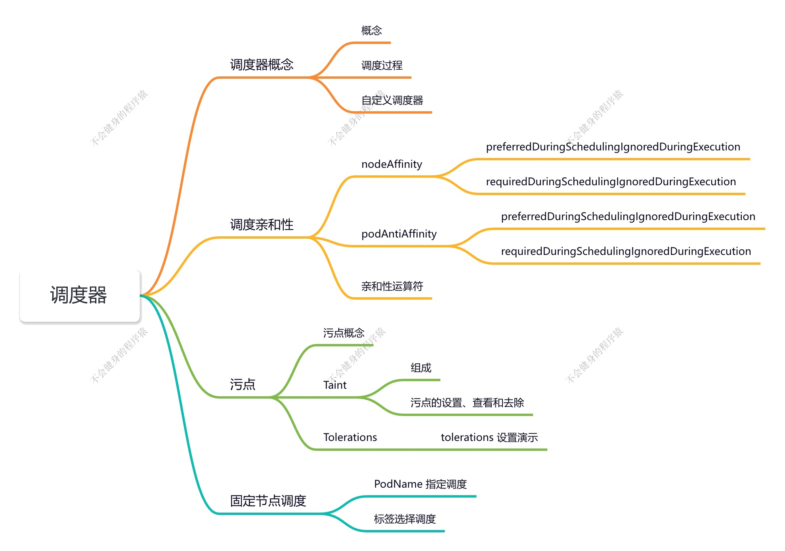

# K8S 调度器

## 调度说明

### 简介

Scheduler 是 kubernetes 的调度器，主要的任务是把定义的 pod 分配到集群的节点上。听起来非常简单，但有很多要考虑的问题：

- 公平：如何保证每个节点都能被分配资源
- 资源高效利用：集群所有资源最大化被使用
- 效率：调度的性能要好，能够尽快地对大批量的 pod 完成调度工作
- 灵活：允许用户根据自己的需求控制调度的逻辑

Sheduler 是作为单独的程序运行的，启动之后会一直监听 APlServer，获取`Podspec.NodeName` 为空的 pod，对每个 pod 都会创建一个 binding，表明该 pod 应该放到哪个节点上

### 调度过程

**调度分为几个部分：**

- 首先是过滤掉不满足条件的节点，这个过程称为 predicate；
- 然后对通过的节点按照优先级排序，这个是 priority；
- 最后从中选择优先级最高的节点。
- 如果中间任何一步骤有错误，就直接返回错误

**Predicate 有一系列的算法可以使用：**

- `PodFitsResources`：节点上剩余的资源是否大于 pod 请求的资源
- `PodFitsHost`：如果 pod 指定了 NodeName，检查节点名称是否和 NodeName 匹配
- `PodFitsHostports`：节点上已经使用的 port 是否和 pod 申请的 port 冲突
- `PodSelectorMatches`：过滤掉和 pod 指定的 label 不匹配的节点
- `NoDiskConflict`：已经 mount 的 volume 和 pod 指定的 volume 不冲突，除非它们都是只读

如果在 predicate 过程中没有合适的节点，pod 会一直在 pending状态，不断重试调度，直到有节点满足条件。经过这个步骤，如果有多个节点满足条件，就继续 priorities 过程：按照优先级大小对节点排序。

优先级由一系列键值对组成，键是该优先级项的名称，值是它的权重（该项的重要性）。这些优先级选项包括：

- `LeastRequestedPriority`：通过计算 CPU 和 Memory 的使用率来决定权重，使用率越低权重越高。换句话说，这个优先级指标倾向于资源使用比例更低的节点
- `BalancedResourceAllocation`：节点上 CPU 和 Memory 使用率越接近，权重越高。这个应该和上面的一起使用，不应该单独使用
- `ImageLocalitypriority`：倾向于已经有要使用镜像的节点，镜像总大小值越大，权重越高

通过算法对所有的优先级项目和权重进行计算，得出最终的结果。

### 自定义调度器

除了 kubernetes 自带的调度器，你也可以编写自己的调度器。通过 `spec:schedulername` 参数指定调度器的名字，可以为 pod 选择某个调度器进行调度。比如下面的 pod 选择 `my-scheduler` 进行调度，而不是默认的 `default-scheduler` ：

~~~yaml
apiVersion: v1
kind: Pod
metadata:
  name: annotation-second-scheduler
  labels:
    name: multischeduler-example
spec:
  schedulername: my-scheduler
  containers:
  - name: pod-with-second-annotation-container
    image: gcr.io/googlecontainers/pause:2.8
~~~

## 调度亲和性

> https://kubernetes.io/zh-cn/docs/concepts/scheduling-eviction/assign-pod-node/

### 节点亲和性

**pod.spec.nodeAffinity**

- preferredDuringSchedulinglgnoredDuringExecution：软策略
- requiredDuringSchedulinglgnoredDuringExecution：硬策略

**requiredDuringSchedulinglgnoredDuringExecution 硬策略示例**

~~~bash
$ kubectl get node --show-labels

~~~

~~~yaml
apiVersion: v1
kind: Pod
metadata:
 name: affinity
 labels:
   app: node-affinity-pod
spec:
  containers:
  - name: with-node-affinity
    image: hub.atguigu.com/library/myapp:v1
  affinity:
    nodeAffinity:
      requiredDuringSchedulingIgnoredDuringExecution:
        nodeSelectorTerms:
        - matchExpressions:
          - key: kubernetes.io/hostname
            operator: NotIn
            values: 
            - k8s-node02
~~~

~~~bash
$ kubectl delete pod affinity && kubectl create -f affinity.yaml && kubectl get pod -o wide

~~~

下一步把 NotIn 改成 In，就可以看到他始终在 k8s-node02上启动啦。

**preferredDuringSchedulinglgnoredDuringExecution 软策略示例**

~~~yaml
apiVersion: v1
kind: Pod
metadata:
  name: affinity
  labels:
    app: node-affinity-pod
spec:
  containers:
  - name: with-node-affinity
    image: hub.atguigu.com/library/myapp:v1
  affinity:
    nodeAffinity:
      preferredDuringschedulingIgnoredDuringExecution :
      - weight: 1
        prefenence:
          matchExpressions:
          - key: kubernetes.io/hostname
            operator: In
            values: 
            - k8s-node03
~~~

**合体**

~~~yaml
apiVersion: v1
kind: Pod
metadata:
 name: affinity
 labels:
   app: node-affinity-pod
spec:
  containers:
  - name: with-node-affinity
    image: hub.atguigu.com/library/myapp:v1
  affinity:
    nodeAffinity:
      requiredDuringSchedulingIgnoredDuringExecution:
        nodeSelectorTerms:
        - matchExpressions:
          - key: kubernetes.io/hostname
            operator: NotIn
            values: 
            - k8s-node02
      preferredDuringschedulingIgnoredDuringExecution :
      - weight: 1
        prefenence:
          matchExpressions:
          - key: kubernetes.io/hostname
            operator: In
            values: 
            - k8s-node03
~~~

> 首先满足硬策略，然后在满足硬策略的范围内，在通过软策略匹配

#### 键值运算关系

- In：label 的值在某个列表中
- NotIn：label的值不在某个列表中
- Gt：label 的值大于某个值
- Lt：label 的值小于某个值
- Exists：某个label 存在
- DoesNotExist：某个label 不存在

<!-- 如果 `nodeSelectorTerms` 下面有多个选项的话，满足任何一个条件就可以了；如果 `matchExpressions` 有多个选项的话，则必须同时满足这些条件才能正常调度 POD -->

### Pod 亲和性

pod.spec.affinity.podAffinity/podAntiAffinity

- preferredDuringSchedulinglgnoredDuringExecution：软策略
- requiredDuringSchedulinglgnoredDuringExecution：硬策略

~~~yaml
apiVersion: v1
kind: Pod
metadata:
  name: pod-3
  labels:
    app: pod-3
spec:
  containers:
  - name: pod-3
    image: hub.atguigu.com/library/myapp:v1
    affinity:
      podAffinity:
        reguiredDuringSchedulingIgnoredDuringExecution
        - labelselector:
            matchExpressions:
            - key: app
              operator: In
              values:
              - pod-1
          topologyKey: kubernetes.io/hostname
      podAntiAffinity:
        preferredDuringSchedulingIgnoredDuringExecution:
        - weight: 1
          podAffinityTerm:
            labelselector:
              matchExpressions:
              - key: app
                operator: In
                values:
                - pod-2
            topologykey: kubernetes.io/hostname
~~~

---

**先执行一个 Pod**

~~~yaml
apiVersion: v1
kind: Pod
metadata:
  name: affinity
  labels:
    app: node01
spec:
  containers:
  - name: with-node-affinity
    image: wangyanglinux/myapp:v1
~~~

再执行亲和性硬策略

~~~yaml
apiVersion: v1
kind: Pod
metadata:
  name: pod-3
  labels:
    app: pod-3
spec:
  containers:
  - name: pod-3
    image: hub.atguigu.com/library/myapp:v1
    affinity:
      podAffinity:
        reguiredDuringSchedulingIgnoredDuringExecution:
        - labelselector:
            matchExpressions:
            - key: app
              operator: In
              values:
              - node01
          topologyKey: kubernetes.io/hostname 	# 这里绑定同一个拓扑域
~~~

---

> 如果没有这个 key，则会 pending

~~~yaml
apiVersion: v1
kind: Pod
metadata:
  name: pod-3
  labels:
    app: pod-3
spec:
  containers:
  - name: pod-3
    image: hub.atguigu.com/library/myapp:v1
    affinity:
      podAntiAffinity:	# 必须不再同一个节点
        reguiredDuringSchedulingIgnoredDuringExecution:	#硬策略
        - labelselector:
            matchExpressions:
            - key: app
              operator: In
              values:
              - node01
          topologyKey: kubernetes.io/hostname
~~~

~~~bash
# 打标签
$ kubectl label pod node01 app=node02 --overwrite=true
~~~

### 亲和性/反亲和性调度策略比较如下：

| 调度策略        | 匹配标建 | 操作符                                     | 拓扑域支持 | 调度目标                   |
| --------------- | -------- | ------------------------------------------ | ---------- | -------------------------- |
| nodeAffinity    | 主机     | In, NotIn, Exists DoesNotExist, Gt, Lt | 否         | 指定主机                   |
| podAffinity     | POD      | In, NotIn, Exists, DoesNotExist        | 是         | POD与指定POD同一拓扑域     |
| podAnitAffinity | POD      | In, NotIn, Exists DoesNotExist         | 是         | POD与指定POD不在同一拓扑域 |

## 污点（Taint）和容忍（Toleration）

> 你能容忍这个污点，那么你就能发生一些事情，也可能不发生。就是有了可能性而已

节点亲和性，是 pod 的一种属性（偏好或硬性要求），它使 pod 被吸引到一类特定的节点。Taint 则相反，它使节点能够排斥一类特定的 pod。
Taint 和 toleration 相互配合，可以用来避免 pod 被分配到不合适的节点上。每个节点上都可以应用一个或多个 taint ，这表示对于那些不能容忍这些 taint 的 pod，是不会被该节点接受的。如果将 toleration 应用于 pod 上，则表示这些 pod 可以（但不要求）被调度到具有匹配 taint 的节点上。

### 污点（Taint）

#### 污点（Taint）的组成

使用 `kubectl taint` 命令可以给某个 Node 节点设置污点，Node 被设置上污点之后就和 Pod 之间存在了一种相斥的关系，可以让 Node 拒绝 Pod 的调度执行，甚至将 Node 已经存在的 Pod 驱逐出去。

每个污点的组成如下:

~~~yaml
key=value:effect
~~~

每个污点有一个 key 和 value 作为污点的标签，其中 value 可以为空，effect 描述污点的作用。当前 taint effect 支持如下三个选项：

- NoSchedule：表示 k8s 将不会将 Pod 调度到具有该污点的 Node 上
- PreferNoSchedule：表示 k8s 将尽量避免将 Pod 调度到具有该污点的 Node 上
- NoExecute：表示 k8s 将不会将 Pod 调度到具有该污点的 Node 上，同时会将 Node 上已经存在的 Pod 驱逐出去

其实集群中已经有设置过污点了

~~~bash
$ kubectl describe node k8s-master01
...
Taints: node-role.kubernetes.io/master:Noschedule
...
~~~

#### 污点的设置、查看和去除

~~~bash
#设置污点
$ kubectl taint nodes node1 key1=value1:NoSchedule

# 节点说明中，查找 Taints 字段
$ kubectl describe pod pod-name

# 去除污点，把设置污点的命令加上-，就会去除
$ kubectl taint nodes node1 key1:NoSchedule-
~~~

### 容忍（Toleration）

设置了污点的 Node 将根据 taint 的 effect: NoSchedule、PreferNoSchedule、NoExecute 和 Pod 之间产生互斥的关系，Pod 将在一定程度上不会被调度到 Node 上。 

但我们可以在 Pod 上设置容忍（Toleration），意思是设置了容忍的 Pod 将可以容忍污点的存在，可以被调度到存在污点的 Node 上。

**pod.spec.tolerations**

~~~yaml
tolerations :
- key: "key1"
  operator: "Equal"
  value: "value1"
  effect: "Noschedule"
  tolerationSeconds: 3600
- key: "key1"
  operator: "Equal"
  value: "value1"
  effect: "NoExecutel
- key: "key2"
  operator: "Exists"
  effect: "NoSchedule"
~~~

- 其中 key、vaule、effect 要与 Node 上设置的 taint 保持一致。
- operator 的值为 Exists 将会忽略 value 值
-  tolerationSeconds 用于描述当 Pod 需要被驱逐时可以在 Pod 上继续保留运行的时间

1. 当不指定 key 值时，表示容忍所有的污点 key：

   ~~~yaml
   tolerations:
   - operator:"Exists"
   ~~~

2. 当不指定 effect 值时，表示容忍所有的污点作用

   ~~~yaml
   tolerations:
   - key: "key"
     operator: "Exists"
   ~~~

3. 有多个 Master 存在时，防止资源浪费，可以如下设置

   ~~~bash
   $ kubectl taint nodes Node-Name node-role.kubernetes.io/master=:PreferNoSchedule
   
   # 例如：
   $ kubectl taint nodes k8s-master-01 node-role.kubernetes.io/master=:PreferNoSchedule
   ~~~

示例：

~~~yaml
apiVersion: v1
kind: Pod
metadata:
  name: affinity
  labels:
    app: node01
spec:
  containers:
  - name: with-node-affinity
    image: wangyanglinux/myapp:v1
  tolerations:
  - key: "key1"
    operator: "Equal"
    value: "value1"
    effect: "NoExecute"
    tolerationSeconds: 3600
~~~

## 固定节点调度

Pod.spec.nodeName 将 Pod 直接调度到指定的 Node 节点上，会跳过 Scheduler 的调度策略，**该匹配规则是强制匹配。**

~~~yaml
apiVersion: extensions/v1beta1
kind: Deployment
metadata:
  name: myweb
spec:
  replicas: 7
  template:
    metadata:
    labels:
      app: myweb
    spec:
      nodeName: k8s-node01
      containers:
      - name: myweb
        image: hub.atguigu.com/library/myapp:v1
        ports:
        - containerPort: 80
~~~

Pod.spec.nodeSelector：通过 kubernetes 的 label-selector 机制选择节点，由调度器调度策略匹配 label，而后调度 Pod 到目标节点，**该匹配规则属于强制约束。**

~~~yaml
apiVersion: extensions/v1beta1
kind: Deployment
metadata:
  name: myweb
spec:
  replicas: 2
  template:
    metadata:
      labels:
        app: myweb
    spec:
      nodeSelector:
        type: backEndNode1 # 或 disk: ssd
      containers:
      - name: myweb
        image: harbor/tomcat:8.5-jre8
        ports:
        - containerPort: 80
~~~

~~~bash
# 打标签
$ kubectl label node k8s-node1 disk=ssd
~~~

