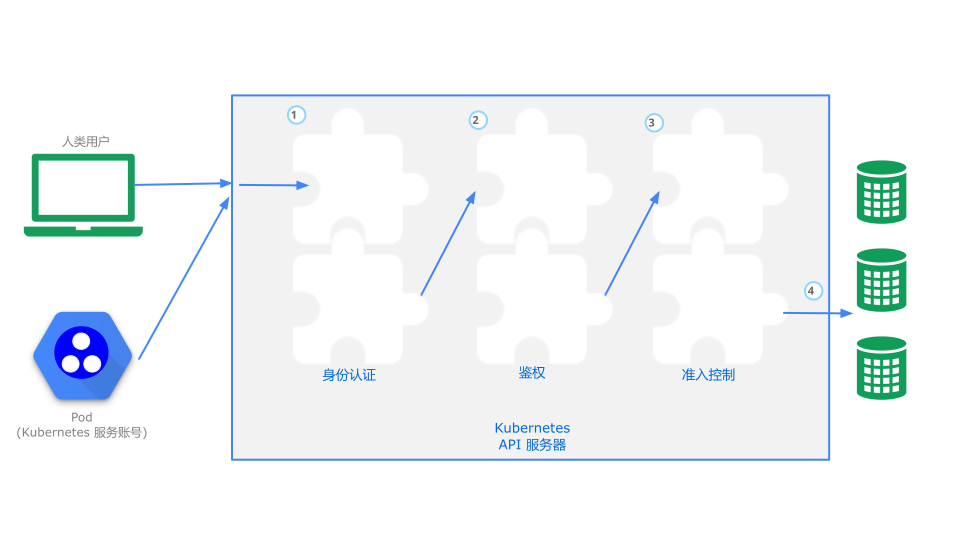
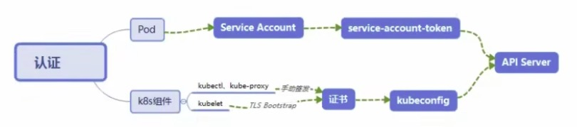

# K8S 集群安全机制

## 机制说明

Kubernetes 作为一个分布式集群的管理工具，保证集群的安全性是其一个重要的任务。API Server 是集群内部各个组件通信的中介，也是外部控制的入口。所以 Kubernetes 的安全机制基本就是围绕保护 API Server 来设计的。

Kubernetes 使用了认证（Authentication）、鉴权（Authorization）、准入控制（AdmissionControl）三步来保证APlServer的安全

## 认证 - Authentication

- HTTP Token 认证：通过一个 Token 来识别合法用户
  - HTTP Token 的认证是用一个很长的特殊编码方式的并目难以被模仿的字符串 - Token 来表达客户的一种方式。Token 是一个很长的很复杂的字符串，每一个 Token 对应一个用户名存储在 API Server 能访问的文件中。当客户端发起 API 调用请求时，需要在 HTTP Header 里放入 Token。
- HTTP Base 认证：通过 用户名+密码的方式认证
  - 用户名+: +密码 用 BASE64 算法进行编码后的字符串放在 HTTP Request 中的 Heather Authorization 域里发送给服务端，服务端收到后进行编码，获取用户名及密码。
- 最严格的 HTTPS 证书认证：基于 CA 根证书签名的客户端身份认证方式

**两种类型**

- Kubenetes 组件对 API Server 的访间：kubectl、Controller Manager、Scheduler、kubelet、kube-proxy
- Kubernetes 管理的 Pod 对容器的访问：Pod （dashborad 也是以 Pod 形式运行）

**安全性说明**

- Controller Manager、Scheduler 与 API Server 在同一台机器，所以直接使用 API Server 的非安全端口访问，`--insecure-bind-address=127.8.0.1`
- kubectl、kubelet、kube-proxy 访问 API Server 就都需要证书进行 HTTPS 双向认证

**证书颁发**

- 手动签发：通过 k8s 集群的跟 ca 进行签发 HTTPS 证书
- 自动签发：kubelet 首次访问 API Server 时，使用 token 做认证，通过后，Controller Manager 会为 kubelet 生成一个证书，以后的访问都是用证书做认证了。

Ⅲ、kubeconfig

~~~bash
$ cd .kube/

$ cat config
~~~

kubeconfig 文件包含集群参数（CA证书、API Server地址），客户端参数（上面生成的证书和私钥），集群 context 信息（集群名称、用户名）。Kubenetes 组件通过启动时指定不同的 kubeconfig 文件可以切换到不同的集群。

Ⅳ、ServiceAccount

Pod 中的容器访问 API Server。因为 Pod 的创建、销毁是动态的，所以要为它手动生成证书就不可行了 Kubenetes 使用了 Service  Account 解决 Pod 访问 API Server 的认证问题。

Ⅴ、Secret 与 SA 的关系

Kubernetes 设计了一种资源对象叫做 Secret，分为两类，一种是用于 ServiceAccount 的 service-account-token，另一种是用于保存用户自定义保密信息的 Opaque。

ServiceAccount 中用到包含三个部分：Token、ca.crt、namespace

- token 是使用 API Server 私钥签名的 JWT。用于访问 API Server 时，Server 端认证。
- ca.crt，根证书。用于 Client 端验证 API Server 发送的证书。
- namespace，标识这个 service-account-token 的作用域名空间

<!--Json web token(JwT)，是为了在网络应用环境间传递声明而执行的一种基于 JSON 的开放标准([(RFC 7519]).该token被设计为紧凑且安全的，特别适用于分布式站点的单点登录(sso)场景。Jwt 的声明一般被用来在身份提供者和服务提供者间传递被认证的用户身份信息，以便于从资源服务器获取资源，也可以增加一些额外的其它业务逻辑所必须的声明信息，该 token 也可直接被用于认证，也可被加密-->

~~~bash

$ kubectl get pod -n kube-system

$ kubectl exec {kube-proxy-name} -n kube-system -it -- /bin/sh

$ cd /run/secrets/kubernetes.io/serviceaccount

~~~

~~~bash
$ kubectl get secret --all-namespaces
$ kubectl describe secret default-token-5gm9r --namespace=kube-system
~~~

默认情况下，每个 namespace 都会有一个 ServiceAccount，如果 Pod 在创建时没有指定 ServiceAccount，就会使用 Pod 所属的namespace 的 ServiceAccount

<!-- 默认挂载目录: /run/secrets/kubernetes.io/serviceaccount/ -->

## 鉴权 - Authorization

上面认证过程，只是确认通信的双方都确认了对方是可信的，可以相互通信。而鉴权是确定请求方有哪些资源的权限。

API Server 目前支持以下几种授权策略（通过 APl Server 的启动参数 `--authorization-mode` 设置）

- AlwaysDeny：表示拒绝所有的请求，一般用于测试
- AlwaysAllow：允许接收所有请求，如果集群不需要授权流程，则可以采用该策略
- ABAC（Attribute-Based Access Control）：基于属性的访问控制，表示使用用户配置的授权规则对用户请求进行匹配和控制
- Webbook：通过调用外部 REST 服务对用户进行授权
- **RBAC（Role-Based Access control）：基于角色的访问控制，现行默认规则**

> 只有 RBAC 现在是最常用的策略，其余已经是历史，要么就不满足鉴权的要求。

### RBAC 授权模式

> https://kubernetes.io/zh-cn/docs/concepts/security/rbac-good-practices/
>
> https://kubernetes.io/zh-cn/docs/reference/access-authn-authz/rbac/

RBAC（Role-Based Access Control）基于角色的访问控制，在 Kubernetes 1.5 中引入，现行版本成为默认标准。

相对其它访问控制方式，拥有以下优势：

- 对集群中的资源和非资源均拥有完整的覆盖
- 整个 RBAC 完全由几个 API 对象完成，同其它 API 对象一样，可以用 kubectl 或 API 进行操作
- 可以在运行时进行调整，无需重启 APl Server

Ⅰ、RBAC 的 API 资源对象说明

RBAC 引入了4个新的顶级资源对象：Role、ClusterRole、RoleBinding、ClusterRoleBinding，4种对象。类型均可以通过 kubectl 与 API 操作。

需要注意的是 Kubenetes 并不会提供用户管理，那么 User、Group、ServiceAccount 指定的用户又是从哪里来的呢？

Kubenetes 组件（kubectl、kube-proxy）或是其他自定义的用户在向 CA 申请证书时，需要提供一个证书请求文件

~~~json
{
    "CN": "admin",
    "hosts": [],
    "key": {
        "algo": "rsa",
        "size": 2048
    },
    "names": [
        {
            "C": "CN",
            "ST": "Hangzhou",
            "L": "XS",
            "0": "system:masters",
            "oU": "System"
        }
    ]
}
~~~

APl Server 会把客户端证书的 CN 字段作为 User，把 `names.o` 字段作为 Group kubelet 使用 TLS Bootstaping 认证时，APl Server 可以使用 Bootstrap Tokens 或者 Token authentication file 验证 = token，无论哪一种，Kubenetes 都会为 token 绑定一个默认的 User 和 Group。

Pod 使用 ServiceAccount 认证时，service-account-token 中的 JWT 会保存 User 信息。

有了用户信息，再创建一对角色/角色绑定（集群角色/集群角色绑定）资源对象，就可以完成权限绑定了。

#### Role and ClusterRole

在 RBAC API 中，Role 表示一组规则权限，权限只会增加（累加权限），不存在一个资源一开始就有很多权限而通过 RBAC 对其进行减少的操作；Role 可以定义在一个 namespace 中，如果想要跨 namespace 则可以创建 ClusterRole。

~~~yaml
apiVersion: rbac.authorization.k8s.io/v1beta1
kind: Role
metadata:
  namespace: default
  name: pod-reader
rules:
- apiGroups: [""] # "" indicates the core ApI group
  resources: ["pods"]
  verbs: ["get",，"watch", "list"]		# 指的是执行的操作
~~~

ClusterRole 具有与 Role 相同的权限角色控制能力，不同的是 ClusterRole 是集群级别的，clusterRole 可以用于：

- 集群级别的资源控制（例如 node 访问权限）
- 非资源型 endpoints（例如 /healthz 访问）
- 所有命名空间资源控制（例如 pods）

~~~yaml
apiVersion: rbac.authorization.k8s.io/v1beta1
kind: clusterRole
metadata:
  # "namespace" omitted since ClusterRoles are not namespaced
  name: secret-reader
rules:
- apiGroups: [""]
  resources: ["secrets"]
  verbs: ["get", "watch", "list"]
~~~

#### RoleBingding and ClusterRoleBinding

> RoleBingding 可以绑定 role 也可以绑定 cluster role

RoloBinding 可以将角色中定义的权限授予用户或用户组，RoleBinding 包含一组权限列表（subjects），权限列表中包含有不同形式的待授予权限资源类型（users, groups, or service accounts）；RoloBinding 同样包含对被 Bind 的 Role 引用；RoleBinding 适用于某个命名空间内授权，而 ClusterRoleBinding 适用于集群范围内的授权。

将 default 命名空间的 `pod-reader` Role 授予 jane 用户，此后 jane 用户在 default 命名空间中将具有 `pod-reader` 的权限。

~~~yaml
apiVersion: rbac.authorization.k8s.io/v1beta1
kind: RoleBinding
metadata:
  name: read-pods
  namespace: default
subjects:
- kind: User
  name: jane
  apiGroup: rbac.authorization.k8s.io
roleRef:
  kind: Role
  name: pod-reader
  apiGroup: rbac.authorization.k8s.io
~~~

RoleBinding 同样可以引用 ClusterRole 来对当前 namespace 内用户、用户组或 ServiceAccount 进行授权，这种操作允许集群管理员在整个集群内定义一些通用的 ClusterRole，然后在不同的 namespace 中使用 RoleBinding 来引用。

例如，以下 RoleBinding 引用了一个 ClusterRole，这个 ClusterRole 具有整个集群内对 secrets 的访问权限；但是其授权用户 **dave** 只 2 能访问 development 空间中的 secrets（因为 RoleBinding 定义在 development 命名空间）

~~~yaml
# This role binding allows "dave" to read secrets in the "development" namespace.
apiVersion: rbac.authorization.k8s.io/v1beta1
kind: RoteBinding
metadata:
  name: read-secrets
  namespace: development # This only grants permissions within the "development" namespace.
subjects:
- kind: User
  name: dave
  apiGroup: rbac.authorization.k8s.io
roleRef:
  kind: ClusterRole
  name: secret-reader
  apiGroup: rbac.authorization.k8s.io
~~~

使用 clusterRoleBinding 可以对整个集群中的所有命名空间资源权限进行授权；

以下 clusterRoleBinding 样例展示了授权 manager 组内所有用户在全部命名空间中对 secrets 进行访问

~~~yaml
# This cluster role binding allows anyone in the "manager" group to read secrets in anynamespace.
apiversion: rbac.authorization.k8s.io/v1beta1
kind: clusterRoleBinding
metadata:
  name: read-secrets-global
subjects:
- kind: Group
  name: manager
  apiGroup: rbac.authorization.k8s.io
roleRef:
  kind: ClusterRole
  name: secret-reader
  apiGroup: rbac.authorization.k8s.io
~~~

#### Resources

Kubernetes 集群内一些资源一般以其名称字符串来表示，这些字符串一般会在 API 的 URL 地址中出现；同时某些资源也会包含子资源，例如 logs 资源就属于 pods 的子资源，API 中 URL 样例如下：

~~~curl
GET /api/v1/namespaces/{namespace}/pods/{name}/log
~~~

如果要在 RBAC 授权模型中控制这些子资源的访问权限，可以通过/分隔符来实现，以下是一个定义 pods 资资源 logs 访问权限的 Role 定义样例

~~~yaml
apiversion: rbac.authorization.k8s.io/v1beta1
kind: Role
metadata:
  namespace: default
  name: pod-and-pod-logs-reader
rules:
- apiGroups: [""]
  resources: ["pods","pods/log"]
  verbs: ["get", "list"]
~~~

#### to Subjects

RoleBinding 和 ClusterRoleBinding 可以将 Role 绑定到 Subjects；Subjects 可以是 groups、users 或者 service accounts。/

Subjects 中 Users 使用字符串表示，它可以是一个普通的名字字符串，如"alice”；也可以是email 格式的邮箱地址，如"example@163.com”；甚至是一组字符串形式的数字 ID。但是 Users 的前缀 system: 是系统保留的，集群管理员应该确保普通用户不会使用这个前缀格式。

Groups 书写格式与 Users 相同，都为一个字符串，并且没有特定的格式要求；向样 system: 前缀为系统保留。

#### 实践：创建一个用户只能管理 dev 空间

> mysql、Nginx 指的是命名空间

