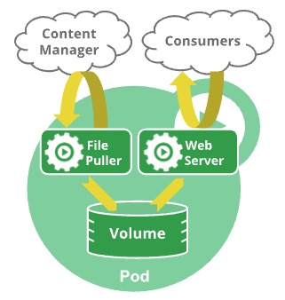

> Pod 的生命周期
>
> https://kubernetes.io/zh-cn/docs/concepts/workloads/pods/pod-lifecycle/

Pod 遵循预定义的生命周期，起始于 `Pending` 阶段， 如果至少其中有一个主要容器正常启动，则进入 `Running`，之后取决于 Pod 中是否有容器以失败状态结束而进入 `Succeeded` 或者 `Failed` 阶段。

和一个个独立的应用容器一样，Pod 也被认为是**相对临时性（而不是长期存在）的实体**。 Pod 会被创建、赋予一个唯一的 ID（UID）并被调度到节点，并在终止（根据重启策略）或删除之前一直运行在该节点。 如果一个节点死掉了，调度到该节点的 Pod 也被计划在给定超时期限结束后删除。


## 1. Pod 生命期

在 Pod 运行期间，`kubelet` 能够重启容器以处理一些失效场景。 在 Pod 内部，Kubernetes 跟踪不同容器的状态并确定使 Pod 重新变得健康所需要采取的动作。

在 Kubernetes API 中，Pod 包含规约部分和实际状态部分。 Pod 对象的状态包含了一组 **Pod 状况（Conditions）**。 如果应用需要的话，你也可以向其中注入自定义的**就绪态**信息。

Pod 在其生命周期中只会被调度一次。将 Pod 分配到特定节点的过程称为**绑定**，而选择使用哪个节点的过程称为**调度**。一旦 Pod 被调度并绑定到某个节点，Kubernetes 会尝试在该节点上运行 Pod。 Pod 会在该节点上运行，直到 Pod 停止或者被**终止**；如果 Kubernetes 无法在选定的节点上启动 Pod（例如，如果节点在 Pod 启动前崩溃）， 那么特定的 Pod 将永远不会启动。

你可以使用 Pod 调度就绪态来延迟 Pod 的调度，直到所有的**调度门控**都被移除。 例如，你可能想要定义一组 Pod，但只有在所有 Pod 都被创建完成后才会触发调度。


### 1.1. Pod 和故障恢复

如果 Pod 中的某个容器失败，Kubernetes 可能会尝试重启特定的容器。 有关细节参阅 **Pod 如何处理容器问题**。   

然而，Pod 也可能以集群无法恢复的方式失败，在这种情况下，Kubernetes 不会进一步尝试修复 Pod； 相反，Kubernetes 会删除 Pod 并依赖其他组件提供自动修复。

如果 Pod 被调度到某个节点而该节点之后失效， Pod 会被视为不健康，最终 Kubernetes 会删除 Pod。 Pod 无法在因节点资源耗尽或者节点维护而被**驱逐**期间继续存活。

> 驱逐：终止节点上一个或多个 Pod

Kubernetes 使用一种高级抽象来管理这些相对而言可随时丢弃的 Pod 实例， 称作控制器。

> 控制器通过 API 服务器监控集群的公共状态，并致力于将当前状态转变为期望状态。

任何给定的 Pod （由 UID 定义）从不会被“重新调度（rescheduled）”到不同的节点； 相反，这一 Pod 可以被一个新的、几乎完全相同的 Pod 替换掉。 如果你创建一个替换 Pod，它甚至可以拥有与旧 Pod 相同的名称（如 `.metadata.name`）， 但替换 Pod 将具有与旧 Pod 不同的 `.metadata.uid`。

Kubernetes 不保证现有 Pod 的替换 Pod 会被调度到与被替换的旧 Pod 相同的节点。


### 1.2. 关联的生命期

如果某物声称其生命期与某 Pod 相同，例如存储卷， 这就意味着该对象在此 Pod （UID 亦相同）存在期间也一直存在。 如果 Pod 因为任何原因被删除，甚至某完全相同的替代 Pod 被创建时， 这个相关的对象（例如这里的卷）也会被删除并重建。

> 包含可被 Pod 中容器访问的数据的目录



一个包含文件拉取程序 **Sidecar（边车）**和 **Web 服务器**的**多容器 Pod**。

此 Pod 使用 **临时 `emptyDir` 卷** 作为容器之间的共享存储。


## 2. Pod 阶段

Pod 的 `status` 字段是一个 PodStatus 对象，其中包含一个 `phase` 字段。

Pod 的阶段（Phase）是 Pod 在其生命周期中所处位置的简单宏观概述。 该阶段并不是对容器或 Pod 状态的综合汇总，也不是为了成为完整的状态机。

Pod 阶段的数量和含义是严格定义的。 除了本文档中列举的内容外，不应该再假定 Pod 有其他的 `phase` 值。

下面是 `phase` 可能的值：

| 取值                | 描述                                                         |
| :------------------ | :----------------------------------------------------------- |
| `Pending`（悬决）   | Pod 已被 Kubernetes 系统接受，但有一个或者多个容器尚未创建亦未运行。此阶段包括等待 Pod 被调度的时间和通过网络下载镜像的时间。 |
| `Running`（运行中） | Pod 已经绑定到了某个节点，Pod 中所有的容器都已被创建。至少有一个容器仍在运行，或者正处于启动或重启状态。 |
| `Succeeded`（成功） | Pod 中的所有容器都已成功结束，并且不会再重启。               |
| `Failed`（失败）    | Pod 中的所有容器都已终止，并且至少有一个容器是因为失败终止。也就是说，容器以非 0 状态退出或者被系统终止，且未被设置为自动重启。 |
| `Unknown`（未知）   | 因为某些原因无法取得 Pod 的状态。这种情况通常是因为与 Pod 所在主机通信失败。 |

> **说明：**
>
> 当 Pod 反复启动失败时，某些 kubectl 命令的 `Status` 字段中可能会出现 `CrashLoopBackOff`。 同样，当 Pod 被删除时，某些 kubectl 命令的 `Status` 字段中可能会出现 `Terminating`。
>
> 确保不要将 **Status**（kubectl 用于用户直觉的显示字段）与 Pod 的 `phase` 混淆。 Pod 阶段（phase）是 Kubernetes 数据模型和 [Pod API](https://kubernetes.io/zh-cn/docs/reference/kubernetes-api/workload-resources/pod-v1/) 的一个明确的部分。
>
> ~~~shell
> NAMESPACE               NAME               READY   STATUS             RESTARTS   AGE
> alessandras-namespace   alessandras-pod    0/1     CrashLoopBackOff   200        2d9h
> ~~~
>
> Pod 被赋予一个可以体面终止的期限，默认为 30 秒。 你可以使用 `--force` 参数来**强制终止 Pod**。

如果某节点死掉或者与集群中其他节点失联，Kubernetes 会实施一种策略，将失去的节点上运行的所有 Pod 的 `phase` 设置为 `Failed`。

##### 示例：如何查看 pod phase

> 虽然在命令行 status 状态为 Completed，他对应于 `status.phase` 的 `Succeeded` 状态。

1. 获取 pod 信息

   ~~~shell
   h.a.hu@AMAR64XLRH7PP demo $ kubectl get pod
   NAME          READY   STATUS      RESTARTS   AGE
   hello-pt4j2   0/1     Completed   0          156m
   ~~~

2. 运行命令查看 pod 信息

   ~~~shell
   h.a.hu@AMAR64XLRH7PP demo $ kubectl get pod hello-pt4j2 -o json
   {
       "apiVersion": "v1",
       "kind": "Pod",
       <snip>
       "status": {
           <snip>
           "phase": "Succeeded",							<-- 这个就是这个 Pod 的 phase
           "podIP": "10.244.0.19",
           "podIPs": [
               {
                   "ip": "10.244.0.19"
               }
           ],
           "qosClass": "BestEffort",
           "startTime": "2025-02-13T06:11:51Z"
       }
   }
   ~~~

   

## 3. 容器状态

Kubernetes 会跟踪 Pod 中每个容器的状态，就像它跟踪 Pod 总体上的**阶段**一样。 你可以使用[容器生命周期回调](https://kubernetes.io/zh-cn/docs/concepts/containers/container-lifecycle-hooks/) 来在容器生命周期中的特定时间点触发事件。

一旦调度器将 Pod 分派给某个节点，`kubelet` 就通过**容器运行时**开始为 Pod 创建容器。

容器的状态有三种：

- `Waiting`（等待）

  如果容器并不处在 `Running` 或 `Terminated` 状态之一，它就处在 `Waiting` 状态。 

  处于 `Waiting` 状态的容器仍在运行它完成启动所需要的操作：例如， 从某个容器镜像仓库拉取容器镜像，或者向容器应用 Secret 数据等等。 

  当你使用 `kubectl` 来查询包含 `Waiting` 状态的容器的 Pod 时，你也会看到一个 Reason 字段，其中给出了容器处于等待状态的原因。

- `Running`（运行中）

  `Running` 状态表明容器正在执行状态并且没有问题发生。 

  如果配置了 `postStart` 回调，那么该回调已经执行且已完成。 

  如果你使用 `kubectl` 来查询包含 `Running` 状态的容器的 Pod 时， 你也会看到关于容器进入 `Running` 状态的信息。

- `Terminated`（已终止）

  处于 `Terminated` 状态的容器开始执行后，或者运行至正常结束或者因为某些原因失败。 

  如果你使用 `kubectl` 来查询包含 `Terminated` 状态的容器的 Pod 时， 你会看到容器进入此状态的原因、退出代码以及容器执行期间的起止时间。

  如果容器配置了 `preStop` 回调，则该回调会在容器进入 `Terminated` 状态之前执行。

> **kube-scheduler - 调度器：**
>
> 控制平面组件，负责监视新创建、未指定运行节点的 Pod，选择节点在上面运行。
>
> **容器运行时：**
>
> 容器运行时是运行容器的软件。
>
> **secret：**
>
> Secret 用于存储敏感信息，如密码、OAuth 令牌 和 SSH 密钥。

要检查 Pod 中容器的状态，你可以使用 `kubectl describe pod <pod 名称>`。 其输出中包含 Pod 中每个容器的状态。

##### 示例：查看 pod 容器的状态

~~~shell
h.a.hu@AMAR64XLRH7PP K8S-Oceam $ kubectl get pod
NAME          READY   STATUS      RESTARTS      AGE
nginx         1/1     Running     1 (23h ago)   29h

h.a.hu@AMAR64XLRH7PP K8S-Oceam $ kubectl describe pod nginx
Name:             nginx
Namespace:        default
<snip>
Containers:
  nginx:
    Container ID:   docker://ff324c5ac27ca8233b267625487ee41cd8b857ef59e0a102ca3fcb9cfc757423
    Image:          nginx:1.14.2
    Image ID:       docker-pullable://nginx@sha256:f7988fb6c02e0ce69257d9bd9cf37ae20a60f1df7563c3a2a6abe24160306b8d
    Port:           80/TCP
    Host Port:      0/TCP
    State:          Running																				<-- 容器的状态
      Started:      Fri, 14 Feb 2025 17:08:30 +0800
    Last State:     Terminated
      Reason:       Completed																			<-- 容器状态的原因
      Exit Code:    0
      Started:      Thu, 13 Feb 2025 11:58:43 +0800
      Finished:     Thu, 13 Feb 2025 17:46:30 +0800
    Ready:          True
    Restart Count:  1
    Environment:    <none>
    Mounts:
      /var/run/secrets/kubernetes.io/serviceaccount from kube-api-access-4r5hb (ro)
<snip>

h.a.hu@AMAR64XLRH7PP K8S-Oceam $ kubectl get pod                 
NAME          READY   STATUS      RESTARTS      AGE
hello-pt4j2   0/1     Completed   0             27h

h.a.hu@AMAR64XLRH7PP K8S-Oceam $ kubectl describe pod hello-pt4j2
Name:             hello-pt4j2
Namespace:        default
<snip>
Containers:
  hello:
    Container ID:  docker://0433d58aaa937196590226889c2700f5cd2f8c9ba20f139dee4f0a41bfd1b51b
    Image:         busybox:1.28
    Image ID:      docker-pullable://busybox@sha256:141c253bc4c3fd0a201d32dc1f493bcf3fff003b6df416dea4f41046e0f37d47
    Port:          <none>
    Host Port:     <none>
    Command:
      sh
      -c
      echo "Hello, Kubernetes!" && sleep 3600
    State:          Terminated																					<-- 容器的状态
      Reason:       Completed																						<-- 容器当前状态的原因
      Exit Code:    0																									  <-- 容器退出代码
      Started:      Thu, 13 Feb 2025 14:13:00 +0800											<-- 容器开始时间
      Finished:     Thu, 13 Feb 2025 15:13:00 +0800											<-- 容器结束时间
    Ready:          False
    Restart Count:  0
    Environment:    <none>
    Mounts:
      /var/run/secrets/kubernetes.io/serviceaccount from kube-api-access-lk6rd (ro)
<snip>
~~~


## 4. Pod 如何处理容器问题

~~~yaml
apiVersion: batch/v1
kind: Job
metadata:
  name: hello
spec:
  template:
    # 这里是 Pod 模板
    spec:
      containers:
      - name: hello
        image: busybox:1.28
        command: ['sh', '-c', 'echo "Hello, Kubernetes!" && sleep 3600']
      restartPolicy: OnFailure                #  <-- 这个地方重启策略的配置
~~~

Kubernetes 通过在 Pod `spec` 中定义的 **restartPolicy** 管理 Pod 内容器出现的失效。 

该策略决定了 Kubernetes 如何对由于错误或其他原因而退出的容器做出反应，其顺序如下：

1. **最初的崩溃**：Kubernetes 尝试根据 Pod 的 `restartPolicy` 立即重新启动。
2. **反复的崩溃**：在最初的崩溃之后，Kubernetes 对于后续重新启动的容器采用指数级回退延迟机制， 如 **restartPolicy** 中所述。 这一机制可以防止快速、重复的重新启动尝试导致系统过载。
3. **CrashLoopBackOff 状态**：这一状态表明，对于一个给定的、处于崩溃循环、反复失效并重启的容器， 回退延迟机制目前正在生效。
4. **回退重置**：如果容器成功运行了一定时间（如 10 分钟）， Kubernetes 会重置回退延迟机制，将新的崩溃视为第一次崩溃。

在实际部署中，`CrashLoopBackOff` 是在描述或列出 Pod 时从 `kubectl` 命令输出的一种状况或事件。 当 Pod 中的容器无法正常启动，并反复进入尝试与失败的循环时就会出现。

换句话说，当容器进入崩溃循环时，Kubernetes 会应用 **容器重启策略** 中提到的指数级回退延迟机制。这种机制可以防止有问题的容器因不断进行启动失败尝试而导致系统不堪重负。

下列问题可以导致 `CrashLoopBackOff`：

- 应用程序错误导致的容器退出。
- 配置错误，如环境变量不正确或配置文件丢失。
- 资源限制，容器可能没有足够的内存或 CPU 正常启动。
- 如果应用程序没有在预期时间内启动服务，健康检查就会失败。
- 容器的存活探针或者启动探针返回 `失败` 结果，如**探针部分**所述。

要调查 `CrashLoopBackOff` 问题的根本原因，用户可以：

1. **检查日志**：使用 `kubectl logs <pod名称>` 检查容器的日志。 这通常是诊断导致崩溃的问题的最直接方法。
2. **检查事件**：使用 `kubectl describe pod <pod名称>` 查看 Pod 的事件， 这可以提供有关配置或资源问题的提示。
3. **审查配置**：确保 Pod 配置正确无误，包括环境变量和挂载卷，并且所有必需的外部资源都可用。
4. **检查资源限制**： 确保容器被分配了足够的 CPU 和内存。有时，增加 Pod 定义中的资源可以解决问题。
5. **调试应用程序**：应用程序代码中可能存在错误或配置不当。 在本地或开发环境中运行此容器镜像有助于诊断应用程序的特定问题。


### 4.1.  容器重启策略

Pod 的 `spec` 中包含一个 `restartPolicy` 字段，其可能取值包括 Always、OnFailure 和 Never。**默认值是 Always**。

`restartPolicy` 应用于 Pod 中的**应用容器**和常规的**Init 容器**。 **Sidecar 容器**忽略 Pod 级别的 `restartPolicy` 字段：在 Kubernetes 中，Sidecar 被定义为 `initContainers` 内的一个条目，其容器级别的 `restartPolicy` 被设置为 `Always`。 对于因错误而退出的 Init 容器，如果 Pod 级别 `restartPolicy` 为 `OnFailure` 或 `Always`， 则 kubelet 会重新启动 Init 容器。

> **应用容器：**
>
> 用于运行部份工作负载的容器。与 Init 容器比较而言。

- `Always`：只要容器终止就自动重启容器。
- `OnFailure`：只有在容器错误退出（退出状态非零）时才重新启动容器。
- `Never`：不会自动重启已终止的容器。

当 kubelet 根据配置的重启策略处理容器重启时，仅适用于同一 Pod 内替换容器并在同一节点上运行的重启。当 Pod 中的容器退出时，`kubelet` 会以指数级回退延迟机制（10 秒、20 秒、40 秒......）重启容器， 上限为 300 秒（5 分钟）。一旦容器顺利执行了 10 分钟， kubelet 就会重置该容器的重启延迟计时器。

 Sidecar 容器和 Pod 生命周期中解释了 `init containers` 在指定 `restartpolicy` 字段时的行为。


### 4.2. 可配置的容器重启延迟

> **特性状态：** `Kubernetes v1.32 [alpha]` (enabled by default: false)

启用 Alpha 特性门控 `KubeletCrashLoopBackOffMax` 后， 你可以重新配置容器启动重试之间的最大延迟，默认值为 300 秒（5 分钟）。此配置是针对每个节点使用 kubelet 配置进行设置的。 

在你的 [kubelet 配置](https://kubernetes.io/zh-cn/docs/tasks/administer-cluster/kubelet-config-file/)中， 在 `crashLoopBackOff` 下设置 `maxContainerRestartPeriod` 字段，取值范围在 `"1s"` 到 `"300s"` 之间。 如上文[容器重启策略](https://kubernetes.io/zh-cn/docs/concepts/workloads/pods/pod-lifecycle/#restart-policy)所述，该节点上的延迟仍将从 10 秒开始，并在每次重启后以指数方式增加 2 倍，但现在其上限将被限制为你所配置的最大值。如果你配置的 `maxContainerRestartPeriod` 小于默认初始值 10 秒， 则初始延迟将被设置为配置的最大值。

参见以下 kubelet 配置示例：

```yaml
# 容器重启延迟将从 10 秒开始，每次重启增加 2 倍
# 最高达到 100 秒
kind: KubeletConfiguration
crashLoopBackOff:
    maxContainerRestartPeriod: "100s"
```

~~~yaml
# 容器重启之间的延迟将始终为 2 秒
kind: KubeletConfiguration
crashLoopBackOff:
    maxContainerRestartPeriod: "2s"
~~~


## 5. Pod 状况

Pod 有一个 PodStatus 对象，其中包含一个 **PodConditions** 数组。Pod 可能通过也可能未通过其中的一些状况测试。 

Kubelet 管理以下 PodCondition：

- `PodScheduled`：Pod 已经被调度到某节点；
- `PodReadyToStartContainers`：Pod 沙箱被成功创建并且配置了网络（Beta 特性，[默认](https://kubernetes.io/zh-cn/docs/concepts/workloads/pods/pod-lifecycle/#pod-has-network)启用）；
- `ContainersReady`：Pod 中所有容器都已就绪；
- `Initialized`：所有的 **Init 容器** 都已成功完成；
- `Ready`：Pod 可以为请求提供服务，并且应该被添加到对应服务的负载均衡池中。


